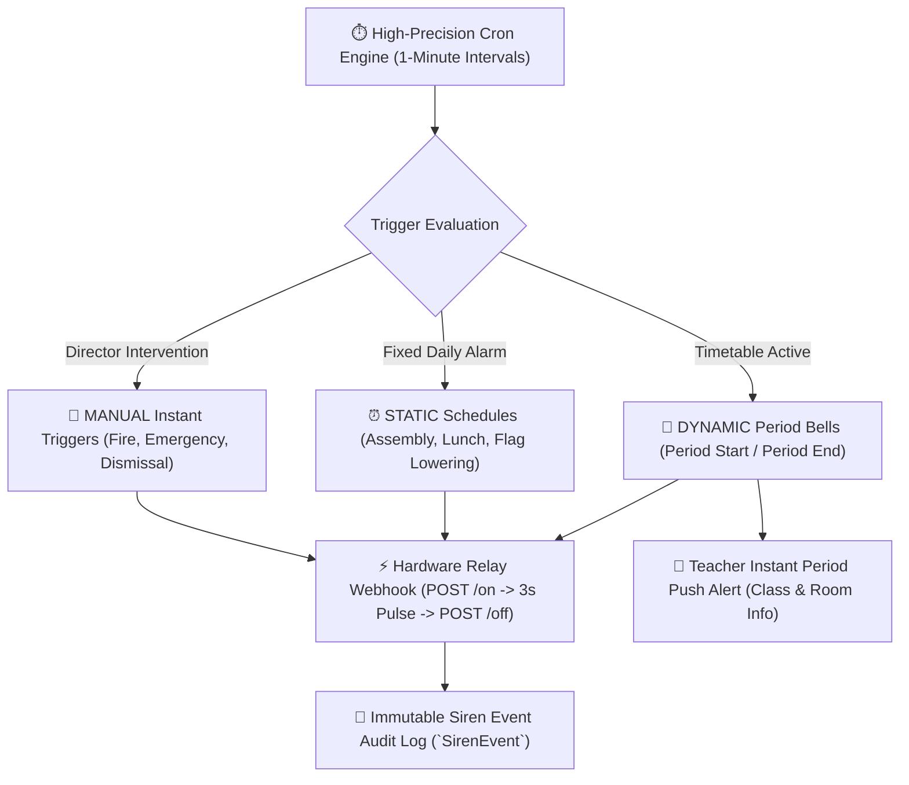

# Automated Siren, Bell & Hardware Relay Management

The **YeneSchool Siren & School Bell System** (`SirenSchedule`, `SirenEvent`, `SirenHardwareConfig`, `siren.service.ts`) automates campus bell ringing, synchronizes period transitions with active timetables, notifies scheduled teachers on mobile, and triggers physical electric bell relays via IoT webhooks.



---

## 1. Dynamic Period Bells vs. Static Alarm Schedules

YeneSchool operates two complementary automated ringing engines:

### 1. Dynamic Timetable Period Bells (`DYNAMIC`)
- **Master Timetable Sync**: Automatically rings at the exact `startTime` and `endTime` defined in **Period Times** (`periodTime`) during teaching weekdays (Monday through Friday).
- **Slot Verification**: Only rings if an active class session exists in `timetableSlot` for that period, preventing unwanted chimes during free periods or study blocks.
- **Teacher Mobile Alert**: At `PERIOD_START`, the system automatically sends a push notification to the scheduled teacher (or covering substitute teacher if a timetable swap is active), detailing the class name, section, subject, and room number.
- **Holiday & Closure Guard**: The system automatically queries `SchoolEvent` and **suppresses all bell ringing** on national holidays, term breaks, and announced campus closures (`isSchoolClosedToday`).

### 2. Static Daily Alarm Schedules (`STATIC`)
For recurring daily events that occur outside standard period transitions:
1. Navigate to **Director > Siren Management > Schedules**.
2. Click **+ Add Custom Schedule**:
   - **Schedule Name**: E.g., *Morning Campus Assembly*, *Primary Lunch Break*, *National Anthem & Flag Ceremony*.
   - **Ring Time**: Exact wall-clock time in 24-hour format (e.g., `07:45`, `12:15`, `15:45`).
   - **Operating Days**: Multi-select active days (e.g., *Monday, Wednesday, Friday*).
   - **Siren Type**: `GENERAL`, `PERIOD_START`, `PERIOD_END`, `DISMISSAL`, `WARNING`.
3. Toggle **Active** and click **Save Schedule**.

---

## 2. Emergency Alarms & Manual Instant Triggers

In urgent situations, School Directors and authorized Supervisors can trigger instant sirens directly from the dashboard:

| Manual Siren Type | Recommended Use Case | Visual & Audio Alert Behavior |
| :--- | :--- | :--- |
| **`FIRE`** | Fire alarm or emergency evacuation. | Continuous cycling pulse; emergency red banner on all staff screens. |
| **`EMERGENCY`** | Campus lockdown or severe weather alert. | High-priority siren tone broadcast across connected speakers. |
| **`DISMISSAL`** | Early rainy day dismissal or special assembly. | Double-chime dismissal pattern. |
| **`PERIOD_START` / `PERIOD_END`** | Manual period chime during ad-hoc schedule shifts. | Standard 3-second transition ring. |
| **`WARNING`** | 5-minute warning bell before morning gate closes. | Short warning chime. |
| **`GENERAL`** | General campus announcement chime. | Single chime. |

---

## 3. IoT Hardware Relay Integration (ESP32 / Raspberry Pi / Shelly)

To physically ring mechanical or electronic school bells across campus:

```mermaid
flowchart LR
    A["YeneSchool Cloud Server"] -->|HTTP POST <webhookUrl>/on| B["🔌 IoT Relay Controller (ESP32 / Shelly)"]
    B -->|Close Relay Contact (220V AC)| C["🔔 Physical School Bell Rings"]
    A -->|Wait 3 Seconds Pulse Duration| D["⏱️ Timer"]
    D -->|HTTP POST <webhookUrl>/off| B
    B -->|Open Relay Contact| E["🔕 Bell Silenced"]
```

### Configuring Physical Hardware
1. In **Director > Siren Management**, open the **Hardware Integration** tab.
2. Enter your physical relay device settings:
   - **Hardware Webhook URL**: Local IP or dynamic DNS URL of your IoT relay (e.g., `http://192.168.1.150:8080/relay` or `https://relay.yeneschool-device.net`).
   - **Request Timeout (ms)**: Maximum network wait time (Default: `5000` ms).
   - **Enable Hardware Trigger**: Toggle to `Active`.
3. Click **Test Hardware Connection**:
   - The server sends a test pulse (`/on` followed by `/off` after 2 seconds).
   - The screen confirms whether the hardware relay responded successfully.

---

## 4. Reliability & Idempotency Architecture

- **PostgreSQL Advisory Locking**: Every minute cron evaluation uses `pg_try_advisory_lock` to ensure that clustered server instances never duplicate bell triggers.
- **Timezone Resolution**: Automatically resolves the school's local wall-clock time in `Africa/Addis_Ababa` timezone.
- **Audit Logging**: Every bell event (manual, static, or dynamic) is permanently logged in `SirenEvent` with execution timestamps, delivery flags (`webhookSent`, `pushSent`), and operator attribution.

---

## Next Steps

- [AI Timetable & Substitution Watchdog](/ai/timetable-watchdog) — Automatic teacher substitution during absences
- [Period Times & Class Duration Setup](/academic/timetable) — Setting period start and end times
- [School-Wide Settings & Configuration](/director/school-settings) — Campus working hours and timezone defaults
