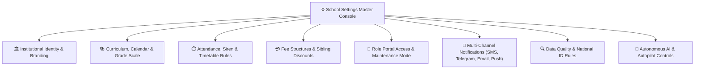
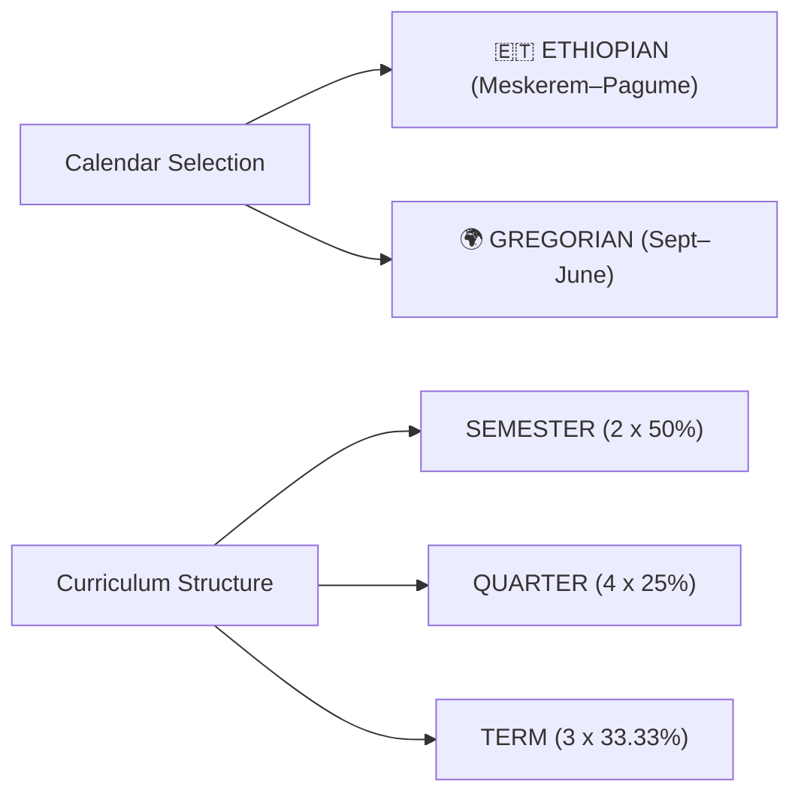
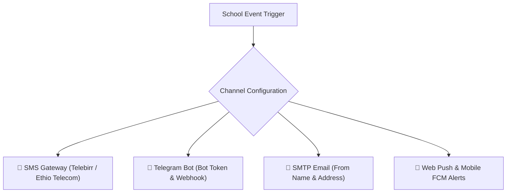

# School-Wide Settings & Configuration

The **School Settings Management Center** (`/director/school-settings` or `PATCH /school-settings`) is the master administrative control console for the School Director. Every academic policy, grading standard, financial workflow, communication gateway, and autonomous AI behavior is configured and enforced here.

---

## 1. Institutional Identity, Branding & Social Links

Defines the official brand assets, metadata, and contact points displayed on all student transcripts, official report cards, ID cards, receipts, and portal login screens.

| Setting Key | Type / Format | Description & Operational Impact |
| :--- | :--- | :--- |
| `school_name` | String | Official registered name recognized by the Ministry of Education. |
| `school_motto` | String | Institutional slogan displayed on document headers and student portals. |
| `school_address` | String | Physical campus location, Sub-City, Woreda, and House number. |
| `school_phone` | Phone | Primary institutional hotline printed on student ID badges and vouchers. |
| `school_email` | Email | Official administrative email for system-generated outgoing dispatches. |
| `logo_url` | Image (PNG/SVG) | High-resolution transparent crest for light and dark themes. |
| `login_image_url`| Image URL | Custom background banner rendered on the school's public sign-in portal. |
| `theme_color` | Hex Code (`#hex`) | Primary institutional brand color applied dynamically across web & mobile. |
| `BRAND_COLOR_IN_NAVIGATION` | Boolean (`true/false`) | Tints sidebar navigation rails and active headers with school brand color. |
| `CUSTOM_BRANDING` | Boolean | Enables white-label custom domain and custom login branding. |
| `social_telegram` | URL / Username | School's official Telegram channel or group link. |
| `social_facebook` | URL | Official institutional Facebook community page. |

---

## 2. Academic Curriculum, Calendar & Grade Systems

Controls the fundamental pedagogical structure of the school year, evaluation periods, and promotion criteria.

### Supported Curriculum Types (`curriculum_type`)
- **`SEMESTER`** (Default): Two terms per academic year (50% Semester 1, 50% Semester 2).
- **`QUARTER`**: Four terms per academic year (25% weight per quarter).
- **`TERM`**: Three terms per academic year (33.33%, 33.33%, 33.34% split).
- **`CUSTOM`**: Custom period date ranges and variable percentage weights.

### Supported Grade Systems (`grade_system`)
Select the institution's educational span:
- `1-8` | `1-10` | `1-12` | `9-12`
- `K-4` | `K-8` | `KG-8` | `K-12` | `KG-12` | `PRE-K-12`
- `KG-ONLY` | `EARLY-CHILDHOOD` | `NURSERY-KG3` | `KG1-KG3`

### Grading Scale & Promotion Policy Keys
- **`PASSING_MARK_THRESHOLD`**: Minimum overall percentage required for passing (e.g., `50%` or `60%`).
- **`MIN_PASSING_MARK_SECONDARY`**: Specific passing threshold enforced for secondary and preparatory grades (7–12).
- **`SHOW_LETTER_GRADES`**: Displays letter designations (`A`, `B`, `C`, `D`, `F`) alongside raw percentage numbers on report cards.
- **`ENABLE_CONDUCT_GRADING`**: Adds behavioral conduct grading (`A=Excellent`, `B=Very Good`, `C=Satisfactory`, `U=Unsatisfactory`) to report cards.
- **`PROMOTION_MIN_AVERAGE_GRADE`**: Cutoff score required for automated grade promotion at year-end.
- **`PROMOTION_MIN_ATTENDANCE`**: Minimum attendance percentage (e.g., `80%`) required to qualify for promotion.
- **`PROMOTION_ALLOW_FAILED_SUBJECTS`**: Maximum number of failed non-core subjects allowed before student is held back (e.g., `0` or `1`).
- **`GRADE_EDIT_WINDOW_DAYS`**: Number of days teachers have to edit marks after an assessment date before the gradebook automatically locks (e.g., `7` days).

---

## 3. Attendance, Timetable & Operational Rules

Controls classroom attendance cutoffs, teacher workload limits, and schedule constraints.

| Setting Key | Default | Description |
| :--- | :--- | :--- |
| `SCHOOL_START_TIME` | `08:00` | Official morning start time for campus operations. |
| `SCHOOL_END_TIME` | `15:30` | Official dismissal time for standard class periods. |
| `ATTENDANCE_CUTOFF_TIME` | `08:15` | Arriving students marked after this time are automatically flagged **Late**. |
| `LATE_THRESHOLD_MINUTES` | `15` | Grace period in minutes before student arrival is categorized as tardy. |
| `CONSECUTIVE_ABSENCE_ALERT_DAYS`| `3` | Triggers high-priority alerts to Director when student is absent X days in a row. |
| `ATTENDANCE_DAILY_LOCK_TIME` | `17:00` | Time when daily attendance registers lock, preventing retroactive teacher edits. |
| `ATTENDANCE_EDIT_WINDOW_DAYS` | `3` | Maximum days allowed for attendance record adjustments with supervisor approval. |
| `MAX_PERIODS_PER_DAY` | `7` | Maximum daily class periods scheduled in the automated timetable generator. |
| `DEFAULT_SECTION_CAPACITY` | `40` | Maximum student capacity allowed per classroom section before split warning. |

---

## 4. Fee Structures, Sibling Discounts & Grade Access Policies

Defines tuition billing cycles, automated late penalties, sibling discount formulas, and report card financial gates.

### Fee Structure Modes (`fee_structure_mode`)
- **`MONTHLY`**: 12 monthly fee cycles per calendar year.
- **`MONTHLY_10`**: 10 academic monthly fee cycles (excluding summer vacation months).
- **`QUARTERLY`**: 4 quarterly billing invoices.
- **`SEMESTER`**: 2 semester billing invoices.
- **`TERM`**: 3 term billing invoices.
- **`YEARLY`**: Single annual tuition invoice.

### Sibling & Family Discount Policy
- **`family_discount_enabled`** (`true/false`): Activates automatic tuition deductions for families with multiple enrolled children.
- **`family_discount_min_students`**: Minimum number of enrolled siblings required to activate the discount (e.g., `2` or `3`).
- **`family_discount_percent`**: Percentage deducted from tuition for eligible siblings (e.g., `10%` or `15%`).
- **`family_discount_fee_types`**: Array of fee categories eligible for discount (e.g., `["TUITION"]`).

### Financial Grade Access Controls
- **`parent_view_grades`** (`true/false`): Enables parents to view live continuous assessment marks.
- **`parent_grades_without_payment`** (`true/false`): When set to `false`, parents with outstanding overdue balances cannot view or download end-of-term terminal report cards until fees are settled.

---

## 5. Portal Access Controls & Maintenance Mode

Directors can grant, restrict, or suspend system access per user role:

| Access Control Toggle | Default | Description |
| :--- | :--- | :--- |
| `TEACHER_PORTAL_ACCESS` | `true` | Allows teaching faculty to sign in, take attendance, and enter marks. |
| `STUDENT_PORTAL_ACCESS` | `true` | Allows students to access online exams, assignments, and timetables. |
| `PARENT_PORTAL_ACCESS` | `true` | Allows parents to monitor attendance, view report cards, and pay fees. |
| `FINANCE_PORTAL_ACCESS` | `true` | Enables finance cashier access for payments and receipting. |
| `REGISTRAR_PORTAL_ACCESS` | `true` | Enables registrar staff access for admissions and record edits. |
| `MAINTENANCE_MODE` | `false` | Locks all user portals with a friendly maintenance banner during database upgrades. |
| `PORTAL_MAINTENANCE_MESSAGE` | String | Custom message shown on login screen during maintenance periods. |

---

## 6. Multi-Channel Notification Gateways

Configure SMS, Telegram Bot, Email, and Web Push notifications across all school events:

### Event Notification Matrix
Every communication channel supports granular topic-level triggers:
- **`*_ON_ATTENDANCE`**: Real-time absent/late notifications dispatched to parents.
- **`*_ON_FEES`**: Due date reminders, overdue warnings, and payment receipts.
- **`*_ON_ACADEMICS`**: Published exam results, report card releases, and assignment deadlines.
- **`*_ON_COMMUNICATION`**: School-wide circulars, emergency closures, and PTM notices.

### Telegram Bot Integration Keys
- **`TELEGRAM_NOTIFICATIONS_ENABLED`**: Enables native Telegram bot notifications.
- **`TELEGRAM_BOT_TOKEN`**: Secure bot API token generated via Telegram `@BotFather`.
- **`TELEGRAM_BOT_USERNAME`**: Public username of your school's verified Telegram bot.
- **`TELEGRAM_WEBHOOK_SECRET`**: HMAC signature secret for verifying incoming webhook requests.
- **`TELEGRAM_CHANNEL_ID`**: Optional school public channel ID for whole-school broadcast circulars.

---

## 7. Data Quality & National ID (Fayda) Enforcement

Maintains database integrity and enforces Ministry of Education standards during student and staff enrollment:

- **`DATA_QUALITY_REQUIRE_FAYDA`** (`true/false`): Mandates entering the Ethiopian National Digital ID (Fayda Identification Number) for all enrolled students.
- **`DATA_QUALITY_REQUIRE_MOTHER_NAME`** (`true/false`): Requires recording the mother's full legal name on student enrollment forms.
- **`DATA_QUALITY_REQUIRE_PARENT`** (`true/false`): Prevents completing student admission without linking at least one primary guardian with a valid phone number.
- **`DATA_QUALITY_CHECK_DUPLICATE_CODE`** (`true/false`): Real-time validation preventing duplicate student ID codes across campuses.
- **`RESTRICT_STUDENT_DATA_EXPORT`** (`true/false`): Restricts bulk CSV student data exports exclusively to the School Director.

---

## 8. Autonomous AI Engine & Proactive Autopilot Controls

Governs how YeneSchool's background AI assistants, automated outreach bots, and intelligent watchdogs operate across the institution:

### Autonomy Levels (`AI_PROACTIVE_AUTONOMY_LEVEL`)
- **`SUPERVISED`** (Default): AI generates drafts (attendance SMS, lesson plans, schedule proposals) but requires manual director/teacher confirmation before dispatch.
- **`AUTONOMOUS`**: AI automatically executes scheduled background tasks (sending absence notices, morning briefings, timetable conflict resolution) without manual intervention.
- **`ADVISORY`**: AI provides analytics insights and recommendations on the dashboard only.

### Tone & Communication Style (`AI_TONE_FRIENDLINESS`)
- **`WARM_EMPATHETIC`**: Empathetic, supportive tone prioritizing parental reassurance and collaborative problem-solving.
- **`BALANCED_PROFESSIONAL`**: Clear, polite, business-like educational communication.
- **`FORMAL_ACADEMIC`**: Structured institutional phrasing suitable for strict compliance circulars.
- **`ENTHUSIASTIC_COACH`**: Encouraging, motivating tone tailored for student study coaches.

### Proactive Background Watchdogs & Topic Toggles
- **`AI_PROACTIVE_KILL_SWITCH`** (`true/false`): Master emergency cutoff switch that instantly halts all autonomous AI background workflows across the school.
- **`AI_PROACTIVE_TIMETABLE_WATCHDOG`**: Continuously monitors teacher leave and automatically generates substitution schedules.
- **`AI_PROACTIVE_ATTENDANCE_NUDGES`**: Dispatches friendly reminders to teachers who haven't submitted their morning roll-call within 20 minutes of period start.
- **`AI_PROACTIVE_MIDNIGHT_RECON`**: Runs nightly data integrity checks, recalculates student early-warning risk scores, and prepares the Director Morning Briefing.

---

## Next Steps

- [AI Configuration & Model Settings](/ai/ai-settings) — Configure OpenRouter models, API keys, and autonomous cron switches
- [Academic Years & Term Framework](/academic/academic-years) — Configure term dates and academic calendar
- [Siren & Hardware Bell Management](/director/siren-management) — Connect period schedules to physical bell relays
- [Early Warning Student Risk Dashboard](/director/student-risk) — Monitor predictive student dropout and failure indicators
- [User Profile & 2FA Security](/platform/user-profile-security) — Secure your Director account with two-factor authentication
