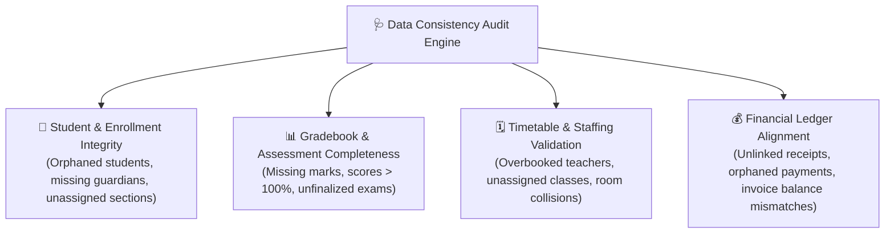

# Data Consistency & Health Audit

Before generating term-end report cards, processing grade promotions, or submitting official regulatory reports, Directors must ensure that school records are 100% complete and free of errors. The **Data Consistency Audit Panel** (`/director/reports/data-consistency`) runs automated health checks across all school datasets to detect anomalies, missing marks, and orphaned profiles.

---

## The 4 Key Audit Domains

---

## Running an Automated System Audit

1. In the Director navigation menu, click **Reports** > **Data Consistency**.
2. Click the **Run Full System Audit** button.
3. The engine performs real-time queries across your school's database and displays a categorized health scorecard:
   - 🟢 **Healthy (0 issues)**: Dataset is complete and verified.
   - 🟡 **Warning**: Minor non-blocking data gaps (e.g. 3 students missing guardian phone numbers).
   - 🔴 **Critical Issue**: Blocker items requiring resolution before term closing (e.g. 12 students missing Final Exam scores in Grade 11 Physics).

---

## Common Anomalies & One-Click Fixes

| Detected Issue | Risk Impact | Recommended Resolution |
| :--- | :--- | :--- |
| **Orphaned Student Record** | Student is active but not enrolled in any class section for the current academic year | Click **Assign Section** to assign the student to their designated classroom. |
| **Unentered Assessment Score** | Teacher marked student present but left exam or quiz score blank | Click **Notify Teacher** to send an urgent reminder alert directly to the teacher's dashboard. |
| **Duplicate Student Admission** | Identical student registered twice with conflicting ID numbers | Click **Merge Profiles** to consolidate attendance and payment history into one canonical record. |
| **Teacher Schedule Collision** | Same teacher assigned to two different sections during Period 3 on Tuesday | Click **Open Timetable** to reassign one period slot to an available teacher. |

---

## Term-End Sign-Off Checklist

Before locking term records and publishing official report cards, verify that all four audit items read **100% Resolved**:

- [ ] All student profiles have an active grade and section assignment.
- [ ] 100% of continuous assessment marks and final exam scores have been entered and submitted by subject teachers.
- [ ] School attendance logs are reconciled with zero unexcused pending absence flags.
- [ ] All cash and digital fee receipts have been balanced with invoice ledgers.

---

## Next Steps

- [PTA Parent Presentation Generator](/director/parent-presentation) — Present verified term statistics to families
- [Director Reports & Analytics](/director/reports-analytics) — View consolidated academic performance
- [Promotion Processing Workflow](/registrar/promotion) — Advance students to the next grade level
