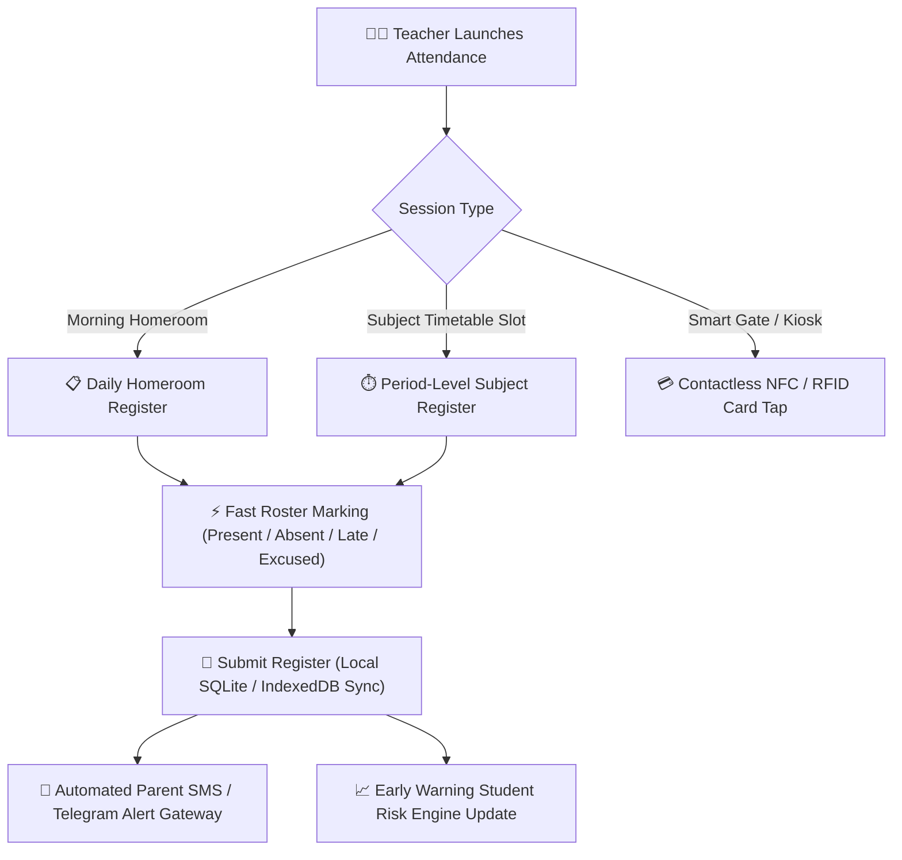
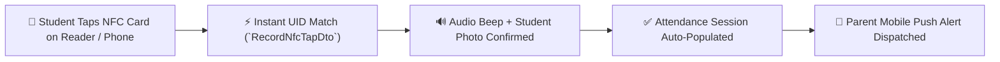

# Classroom Attendance Marking (Online, Offline & NFC Tap)

The **YeneSchool Attendance Module** (`AttendanceSession`, `AttendanceRecord`, `attendance-nfc.service.ts`) is designed for maximum speed and rock-solid reliability. Teachers can take roll-call for 40+ students in under 30 seconds via web, mobile app, or contactless NFC smart card taps—with full offline persistence.

---

## 1. Daily Homeroom vs. Period-Level Subject Attendance

YeneSchool supports two attendance tracking modes configured by the school director:

1. **Daily Homeroom Attendance**:
   - Conducted once every morning by the assigned homeroom class teacher (`ClassHomeroom`).
   - Serves as the primary official legal attendance record for Ministry of Education compliance, end-of-term report cards, and daily parent absence notifications.
2. **Period-Level Subject Attendance (`timetableSlotId`)**:
   - Conducted at the start of each individual subject period (e.g., *Period 3: Grade 10B Chemistry*).
   - Prevents classroom skipping, tracks student engagement per subject, and feeds into the Teacher Leaderboard punctuality index.

---

## 2. Standard Roster Marking Workflow

### Step-by-Step Instructions
1. Log in to the **Teacher Portal** on your laptop, tablet, or smartphone.
2. Click **Take Attendance Today** on your dashboard or navigate to **Attendance > Mark Attendance**.
3. Select the **Class & Section** (or tap your active schedule period).
4. The system opens the student roster with all students defaulting to **Present (P)** for high-speed marking:

| Attendance Status Code | Status Designation | Operational Behavior & System Actions |
| :--- | :--- | :--- |
| **`PRESENT` (Green P)** | Present on Time | Student is marked in class. Standard baseline. |
| **`ABSENT` (Red A)** | Unexcused Absence | Dispatches an automated instant SMS / Telegram alert to the parent. Increments the student's monthly absence counter. |
| **`LATE` (Yellow L)** | Tardy Arrival | Prompts for arrival time or minutes late. If marked past `ATTENDANCE_CUTOFF_TIME` (e.g., 08:15 AM), late rules apply. 3 lates convert to 1 penalty mark. |
| **`EXCUSED` (Blue E)** | Excused Absence | Used for verified medical leaves, family bereavement, or school sports representation. Does not penalize promotion attendance score. |
| **`HALF_DAY` (Purple H)** | Half-Day Attendance | For students who left campus early with an approved dispensary pass. |

5. Add optional **Remarks / Reason Notes** for absent or tardy students.
6. Click **Submit Attendance Register**.

---

## 3. Contactless NFC & RFID Smart Card Tap Attendance

Schools equipped with RFID/NFC student ID cards can utilize automated contactless check-in:

### How NFC Tap Works
1. When a student enters the classroom or school gate, they tap their smart card against the teacher's NFC-enabled smartphone or classroom USB reader.
2. The endpoint `POST /attendance/nfc/tap` verifies the card UID (`cardUid`) and records the exact microsecond timestamp.
3. The teacher's screen flashes green with the student's verified photo.
4. Any student who hasn't tapped by `ATTENDANCE_CUTOFF_TIME` is automatically flagged as absent.

---

## 4. Offline Attendance & PWA Synchronization

If the school's internet connectivity or electricity drops:

1. Continue taking attendance on your mobile app or laptop web browser without interruption.
2. An amber **Offline Caching** indicator appears in the navbar.
3. Records are encrypted and queued inside the device's local **SQLite / IndexedDB Database** with immutable transaction timestamps.
4. The moment internet connectivity is restored, the background worker automatically flushes the queue (`POST /sync/batch`), syncing all registers with zero data loss.

---

## 5. Attendance Locking Policies & Supervisor Overrides

To maintain data integrity and prevent retroactive manipulation:
- **`ATTENDANCE_DAILY_LOCK_TIME`** (e.g., *17:00 / 5:00 PM*): Daily attendance registers automatically lock at the end of the school day.
- **`ATTENDANCE_EDIT_WINDOW_DAYS`** (e.g., *3 Days*): Teachers have up to 3 days to modify attendance records (e.g., updating an *Absent* to *Excused Medical* upon receiving a doctor's slip).
- After the edit window closes, any retrospective modification requires **Supervisor or Director Authorization** with an audit log reason code.

---

## Next Steps

- [Teacher Mobile Experience](/mobile/teacher-mobile) — Marking roll-call via mobile app
- [QR Code & Barcode Gate Scanning](/mobile/qr-attendance) — Scanning student ID cards at campus entry gates
- [Early Warning Student Risk Dashboard](/director/student-risk) — Monitoring chronic absenteeism patterns
- [Parent Attendance Monitoring](/parent/attendance) — How parents view student attendance history
