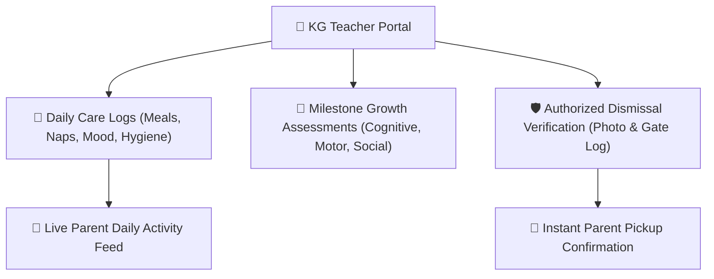
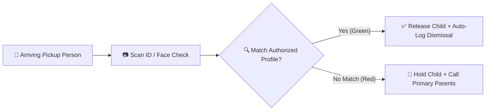

# Early Childhood & Kindergarten (KG) Care

The **YeneSchool Early Childhood Education (ECE) Module** is specifically designed for Nursery, KG-1, KG-2, and KG-3 classrooms. It moves beyond standard grading to provide holistic care tracking, developmental milestone assessments, and stringent guardian dismissal security.

---

## 1. Daily Care Logs (Routines & Activities)

KG teachers record daily physical and emotional routines so parents can monitor their young children with peace of mind.

### Recording Daily Care Entries
1. Navigate to **Teacher Portal > Kindergarten > Daily Care Log**.
2. Select your KG section (e.g., *KG-2 Sunshine Section*).
3. The roster displays each child with quick-tap status widgets:

| Activity Category | Options / Metrics Tracked | Impact for Parents |
| :--- | :--- | :--- |
| **Meal & Snack Intake** | `Finished All`, `Ate Half`, `Ate Very Little`, `Refused Food` | Alerts parents if the child didn't eat lunch or finish water. |
| **Nap & Rest Time** | Start Time, End Time, Sleep Quality (`Sound Sleep`, `Restless`, `Did Not Sleep`) | Helps parents manage evening bedtime schedules. |
| **Mood & Social Behavior**| `Happy & Energetic`, `Calm`, `Fussy / Crying`, `Tired`, `Needs Extra Cuddles` | Insights into emotional wellbeing and peer socialization. |
| **Hygiene & Potty** | Diaper Change Count, Potty Training Attempts, Accident Notes | Essential for toddler and nursery stage tracking. |
| **Medication Administered**| Time, Dosage, Medicine Name (e.g., *Asthma Inhaler at 11:30 AM*) | Validates that teacher followed parent prescription instructions. |

4. Tap **Broadcast Daily Log**. Parents instantly receive a summary card in their mobile feed.

---

## 2. Developmental Milestone Assessments

Unlike primary grades evaluated by percentage marks, kindergarten progress is measured across developmental domains.

### How to Evaluate Milestones
1. Go to **Kindergarten > Milestone Assessments**.
2. Select the **Term** and **Developmental Domain**:
   - **Gross & Fine Motor Skills**: Holding a pencil, cutting with child scissors, hopping on one foot, stacking blocks.
   - **Language & Literacy**: Recognizing letters of the alphabet/Fidel, storytelling, following two-step verbal directions.
   - **Cognitive & Mathematical**: Counting objects up to 20, sorting by color/shape, identifying patterns.
   - **Social & Emotional Growth**: Sharing toys, expressing emotions verbally, resolving conflicts with peers.
3. Mark each student's competency level:
   - `Emerging (Beginning to explore)`
   - `Developing (Shows progress with teacher guidance)`
   - `Proficient / Mastered (Demonstrates independently and consistently)`
4. Add teacher qualitative observations and attach photo evidence of classroom craftwork.
5. Generate the official **Early Childhood Developmental Progress Report Card**.

---

## 3. Authorized Guardian Pickup & Dismissal Security

Young children require strict handover security during afternoon dismissal to prevent unauthorized departures.

### Dismissal Handover Protocol
1. In the mobile app or classroom tablet, tap **Kindergarten > Dismissal**.
2. When a parent, driver, or relative arrives at the classroom door:
   - Search the child's name.
   - The screen shows the verified photos and legal full names of all **Authorized Pickup Persons** (`KgAuthorizedPickup`) registered by the parents.
3. Tap **Verify & Release** next to the matching person (e.g., *Aunt Bethlehem Kebede*).
4. The system logs an immutable dismissal timestamp (`KgDismissalLog`) and dispatches an instant SMS / push alert to both primary parents:
   > *"Selam! Liya Usman has been safely picked up by Bethlehem Kebede at 03:18 PM."*

---

## Next Steps

- [Curriculum & Textbook Chapters](/teacher/curriculum-syllabus) — Mapping lesson plans to textbook units
- [Lessons & Homework Assignments](/teacher/lessons-assignments) — Uploading study materials and exercises
- [Parent Mobile Experience](/mobile/parent-mobile) — How parents view KG daily activity feeds
