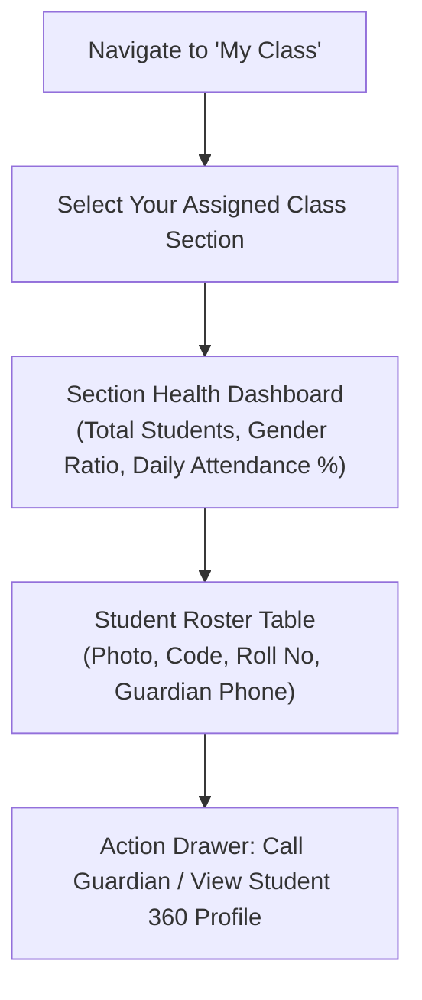

# Homeroom & Class Teacher Workspace

In addition to subject instruction, designated **Homeroom Teachers** (Class Teachers) carry pastoral and administrative oversight for their assigned section (e.g. *Grade 9B* or *Grade 11 Natural Science*). The **My Class Workspace** (`/teacher/my-class`) provides a unified command center to monitor student well-being, attendance health, academic progress, and family communications.

---

## Key Homeroom Capabilities

::u-page-grid
:::u-page-card
---
title: Section Roster & Profiles
icon: i-lucide-contact
---
Instant access to all enrolled students in your section with roll numbers, gender distribution, and emergency guardian phone contacts.
:::

:::u-page-card
---
title: Attendance Health Monitor
icon: i-lucide-calendar-check-2
---
Real-time section attendance tracking, identifying students with chronic unexcused absences before they trigger early warning risk flags.
:::

:::u-page-card
---
title: Academic Leaderboard & Remarks
icon: i-lucide-award
---
Section rankings, subject mastery summaries, and entering official end-of-term homeroom teacher remarks on report cards.
:::
::

---

## Step-by-Step: Managing Your Assigned Section

### 1. Navigating to the Section Command Center
1. In the Teacher sidebar menu, click **My Class**.
2. If assigned to multiple sections, choose your target section from the class cards.
3. The dashboard opens with vital section KPIs:
   - **Total Enrollment**: Active boys and girls in your classroom.
   - **Today's Attendance**: Present, Absent, and Late count for the morning roll call.
   - **Academic Health**: Section average GPA across all subjects.

### 2. Contacting Guardians Quickly
When a student is absent or requires behavioral attention:
1. In the student roster table, locate the student.
2. The **Parent Phone** column displays verified guardian phone numbers.
3. Click the **Call (Phone icon)** or **Message** button to open the in-app communication book directly with the family.

### 3. Entering Homeroom Teacher Term Remarks
At the conclusion of each term or quarter:
1. Go to the **Report Card Remarks** tab within the workspace.
2. Select the student row.
3. Choose a standardized pedagogical evaluation phrase (e.g., *"Demonstrates exceptional curiosity and respectful peer collaboration"* or *"Shows promising effort in analytical subjects; encouraged to improve homework punctuality"*).
4. Or write personalized qualitative remarks for the student's official printed transcript.
5. Click **Save Remarks**.

---

## Homeroom vs. Subject Teacher Responsibilities

| Workflow | Subject Teacher | Homeroom (Class) Teacher |
| :--- | :---: | :---: |
| **Mark Subject Attendance** | ✅ | ✅ |
| **Enter Subject Quiz & Exam Scores** | ✅ | ✅ |
| **View Full Section GPA & Class Ranking** | ❌ (Own subject only) | ✅ (Entire section across all subjects) |
| **Authorize Morning Absence Excuses** | ❌ | ✅ |
| **Enter Final Report Card Conduct Remarks** | ❌ | ✅ |
| **Host Parent-Teacher Conferences** | Optional | ✅ (Lead organizer) |

---

## Next Steps

- [Attendance Marking Guide](/teacher/attendance-marking) — Daily roll-call workflow and offline marking
- [Gradebook & Mark Entry](/teacher/gradebook-entry) — Enter continuous assessments and exam marks
- [Student Risk Analytics](/teacher/risk-analytics) — Review early warning indicators for at-risk students
