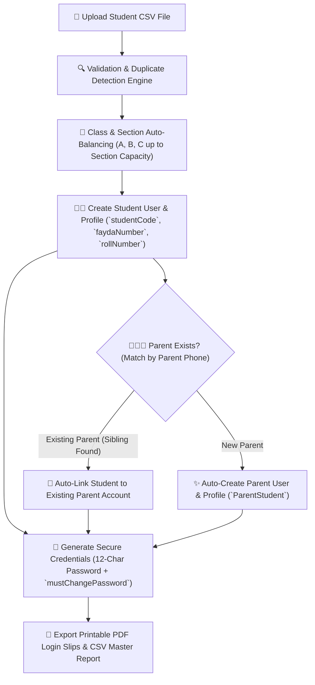

# Bulk Import & Student/Parent Auto-Provisioning

The **YeneSchool Bulk Import Engine** (`BulkStudentImportService`, `BulkStaffImportService`, `BulkCredentialService`) enables registrars and directors to enroll entire grade cohorts, assign classes and sections, generate dual student/parent user accounts, and link siblings in a single atomic operation.

---

## 1. Student Bulk CSV Template & Column Specifications

Download the official template from **Registrar > Bulk Upload > Students (Auto)**. The CSV structure supports full Ethiopian naming and parent demographics:

| Column Header | Required | Valid Formats / Examples | Operational Engine Behavior |
| :--- | :---: | :--- | :--- |
| `first_name` | **Yes** | *Abebe*, *Bethlehem* | Student given first name. |
| `middle_name` | **Yes** | *Tesfaye*, *Kebede* | Father's name (standard Ethiopian middle name). |
| `last_name` | No | *Assefa*, *Tadesse* | Grandfather's name. |
| `fan` | **Yes** | `100000000001` (12 Digits) | National Digital ID (Fayda Identification Number). Enforces uniqueness. |
| `phone` | **Yes** | `0911223344` or `+251911223344` | Student contact phone (normalized to standard Ethiopian format). |
| `gender` | **Yes** | `MALE` or `FEMALE` | Demographic reporting and hostel/sports grouping. |
| `current_class` | **Yes** | `Grade 9`, `Grade 10`, `KG 2` | Must fall within school's configured grade range (`grade_system`). |
| `section` | No | `A`, `B`, `C` | Optional preferred section. If omitted, the engine auto-assigns. |
| `stream` | (Grades 11–12) | `NATURAL` or `SOCIAL` | Academic stream allocation for preparatory secondary levels. |
| `parent_name` | **Yes** | *Tesfaye Assefa* | Primary guardian's full legal name. |
| `parent_phone` | **Yes** | `0933445566` | Guardian mobile number used for SMS alerts and parent portal login. |
| `relation` | No | `Father`, `Mother`, `Guardian` | Relationship recorded in `ParentStudent` linkage. |
| `mother_name` | No | *Almaz Haile* | Recorded for Ministry of Education student dossiers. |

---

## 2. Automatic Section Assignment & Capacity Balancing

When records are imported, the engine handles section placement automatically:

1. **Explicit Section Assignment**: If a student row specifies `section: B`, the engine checks whether Section B exists in that grade. If Section B is below `DEFAULT_SECTION_CAPACITY` (e.g., 40 seats), the student is placed in Section B.
2. **Auto-Balancing Across Sections**: If `section` is left blank, the engine sorts students alphabetically by full name and distributes them evenly across sections `A`, `B`, and `C`, ensuring balanced class sizes.
3. **Roll Number & Room Number Generation**:
   - The engine automatically calculates the student's alphabetical roll number (`rollNumber`, e.g., `1`, `2`, `3...`) within their assigned section.
   - Automatically assigns classroom room numbers based on `ROOM_NAMING_CONVENTION`.

---

## 3. Dual Account Creation & Sibling Auto-Linking

One of YeneSchool's most powerful features is its **intelligent parent deduplication engine**:

- **New Parent Workflow**: If the `parent_phone` does not exist in the school database, the system automatically creates a new `User` with `Role.PARENT`, provisions a `ParentProfile`, and links the student.
- **Sibling Auto-Linking (Zero Duplicate Accounts)**: If a parent already has an elder child enrolled in Grade 9, and you import a younger sibling into Grade 4 with the same `parent_phone`:
  - The system detects the existing parent record.
  - It **links the new student to the existing parent profile** without generating duplicate login credentials.
  - The parent immediately sees both children in their mobile app child switcher.

---

## 4. Bulk Credential Generation & Printable Slips

For every newly created user (both student and parent):

1. **Unique Admission Codes**: Generates formal institutional usernames (e.g., `STU-2024-0142` and `PAR-2024-0089`).
2. **High-Entropy Temporary Passwords**: Generates secure 12-character passwords hashed with bcrypt.
3. **First-Login Security Guard**: Sets `mustChangePassword: true`, requiring users to create a private password upon first sign-in.
4. **Export Printable Login Slips**:
   - Click **Download Credentials PDF** to print personalized login cards for orientation day.
   - Click **Download Master CSV Report** for administrative audit records.

---

## 5. Staff Bulk Upload (`staffbulk.csv`)

In addition to students, registrars and directors can bulk-import teachers and administrative staff:

### Staff CSV Columns
- `full_name`: Full legal name.
- `email`: Official school email address.
- `phone`: Mobile phone number.
- `role`: `teacher`, `finance`, `registrar`, or `supervisor`.
- `teaching_subject`: E.g., `Mathematics`, `English`, `Physics`.
- `teaching_classes`: E.g., `Grade 9, Grade 10`.

When imported, the engine auto-creates the staff account, assigns user roles, and automatically establishes `TeacherSubjectAssignment` links for all specified classes.

---

## Next Steps

- [Student Profile Management](/registrar/student-management) — Search, filter, and edit individual student records
- [Printable Student ID Cards](/registrar/id-cards) — Generate barcode badges for newly imported students
- [Classes & Sections Structure](/academic/classes-sections) — View updated class rosters and section counts
