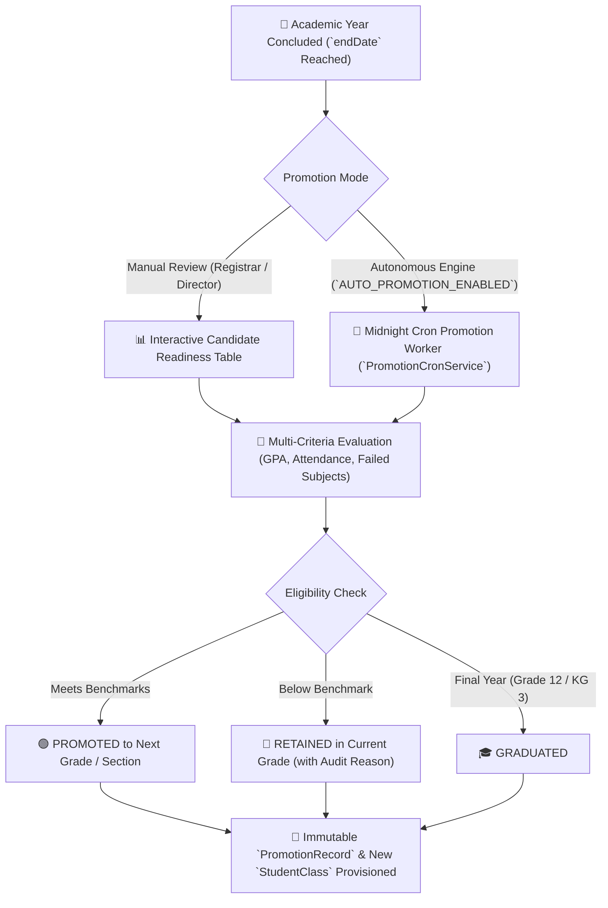
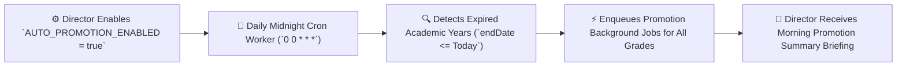

# End-of-Year Grade Promotion (Manual & Autonomous AI)

At the conclusion of an academic year, schools must advance eligible students to the next grade level, hold back students requiring remediation, and graduate final-year cohorts (`PromotionRecord`, `PromotionCandidatesService`, `PromotionCronService`). YeneSchool provides both an **interactive manual review dashboard** and a **fully autonomous midnight auto-promotion engine**.

---

## 1. Multi-Criteria Promotion Policy

The promotion engine evaluates final published report cards (`ReportCardStatus.PUBLISHED`) against three institutional thresholds configured in **Director > School Settings**:

| Policy Parameter | Setting Key | Typical Institutional Standard | Operational Behavior |
| :--- | :--- | :--- | :--- |
| **Minimum Average Score** | `PROMOTION_MIN_AVERAGE_GRADE` | `50%` or `60%` | Minimum cumulative percentage across all subjects required to advance. |
| **Minimum Attendance Rate** | `PROMOTION_MIN_ATTENDANCE` | `80%` or `85%` | Prevents promotion of chronically absent students regardless of exam marks. |
| **Allowable Failed Subjects** | `PROMOTION_ALLOW_FAILED_SUBJECTS` | `0` or `1` Non-Core Subject | Students failing more than the allowed count are flagged for retention or summer remedial. |

---

## 2. Interactive Manual Promotion Review Workflow

Registrars and Directors can review candidates class by class before finalizing decisions:

### Step 1 — Load Candidate Class
1. Navigate to **Registrar > Grade Promotion** (or **Director > Promotion**).
2. Select the **From Academic Year** (the ending year) and **Target Class** (e.g., *Grade 9A*).
3. Select the **To Academic Year** (the upcoming new session).
4. Click **Load Candidates**.

### Step 2 — Review Status & AI Stream Recommendations
The candidate table displays students sorted alphabetically and by class roll number:

- **`PROMOTED (Green)`**: Student meets all GPA, attendance, and failed-subject criteria.
- **`NEEDS_REVIEW / RETAINED (Amber/Red)`**: Fails one or more benchmarks (hovering shows exact reasons, e.g., *"Math score 42% (below 50%)"* or *"Attendance 74% (below 80%)"*).
- **`GRADUATED (Purple)`**: For terminal grade cohorts (e.g., Grade 12 or Nursery/KG).
- **AI Academic Stream Recommendation (Grade 10 to 11 Transition)**:
  - For Grade 10 students advancing to preparatory high school, the AI analyzes historical performance in STEM vs. Humanities subjects and automatically suggests `NATURAL SCIENCE` or `SOCIAL SCIENCE`.

### Step 3 — Manual Overrides & Bulk Execution
1. For flagged students, administrators can apply discretionary board waivers:
   - Click **Promote with Waiver** and enter a mandatory audit remark (e.g., *"Promoted per Academic Committee review following verified medical leave"*).
2. Click **Execute Bulk Promotion**.
3. The BullMQ background queue processes the cohort, creates new `StudentClass` records for the new academic year, advances `StudentProfile.className`, and logs every transition in `PromotionRecord`.

---

## 3. Autonomous Midnight Auto-Promotion Engine

For institutions that prefer zero administrative friction at year-end, YeneSchool includes a fully autonomous cron worker:

### How Auto-Promotion Works
1. In **Director > School Settings > Academic Policies**, toggle **Auto-Promotion Engine** to `Enabled`.
2. Every night at midnight, the worker scans for academic sessions whose official `endDate` has elapsed.
3. For any class that hasn't been manually processed, the engine evaluates all students against the official promotion criteria:
   - Eligible students are automatically moved to the next grade level for the new session.
   - Ineligible students are retained in their current grade.
   - Graduating classes are marked `GRADUATED`.
4. The Director receives a consolidated morning notification summary with full student counts.

---

## 4. Promotion Audit Records & Student History

Every promotion or retention action is stored in the student's permanent transcript record:
- **From / To Academic Year**: E.g., `2016 E.C.` to `2017 E.C.`.
- **From / To Class & Section**: E.g., `Grade 9A` to `Grade 10A`.
- **Decision Status**: `PROMOTED`, `RETAINED`, `GRADUATED`.
- **Operator Attribution**: Recorded as `System (Auto-Promotion)` or the specific Registrar's username.

---

## Next Steps

- [Student Profile Management](/registrar/student-management) — Viewing multi-year student academic history
- [Terminal Report Cards](/registrar/report-cards) — Publishing final report cards before promotion
- [Academic Years & Terms Setup](/academic/academic-years) — Initializing the new academic year session
