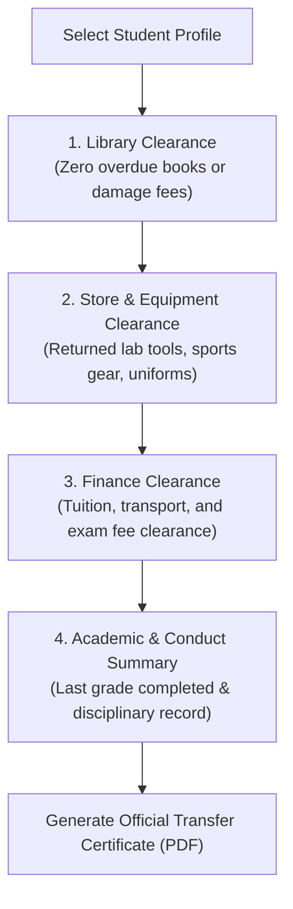

# School-Leaving Clearance & Transfer Certificates

When a student transfers to another institution or completes their final grade, schools must ensure all institutional obligations are met before releasing academic records. The **School-Leaving Clearance Workflow** (`/registrar/school-leaving`) digitizes the end-to-end clearance process, coordinates sign-offs across departments, and generates official, tamper-evident Transfer Certificates (TC).

---

## The 4-Department Clearance Pipeline

---

## Step-by-Step: Processing School-Leaving Clearance

### 1. Locate the Student Record
1. In the Registrar navigation menu, click **School Leaving**.
2. Search for the student by **Name**, **Student ID / Code**, or **Class Section**.
3. Select the student to open the **Clearance Inspection Panel**.

### 2. Departmental Clearances

| Clearance Check | Responsible Role | Verification Method |
| :--- | :--- | :--- |
| **📚 Library Clearance** | Librarian / Registrar | Confirms all borrowed library books are checked in and any replacement fines are settled. |
| **🎒 Store & Assets** | Storekeeper | Verifies return of laboratory kits, athletic uniforms, lockers, or musical instruments. |
| **💰 Finance Clearance** | Finance Officer | Confirms zero outstanding balance on tuition fees, bus transport, and meal plans. |
| **⚖️ Conduct & Standing** | Director / Homeroom | Verifies behavioral standing (*Good*, *Satisfactory*, *Exemplary*) and eligibility to continue education. |

---

## Step-by-Step: Generating the Transfer Certificate (TC)

Once all clearance flags display **Approved (Green)**:

1. Scroll to the **Issue Certificate Form**:
   - **Issue Date & Leaving Date**: Select dates in either Ethiopian Calendar (E.C.) or Gregorian (G.C.).
   - **Reason for Leaving**: Select standard reason (*Transfer to another school*, *Family relocation*, *Graduation*, *Other*).
   - **Destination School & Region**: Enter the destination institution name and regional administrative zone (e.g. *Addis Ababa*, *Oromia*, *Sidama*).
   - **Last Grade Completed**: Specify final completed grade (e.g. *Grade 8* or *Grade 10*).
   - **Conduct Rating**: Select conduct status (*Good*, *Very Good*, *Satisfactory*).
   - **Attendance Standing**: Select cumulative attendance rating (*Satisfactory*, *High Punctuality*).
   - **General Remarks**: Enter optional character references or special academic honors.
2. Click **Save Clearance Record**.
3. Click **Print Official Certificate**.

---

## Tamper-Evident Security Features

Each generated Transfer Certificate includes:

- **Verification QR Code**: Scannable by destination school admissions officers to verify authenticity against the YeneSchool national registry.
- **Unique Clearance Serial Number**: Recorded permanently in the school's audit log to prevent duplicate issuance.
- **Official Crest & Watermark**: Formatted using the school's custom template settings.
- **Director & Registrar Signature Blocks**: Dedicated fields for legal sign-off and official rubber stamp.

---

## Next Steps

- [Student Management Directory](/registrar/student-management) — Search and edit student profile details
- [Custom Certificate Template Builder](/registrar/certificate-templates) — Customize certificate layout and watermark
- [Data Consistency & Health Audit](/director/data-consistency) — Audit student records before term closing
