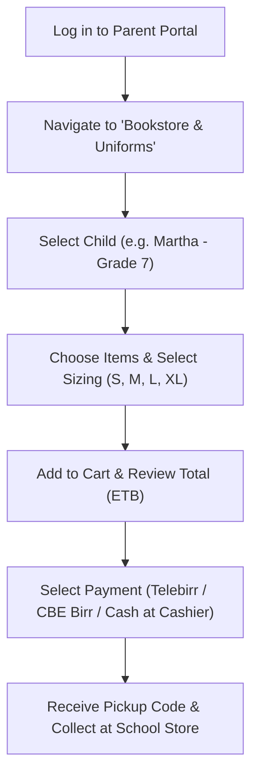

# School Bookstore & Uniform Orders

Parents can purchase official school uniforms, academic textbooks, stationery packs, and physical education equipment directly from the **Parent Portal Bookstore** (`/parent/store`). This digital storefront eliminates long queues on campus during the start-of-year rush and ensures students receive the exact approved school materials.

---

## What Parents Can Purchase

::u-page-grid
:::u-page-card
---
title: School Uniforms
icon: i-lucide-shirt
---
Official school blazers, sweaters, polo shirts, trousers, skirts, neckties, and PE athletic sportswear sorted by grade level and child size.
:::

:::u-page-card
---
title: Curriculum Textbooks
icon: i-lucide-book
---
Approved Ethiopian Ministry of Education curriculum textbooks, student workbooks, and supplementary reference materials.
:::

:::u-page-card
---
title: Stationery Bundles
icon: i-lucide-package
---
Standardized exercise books, mathematical geometry sets, scientific calculators, and drawing supplies.
:::
::

---

## Step-by-Step: Placing an Order for Your Child

### 1. Select the Target Child
1. Open the left menu and click **Bookstore & Uniforms**.
2. If you have multiple children enrolled in YeneSchool, select the child from the dropdown header. The catalog automatically filters items appropriate for that child's grade level.

### 2. Choose Sizing and Add to Cart
1. Click on a product card (e.g. *Grade 7 Official School Uniform Set*).
2. Choose the required size:
   - **Uniforms**: Select chest, waist, and height sizing (*Size 28, 30, 32* or *S, M, L, XL*). Sizing chart links provide measurement guidelines.
   - **Quantity**: Select how many units (e.g. 2 polo shirts, 1 sweater).
3. Click **Add to Cart**.
4. Repeat for any required textbooks or stationery bundles.

### 3. Complete Checkout & Payment
1. Click the **Shopping Cart** icon at the top right to review your order.
2. Select your preferred payment method:
   - **📱 Telebirr / CBE Birr**: Instant digital payment with instant receipt confirmation.
   - **🏦 Direct Bank Transfer**: Displays school bank accounts (CBE, Awash, Dashen) for uploading deposit slips.
   - **💵 Cash at School Cashier**: Generates an unpaid voucher to settle at the campus finance desk.
3. Click **Confirm Order**.

---

## Order Tracking & Campus Pickup

After placing an order:

1. Go to the **My Orders** tab.
2. Your order displays one of three fulfillment states:
   - 🟡 **Pending Confirmation**: Order received; payment verification underway.
   - 🔵 **Ready for Pickup**: The school storekeeper has packed your child's items.
   - 🟢 **Completed**: Items received and verified.
3. When marked **Ready for Pickup**, bring your digital **Order Confirmation Code** (or show the order screen on your phone) to the school bookstore on campus to collect the packaged materials.

---

## Next Steps

- [Parent Fees & Payments](/parent/fees-payments) — Pay school tuition and view statements
- [Storekeeper Inventory Management](/inventory/school-store) — How staff fulfill and dispatches orders
- [Parent Portal Overview](/parent/overview) — Guide to parent portal features
