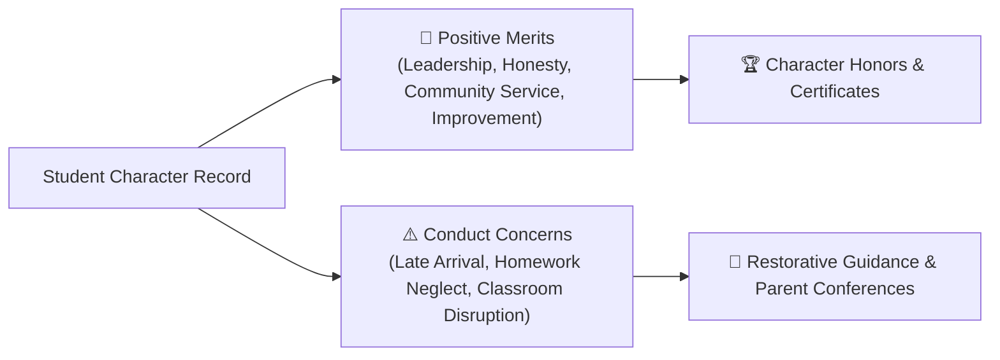

# Behavior, Merit Awards & Pastoral Care

YeneSchool emphasizes holistic student development, balancing academic rigor with positive character education. Through the **Parent Discipline & Pastoral Portal** (`/parent/discipline`), families stay informed about both positive behavioral achievements (Merit Points) and any conduct concerns (Disciplinary Notices), enabling early, collaborative support between home and school.

---

## The Dual Behavioral Model: Merits vs. Demerits

---

## Viewing Your Child's Behavioral Record

1. Log in to the **Parent Portal** or open the **YeneSchool Mobile App**.
2. Select your child and click the **Behavior & Pastoral Care** tab.
3. The dashboard displays:
   - **Cumulative Merit Points**: Total character commendation points awarded by teachers.
   - **Active Notices**: Open incidents or inquiries requiring attention.
   - **Resolved Matters**: Documented outcomes from previous pastoral discussions.

---

## Understanding Incident Severity Levels

When an incident is logged by a teacher or administrator, it is categorized by severity:

| Severity Level | Examples | School Action & Parent Notification |
| :--- | :--- | :--- |
| **🔵 LOW** | Minor dress code slip, forgotten notebook, minor talking in class | Logged for teacher observation. In-app notification to parents. |
| **🟡 MEDIUM** | Repeated unexcused homework omission, disrespect to classmates | Homeroom teacher counseling. Push alert and parent acknowledgment request. |
| **🟠 HIGH** | Skipping class, academic dishonesty, willful school property damage | Parent-teacher phone conference scheduled. Restorative action agreement. |
| **🔴 CRITICAL** | Severe bullying, physical altercation, safety violations | Formal Disciplinary Committee hearing with Director and guardian presence. |

---

## Acknowledging Notices & Scheduling Conferences

When an incident status displays **Requires Parent Acknowledgment**:

1. Click on the incident card to expand details:
   - **Incident Summary**: Exact description logged by the reporting teacher.
   - **Location & Time**: Classroom, laboratory, cafeteria, or playground.
   - **Restorative Guidance Plan**: Recommended supportive steps (e.g. peer mediation or study counseling).
2. Click **Acknowledge & Sign**:
   - Check the digital acknowledgment box.
   - Enter your parent comments or notes for the homeroom teacher.
3. If a conference is requested, click **Select Conference Date** to pick a convenient time slot to meet with the teacher or school counselor in person or via telephone.

---

## Celebrating Character Milestones

When students demonstrate exemplary character:

- **Merit Badges**: Awarded for peer tutoring, environmental club leadership, and perfect punctuality.
- **Official Character Commendations**: Displayed on end-of-term report cards and graduation transcripts.

---

## Next Steps

- [Homeroom Teacher Workspace](/teacher/homeroom-management) — How teachers manage student pastoral care
- [Parent Communication Book](/communication/communication-book) — Message teachers directly regarding your child
- [Parent Portal Overview](/parent/overview) — Guide to all parent portal features
