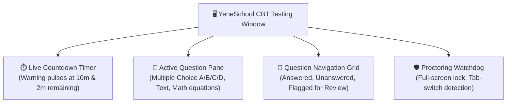

# Computer-Based Testing (CBT) & Exam Proctoring

YeneSchool provides a modern **Computer-Based Testing (CBT)** platform (`/student/online-examination`) for quizzes, mid-term examinations, and national exam mock simulations. The interface is optimized for speed, distraction-free focus, and automatic draft saving, ensuring students never lose exam work even during network drops.

---

## CBT Exam Interface Overview

---

## Step-by-Step: Taking an Online Examination

### 1. Launching the Exam Session
1. Log in to the Student Portal and click **Online Exams**.
2. Locate your scheduled test under **Available Examinations**.
3. Check the exam parameters:
   - **Total Questions & Points**
   - **Allowed Duration** (e.g. *60 Minutes*)
   - **Attempts Permitted** (usually *1 attempt* for official assessments)
4. Click **Start Examination**. Read the honor pledge and click **Enter Full-Screen Mode**.

### 2. Navigating Questions & Answering
- **Select Option**: Click on your chosen answer (**A, B, C, or D**). The option highlights in primary color.
- **Flag for Review (Flag icon)**: If unsure about a question, click **Flag**. The question number turns purple in the navigation grid, reminding you to recheck it before submitting.
- **Direct Jump Grid**: Click any number in the **Question Palette** on the right to jump directly to that question.
- **Instant Draft Sync**: Answers are automatically saved in local browser storage on every click. If your computer crashes or internet disconnects, reopen the exam to resume immediately with zero lost progress.

---

## Anti-Cheating & Proctoring Rules

To ensure academic integrity, the CBT platform includes an automated **Exam Integrity Watchdog**:

| Monitored Event | System Action | Penalty / Impact |
| :--- | :--- | :--- |
| **Exiting Full-Screen** | Immediate warning modal prompts student to re-enter full-screen. | Logged in exam integrity audit. |
| **Tab / Window Switching** | System detects focus loss when opening another browser tab or app. | Warning banner (3rd strike auto-locks exam). |
| **Right-Click & Copy-Paste** | Clipboard copy, right-click, and text selection are disabled during the test. | Keystroke blocked automatically. |
| **Time Limit Expiry** | When the countdown reaches `00:00`, the exam freezes instantly. | Automatically submits all currently answered questions. |

---

## Submitting Your Exam & Reviewing Results

1. When finished, click **Review & Submit**.
2. The review drawer displays your summary:
   - 🟢 **Answered**: e.g., 48 of 50 questions
   - 🔴 **Unanswered**: e.g., 0 questions
   - 🟣 **Flagged**: e.g., 2 questions
3. Click **Confirm Final Submission**.
4. For objective tests (Multiple Choice), your score and percentage breakdown are calculated and displayed immediately. If enabled by your teacher, click **Explain with AI** on missed questions to view step-by-step problem-solving explanations.

---

## Next Steps

- [Student Portal Overview](/student/overview) — Guide to all student features
- [Assignments & Homework](/student/assignments) — Submitting homework and projects
- [Student Grades & Transcripts](/student/grades-report-cards) — View your academic performance
