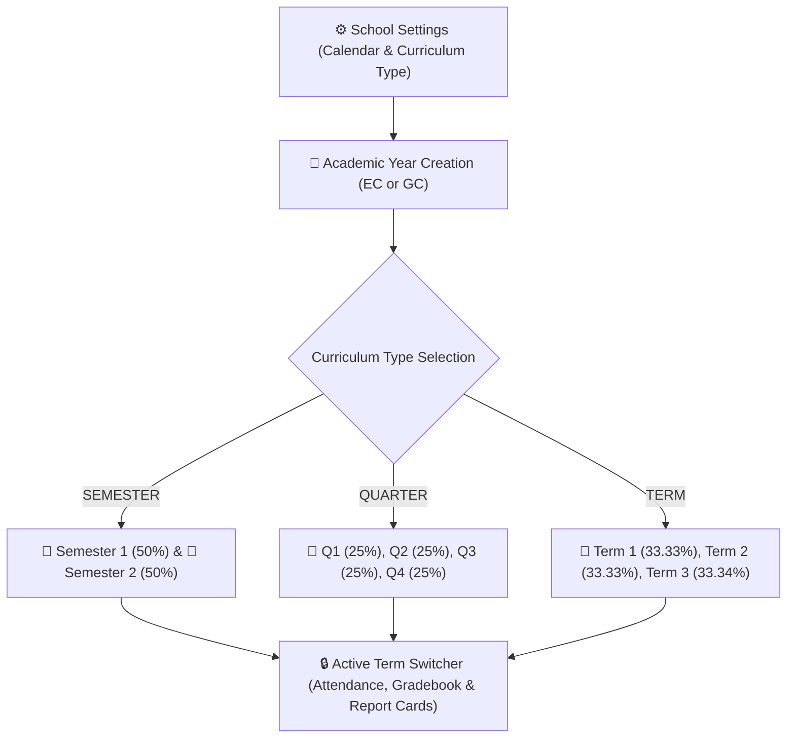

# Academic Years, Calendars & Term Frameworks

The **Academic Year & Term Framework** (`AcademicYear`, `Term`, `buildPeriodDateRanges`) forms the structural foundation of YeneSchool. Every student enrollment, class timetable, attendance roll-call, continuous assessment score, and terminal report card is strictly scoped to an active academic year and term.

---

## 1. Dual Calendar Engine (Ethiopian vs. Gregorian)

YeneSchool natively supports both calendar systems:

| Calendar Engine | Month Cycle | Example School Session | Ministry Alignment |
| :--- | :--- | :--- | :--- |
| **Ethiopian Calendar (`ETHIOPIAN`)** | 13 Months (*Meskerem to Pagume*) | *2017 E.C. (Meskerem 1 – Sene 30)* | Official standard for Ethiopian National Curriculum schools. |
| **Gregorian Calendar (`GREGORIAN`)** | 12 Months (*September to June*) | *2024–2025 G.C.* | Standard for International and Cambridge/IB schools. |

---

## 2. Curriculum Term Structures & Automatic Weightings

When you configure your school's curriculum structure in **Director > School Settings > Academic Configuration**, the platform automatically structures the terms and weight distribution:

### 1. Semester Model (`SEMESTER`)
- **Semester 1**: 50% cumulative grade weight.
- **Semester 2**: 50% cumulative grade weight.
- Ideal for standard secondary high schools and preparatory institutions.

### 2. Quarter Model (`QUARTER`)
- **Quarter 1, Quarter 2, Quarter 3, Quarter 4**: 25% weight per quarter.
- Common in international and specialized primary academies.

### 3. Term / Trimester Model (`TERM`)
- **Term 1** (33.33%), **Term 2** (33.33%), **Term 3** (33.34%).
- Standard for three-term primary and middle schools.

---

## 3. Creating & Managing Academic Years

### Step-by-Step Creation
1. Navigate to **Academic Management > Academic Years** (or **Director > Academic Years**).
2. Click **+ Create Academic Year**.
3. Fill in the parameters:
   - **Academic Year Name**: E.g., `2017 E.C.` or `2024/2025`.
   - **Calendar System**: Select `Ethiopian Calendar` or `Gregorian Calendar`.
   - **Start Date & End Date**: Official first and last operating dates.
   - **Active Session Flag**: Toggle to `Active` to make this the primary operating year.
4. Click **Generate Terms**:
   - The platform calculates start and end dates for each term based on your school's `curriculum_type`.
5. Click **Save Academic Year**.

---

## 4. Term Lifecycle & Historical Archiving

| Term Status | System Operational Behavior |
| :--- | :--- |
| **`ACTIVE`** | The current operational session. Teachers mark attendance, enter continuous assessments, and assign homework. |
| **`UPCOMING`** | Future terms. Timetables and exam seating arrangements can be planned in advance. |
| **`CLOSED`** | Concluded terms. All marks and registers are permanently locked and archived for read-only historical transcripts. |

> [!TIP]
> Only one term can be **Active** at any given moment. When a term ends, the Director switches the active term with a single click, instantly unlocking the new term's gradebook registers while preserving previous records.

---

## Next Steps

- [Classes & Sections](/academic/classes-sections) — Auto-generating grade levels and sections
- [Subjects & Lessons](/academic/subjects) — Configuring subject periods and teacher assignments
- [AI Timetable & Auto-Assignment Engine](/operations/timetable-engine) — Generating conflict-free weekly schedules
