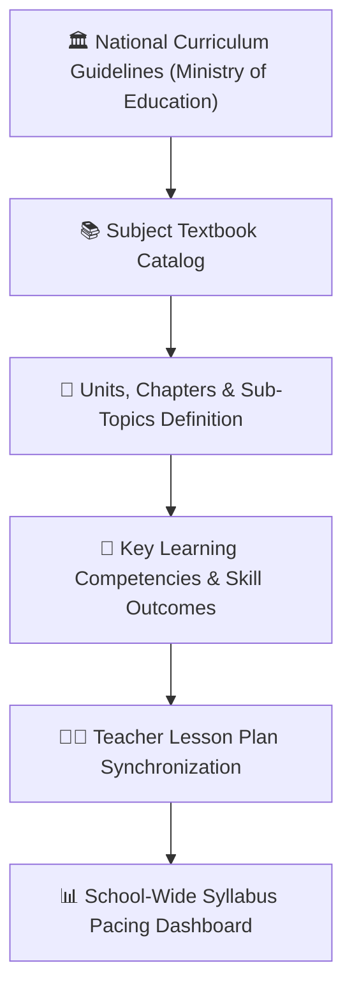

# Curriculum Framework & Textbook Competencies

The **Curriculum Management Module** (`CurriculumTextbook`, `CurriculumTextbookUnit`, `SyllabusMapping`) allows Academic Directors and Heads of Department to organize official national curricula, attach approved textbooks, configure learning competencies, and maintain consistent academic pacing across all sections.

---

## 1. Organizing Textbooks & Units

1. Navigate to **Academic Management > Curriculum > Textbooks**.
2. Click **+ Add Curriculum Textbook**:
   - **Subject & Grade Level**: E.g., *Grade 10 Chemistry*.
   - **Curriculum Edition**: E.g., *New National Curriculum 2024 Edition*.
   - **Total Units / Chapters**: Number of major units in the textbook.
3. For each Unit, define the structured breakdown:
   - **Unit Number & Name**: E.g., *Unit 4: Chemical Bonding & Molecular Structure*.
   - **Allocated Teaching Periods**: Estimated class periods required (e.g., *14 Periods*).
   - **Target Completion Date**: Calendar milestone for finishing the unit before examinations.

---

## 2. Defining Core Learning Competencies

Under each textbook unit, academic leaders can define specific behavioral learning outcomes:
- E.g., *"Students should be able to distinguish between ionic and covalent bonds through laboratory conductivity tests."*
- Teachers can tag these competencies directly when authoring lesson plans and continuous assessment quiz questions.

---

## 3. Departmental Pacing & Quality Audits

Academic supervisors can inspect the **Curriculum Pacing Monitor**:
- Compares each teacher's syllabus progress against the official academic calendar milestone dates.
- Highlights sections lagging behind with amber and red indicators, allowing timely remedial tutorial scheduling before midterm and final examinations.

---

## Next Steps

- [Academic Overview](/academic/academic-overview) — Central academic management dashboard
- [Timetable Management](/academic/timetable) — Weekly period schedules
- [Examinations & Assessments](/exams/exams-assessments) — Scheduling midterms and finals
