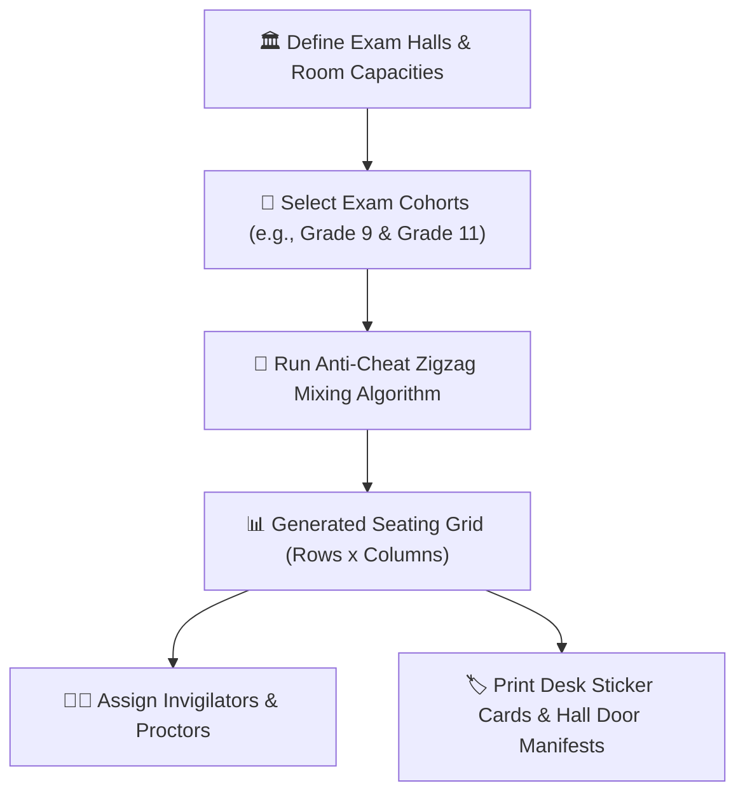

# Exam Seating & Anti-Cheat Hall Generator

Ensuring strict academic integrity during midterm and terminal examinations requires thoughtful desk organization. The **YeneSchool Exam Seating Generator** (`ExamSeatingPlan`, `ExamSectionAssignment`, `ExamSectionStudent`) automatically designs optimal seating plans that interleave students from different grade levels or sections, making unauthorized desk peeking virtually impossible.

---

## 1. Defining Examination Halls & Room Capacities

1. Navigate to **Examinations > Seating Plans > Exam Halls**.
2. Click **+ Add Exam Hall / Room**:
   - **Hall / Room Name**: E.g., *Main Gymnasium*, *Auditorium*, *Block C Room 12*.
   - **Rows & Columns Layout**: E.g., `6 Rows x 5 Columns` (Total: 30 Desks).
   - **Desk Numbering Prefix**: E.g., `GYM-D01` to `GYM-D30`.
   - **Invigilator Count Required**: Number of supervising proctors needed for the hall size (e.g., `2 Invigilators`).
3. Click **Save Hall Layout**.

---

## 2. Generating the Anti-Cheat Zigzag Seating Arrangement

### Steps to Generate Seating
1. Go to **Examinations > Seating Plans > + Generate Plan**.
2. Select the **Examination Session** (e.g., *2nd Term Final Exams — Morning Session*).
3. Select the **Cohorts to Mix**:
   - **Cross-Grade Mixing (Recommended)**: Mixes Grade 9 students sitting for *Biology* with Grade 11 students sitting for *History*. Because adjacent desks are writing completely different subjects, exam cheating is mathematically neutralized.
   - **Cross-Section Mixing**: Interleaves Section 9A students with Section 9B students.
4. Select the **Target Halls** to populate.
5. Click **Generate Anti-Cheat Seating Matrix**.
6. The algorithm computes desk assignments in milliseconds and presents the interactive visual floor plan.

---

## 3. Printing Hall Door Manifests & Desk Labels

To ensure orderly student entry on exam morning:

- **Printable Desk Sticker Cards**: One-click PDF generation of adhesive desk labels containing Student Photo, Full Name, Student ID, Exam Roll Number, and Desk Number.
- **Hall Door Alphabetical Manifest**: Posters placed outside each examination hall so students can quickly find their assigned room and desk without hall congestion.
- **Invigilator Roster & Attendance Sheets**: Proctor sheets allowing invigilators to mark exam room attendance and log any integrity incident reports directly on their mobile device.

---

## Next Steps

- [National & Regional Examination Benchmarking](/exams/national-examinations) — Track standardized leaving exams
- [Online Computer-Based Testing (CBT)](/exams/online-exams-system) — Running digital mock exams with auto-grading
- [Director Exam Seating Overview](/director/exam-seating) — Director administrative perspective on exam seating
