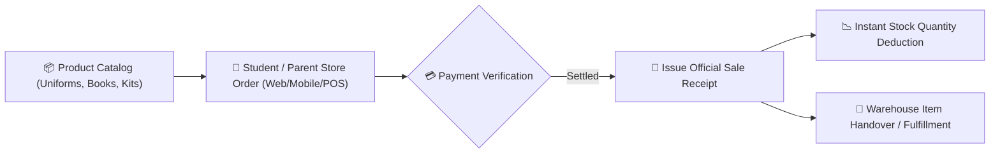

# School Bookstore, Uniforms & Merchandise Sales

The **YeneSchool Bookstore & Retail Module** (`BookstoreProduct`, `BookstoreOrder`, `BookstoreOrderItem`) streamlines the sale and distribution of official school uniforms, physical textbooks, exercise books, laboratory coats, and student stationery packages directly from the school store.

---

## 1. Setting Up Bookstore Products & Sizes

Storekeepers can organize merchandise by category, size variations, and grade level bundles:

### Adding Products to the Catalog
1. Navigate to **Inventory & Store > Bookstore > Products**.
2. Click **+ Add Retail Product**:
   - **Product Name**: E.g., *Official Secondary School Uniform Set (Navy Blue)*, *Grade 9 Textbook Bundle*, *Physics Laboratory Safety Kit*.
   - **Product Category**: `Uniforms & Sportswear`, `Textbooks & Guides`, `Stationery & Exercise Books`, `Lab & Art Supplies`.
   - **Size / Variant Options**: E.g., `Small`, `Medium`, `Large`, `XL`, `XXL` or `Grade 10 Set`.
   - **Selling Price (ETB)**: Unit sale price (e.g., `1,450.00 ETB`).
   - **Current Stock on Hand**: Quantity available in the main storage facility.
   - **Low Stock Alert Level**: Threshold triggering restock warnings (e.g., `< 20 units`).
3. Click **Save Product**.

---

## 2. Processing Student Sales & Point-of-Sale (POS) Checkouts

When a parent or student visits the school store:

1. Go to **Bookstore > POS Checkout**.
2. Scan the student's ID Card barcode (or search student name).
3. Select items and quantities to add to the cart.
4. Select the **Payment Channel**:
   - **Cash at Store Counter**: Cashier collects payment and enters cash tendered.
   - **Charge to Student Billing Account**: Deducts from prepaid balance or adds to the parent's monthly school statement.
   - **Telebirr / CBE Birr QR**: Customer scans digital payment QR at the counter.
5. Click **Complete Sale & Print Receipt**.
6. The system automatically prints a branded POS thermal slip and immediately decrements inventory stock levels in real-time.

---

## 3. Pre-Orders & Term-Start Uniform Distribution

During peak back-to-school registration periods:
- Parents can browse the bookstore catalog on the **Parent Portal / Mobile App** and place pre-orders before the term begins.
- Storekeepers review the **Pre-Order Fulfillment Queue**, pre-package items into named student parcel bags, and execute fast scan-to-handover pickups on orientation day.

---

## Next Steps

- [Inventory Overview](/inventory/overview) — General school asset management
- [Stock In & Stock Out Transactions](/inventory/stock-transactions) — Recording vendor deliveries and departmental usage
- [Finance Payment Receipts](/finance/receipts) — Viewing integrated revenue from bookstore sales
