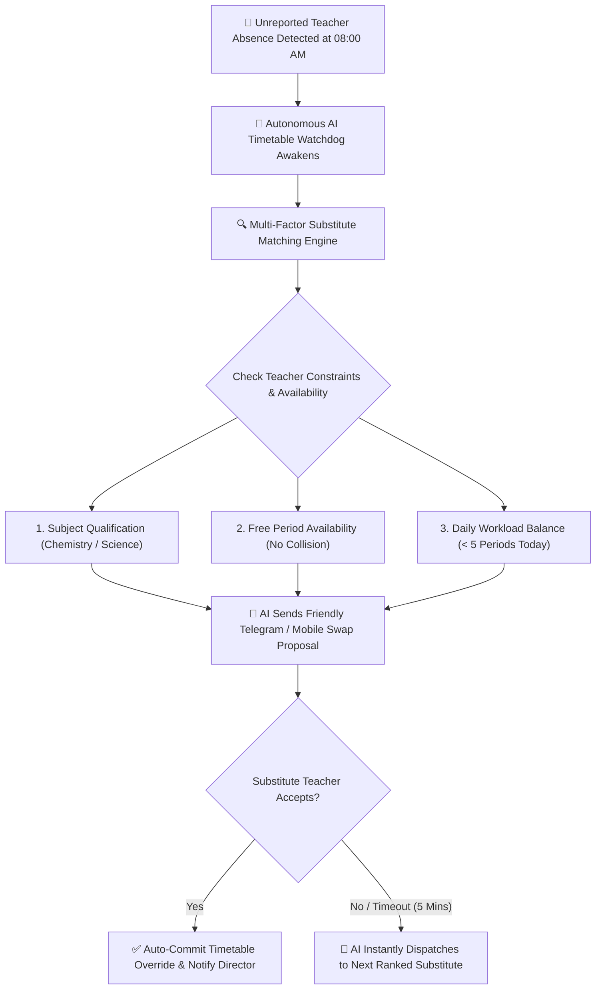

# Autonomous AI Timetable Watchdog & Substitution Engine

Sudden teacher absences due to illness, transport delays, or emergencies often leave classrooms unsupervised and create administrative stress for school administrators. YeneSchool's **Autonomous AI Timetable Watchdog** (`AI_PROACTIVE_TIMETABLE_WATCHDOG`, `ai-timetable.service.ts`) actively monitors staff check-ins in real time and automatically finds, negotiates, and confirms qualified substitutes without administrative panic.



---

## 1. How the Absence Watchdog Works

1. **Absence Trigger**:
   - **Manual Request**: A teacher marks sick leave or personal absence in their mobile portal.
   - **Smart Hardware Trigger**: A teacher has not tapped their RFID/NFC staff card or checked into the biometric terminal by the 08:00 AM morning bell.
2. **Impact Analysis**: The AI instantly pulls the absent teacher's daily schedule (e.g., *Period 2: Grade 10A Physics*, *Period 4: Grade 11B Mathematics*).
3. **Multi-Factor Candidate Ranking**:
   - **Subject Competency**: Teachers certified in the same department or related discipline.
   - **Schedule Availability**: Teachers who have a free prep period during that exact slot.
   - **Workload Fairness**: Prioritizes staff members who have taught fewer periods that week to prevent burnout.

---

## 2. Automated Telegram & App Negotiation

Rather than requiring the Director to manually phone multiple staff members, the AI conducts automated outreach via **Telegram Bot** and **Push Notification**:

```
┌────────────────────────────────────────────────────────────────────────┐
│ 🤖 YeneSchool Timetable Bot                                            │
│ "Hi Teacher Abebe! 👋 Teacher Almaz is on sudden medical leave today.  │
│ Would you be able to cover Grade 10A Physics during Period 2 (09:15)? │
│ You currently have a free period. Replying [Accept] adds 1 sub credit. │
│ [✅ Accept Substitution]      [❌ Decline]                             │
└────────────────────────────────────────────────────────────────────────┘
```

- **Interactive Buttons**: The candidate teacher taps **Accept** or **Decline** directly within Telegram or the mobile app.
- **5-Minute Expiry Window**: If the first candidate does not respond within 5 minutes, the AI politely passes the opportunity to the next highest-ranked available teacher.
- **Instant Timetable Update**: Upon acceptance, the timetable grid updates automatically, notifying classroom monitors and the school director.

---

## 3. Director Oversight & Auto-Approval Controls

In **Director Portal > School Settings > Timetable AI**:
- **Auto-Commit Mode (`AI_TIMETABLE_AUTO_APPROVE = true`)**: The AI finalizes the swap and sends confirmation alerts immediately once a qualified substitute accepts.
- **Director Confirmation Mode (`AI_TIMETABLE_AUTO_APPROVE = false`)**: The AI collects the best willing substitute and presents a 1-click confirmation card on the Director's morning dashboard.

---

## Next Steps in AI Intelligence

- [Teacher Period Swaps & Substitution Guide](/teacher/period-swaps) — How teachers initiate and accept swap proposals
- [Interactive AI Assistant & Copilot](/ai/overview) — Real-time chat assistant and prompt library
- [Autonomous Background Autopilots](/ai/autonomous-autopilot) — Risk detection and daily briefings
- [AI Configuration & Model Settings](/ai/ai-settings) — Setting up API keys and feature switches
