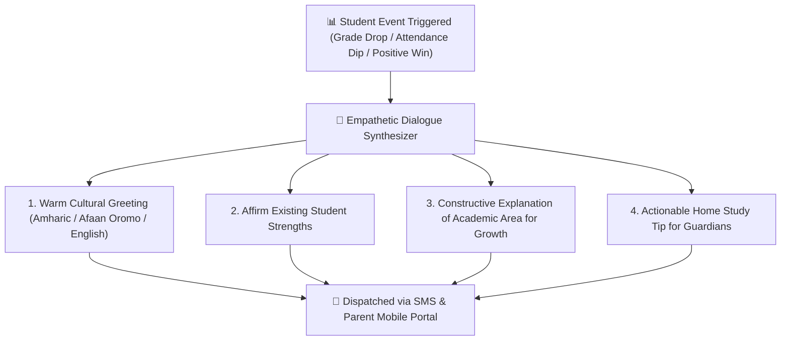

# Autonomous AI Parent Dialogue & Empathetic Engagement

Parental involvement is one of the strongest predictors of student academic success. However, automated school SMS notifications often sound cold, robotic, or alarming. The **YeneSchool Empathetic Parent Dialogue Engine** (`ai-parent-dialogue.service.ts`, `ai-academic-outreach.service.ts`) delivers warm, culturally respectful, multilingual messages that keep families informed, relieve anxiety, and build trust between parents and educators.

---

## 1. Empathetic Communication Principles

When notifying parents about academic struggles or attendance dips, the AI adheres to strict psychological and pedagogical guidelines:

| Traditional Cold Message (Avoided) | YeneSchool Empathetic AI Approach (Delivered) |
| :--- | :--- |
| *"Your son scored 42% on Math Test 2. He is failing."* | *"Greetings Ato Dawit! Bereket showed fantastic effort in Algebra factoring this week. On Tuesday's Geometry quiz, he found triangle proofs tricky (42%). Reviewing textbook pages 45–48 with him for 15 minutes tonight will give him great confidence for Friday's retake!"* |
| *"Your child was absent today without an excuse."* | *"Dear Emaye Tigist, we missed Selam in class today! We hope everything is well at home. Please let us know if she is unwell so her homeroom teacher can share today's biology notes."* |

---

## 2. Parent-Initiated AI Dialogue in the Portal

Parents can also interact with the AI directly within the **Parent Mobile App** or Web Portal:

1. **Homework Explanation in Local Languages**:
   - Parents who may not know English can ask the AI in **Amharic** or **Afaan Oromo** to explain their child's science homework or math assignment.
2. **Medical Excuse Submissions**:
   - Parents can write a quick voice note or short message describing their child's illness. The AI formats a formal absence request and notifies the registrar and homeroom teacher.
3. **Progress Inquiries**:
   - Parents can ask: *"How is Natnael doing in Chemistry compared to last month?"* The AI provides an encouraging, data-backed summary.

---

## 3. Privacy & Teacher Guardrails

- **Zero Unauthorized Data Sharing**: The AI only references records belonging specifically to the authenticated parent's registered children.
- **Teacher Approval Mode**: Teachers can choose to preview and approve AI-generated outreach messages before they are broadcast to parents.

---

## Next Steps in AI Intelligence

- [Parent Dashboard & Child Monitoring Guide](/parent/overview) — How parents view student attendance and grades
- [Interactive AI Assistant & Copilot](/ai/overview) — Real-time chat assistant and prompt library
- [Autonomous Background Autopilots](/ai/autonomous-autopilot) — Risk detection and daily briefings
- [AI Configuration & Model Settings](/ai/ai-settings) — Setting up API keys and provider models
