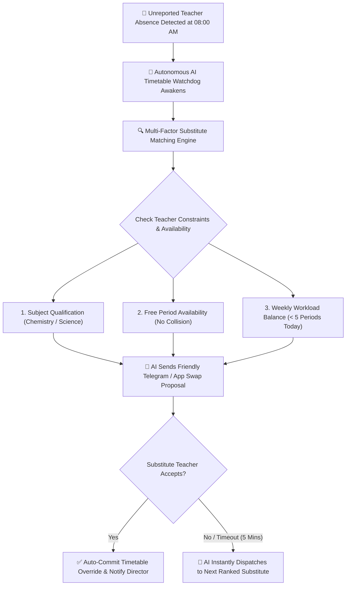

# Autonomous AI Timetable Watchdog & Smart Substitution Engine

Sudden teacher absences due to illness, transport delays, or emergencies often leave classrooms unsupervised and create administrative chaos for the School Director. YeneSchool's **Autonomous AI Timetable Watchdog** (`AI_PROACTIVE_TIMETABLE_WATCHDOG`, `AI_TIMETABLE_AUTO_APPROVE`) actively monitors teacher check-in status in real time and automatically finds, negotiates, and confirms qualified substitutes without human panic.

---

## 1. How the AI Watchdog Detects Schedule Emergencies

Every morning between **07:30 AM and 08:30 AM**, the AI Timetable Watchdog executes continuous background checks:

1. **Morning Gate Check-In Scan**: Verifies whether scheduled first-period teachers have tapped their NFC cards or logged into the portal.
2. **Teacher Emergency Absence Signal**: If a teacher taps *"I Cannot Attend Today"* on their mobile app or informs the school chatbot via Telegram:
   - The AI immediately flags the affected class periods for the day.
   - The AI identifies the grade level, classroom section, and scheduled subject curriculum unit.

---

## 2. Multi-Factor Substitute Matching Algorithm

When a replacement teacher is needed, the AI does not pick candidates randomly. It executes an intelligent multi-criteria ranking algorithm:

| Evaluation Factor | Weight | AI Decision Logic |
| :--- | :--- | :--- |
| **1. Schedule Free Slot** | **Mandatory** | The candidate teacher must have zero scheduled classes during that period (guaranteed zero double-booking). |
| **2. Subject Department Alignment** | High (40%) | Prioritizes teachers from the same academic department (e.g., a Physics teacher covering a Chemistry class). |
| **3. Daily Workload Equity** | High (30%) | Avoids overloading colleagues who already have 4 or 5 intense teaching periods scheduled that day. |
| **4. Homeroom & Class Familiarity** | Medium (20%) | Favors teachers who already teach other subjects to that specific section. |
| **5. Historical Substitution Karma** | Bonus (10%) | Balances substitution favors equally among department staff over the semester. |

---

## 3. Autonomous Swap Negotiation & Teacher Outreach

Once the AI selects the optimal substitute candidates:

1. **Empathetic Telegram / In-App Message**: The AI sends a polite, structured invitation to the candidate:
   > *"Selam Teacher Dawit! Teacher Aster is unexpectedly unwell today. Could you please cover Grade 10B Chemistry during Period 3 (10:15 AM – 11:00 AM)? She has prepared Worksheet #4 on Chemical Bonding which is already uploaded to your portal. Tap [Accept Cover] or [Decline]."*
2. **Instant Material Handoff**: The moment the substitute taps **Accept Cover**, the AI automatically attaches the original teacher's lesson notes, student roster, and attendance register to the substitute's dashboard.
3. **Escalation Fallback**: If the candidate declines or does not respond within 5 minutes, the AI gracefully moves to Candidate #2 without human delay.

---

## 4. Director Autonomy & Auto-Approval Controls

In **Director > School Settings > Autonomous AI Settings**:

- **`AI_PROACTIVE_TIMETABLE_WATCHDOG`** (`true/false`): Activates the autonomous absence detection and substitute matching engine.
- **`AI_TIMETABLE_AUTO_APPROVE`** (`true/false`):
  - When **Enabled (`true`)**: The AI finalizes the timetable override immediately upon the substitute teacher's acceptance and sends a confirmation briefing to the Director.
  - When **Supervised (`false`)**: The AI generates the optimal substitution proposal and presents a one-tap **[Approve AI Substitution]** button on the Director Dashboard.

---

## Next Steps

- [Timetable Overrides & Period Swap Requests](/teacher/period-swaps) — Teacher manual and AI-assisted swap workflows
- [Autonomous AI Autopilot Architecture](/ai/autonomous-ai-autopilot) — Complete background agent architecture
- [AI Parent Empathy Dialogue](/ai/ai-parent-empathy-dialogue) — How AI communicates with families
