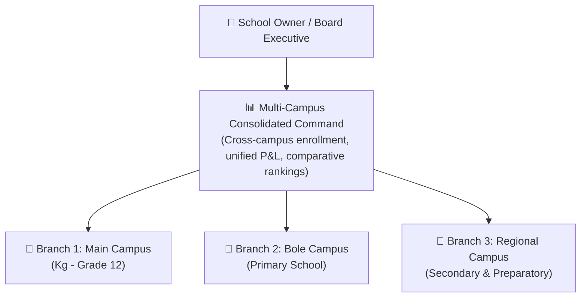
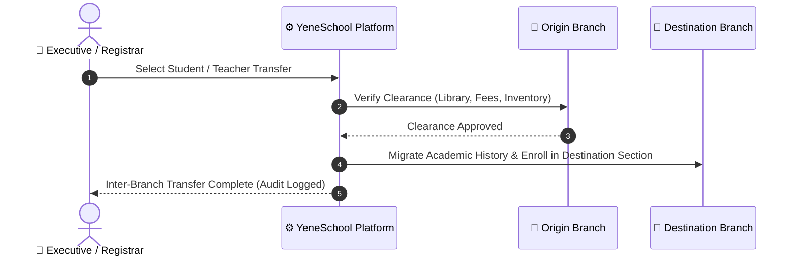

# Inter-Branch Operations & Consolidation

For educational groups and institutions operating multiple campuses across different cities or administrative zones (e.g. *Main Campus*, *Bole Branch*, *Hawassa Branch*), YeneSchool provides enterprise-grade **Multi-Branch Governance** (`/settings/branches` and `/owner`). School Owners and Executive Directors can oversee operations from a unified master dashboard while maintaining isolated daily workspaces for branch directors.

---

## Multi-Branch Architectural Model

---

## Step-by-Step: Managing Campus Branches

### 1. Adding and Configuring a New Campus Branch
1. Log in with **School Owner** or **Executive Director** privileges.
2. Navigate to **Settings** > **Branches** (`/settings/branches`).
3. Click the **+ Add Branch** button.
4. Fill in the campus profile:
   - **Branch Name & Code**: E.g., *"YeneSchool Bole Campus (BOLE-01)"*.
   - **Physical Location**: Region, Sub-city, Woreda, and street address.
   - **Contact Information**: Dedicated campus phone, email, and emergency contact.
   - **Offerings**: Specify supported grade levels (e.g. *KG to Grade 8*).
5. Click **Create Branch**. You can optionally click **Generate Default Classes** to auto-scaffold Grade 1 through 8 sections with one click.

---

## Inter-Branch Student & Staff Transfers

When families relocate or faculty are reassigned between campuses:

1. In the Branch Management panel, select **Inter-Branch Transfers**.
2. Select transfer type: **Student Transfer** or **Faculty Reassignment**.
3. Select the source campus and the destination branch.
4. The system validates departmental clearance (verifying zero overdue library books or tuition arrears at the origin campus).
5. Confirm transfer. The student's historical transcripts, attendance records, and payment receipts migrate seamlessly without manual re-entry.

---

## Consolidated Financial & Academic Benchmarking

In the **Owner Executive Dashboard** (`/owner`):

| Strategic KPI | Scope Analyzed | Business Insight |
| :--- | :--- | :--- |
| **Consolidated Enrollment** | Whole Network | Total active students across all branches vs capacity limits. |
| **Branch Revenue Yield** | Per Branch | Monthly tuition collections, outstanding fee aging, and collection efficiency percentage per campus. |
| **Academic Benchmark Index** | Per Branch | Comparative pass rates and national examination results across campuses. |
| **Faculty Retention & Load** | Per Branch | Teacher-to-student ratios and period distribution per branch. |

---

## Next Steps

- [School Owner Overview](/owner/overview) — Executive command center overview
- [Multi-Branch Dashboard](/owner/multi-branch) — Cross-branch performance widgets
- [Director Subscription & Billing](/director/subscription-billing) — Managing network-wide student capacity
