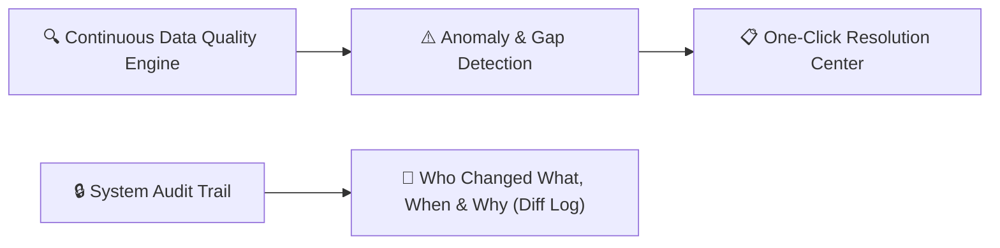

# Data Quality, Health Audits & Security Logs

Maintaining pristine institutional data is vital for accurate report cards, Ministry of Education submissions, and billing precision. The Data Quality & Security Auditing Module provides real-time health checks, anomaly detection, and a tamper-evident audit trail for every user action.

---

## 1. School Data Quality Health Score

On the Director Dashboard and Registrar Portal, the **Data Quality Widget** displays an overall health score (0% – 100%) calculated across five core dimensions:

| Health Check Category | What the System Scans For | Impact If Unfixed |
| :--- | :--- | :--- |
| **Incomplete Student Profiles** | Missing date of birth, gender, blood group, or student photo. | Report card generation errors and ID card printing blocks. |
| **Missing Guardian Links** | Students without a registered primary parent phone or emergency contact. | Failed SMS/Telegram attendance notifications and fee reminders. |
| **Duplicate Records** | Matching First/Last name with identical Date of Birth or phone. | Double fee invoicing and skewed enrollment counts. |
| **Unassigned Students** | Active students not assigned to an academic class or section. | Inability to take attendance or record gradebook scores. |
| **Orphaned Entities** | Subjects without assigned teachers or timetables with room overlaps. | Broken student schedule views and unmonitored classroom periods. |

### Running a Data Health Scan
1. Go to **School Operations > Data Quality**.
2. Click **Run Full School Health Scan**.
3. The engine parses all active tables in seconds and generates a list of actionable discrepancy cards.
4. Click **Resolve** next to any item to jump directly to the edit dialog with pre-filled recommendations.

---

## 2. System-Wide Audit Trails & Change Logs

Every administrative, academic, and financial action in YeneSchool is permanently logged to ensure full institutional accountability and fraud prevention.

### Types of Audit Logs
1. **System Audit Trail (`SystemAuditLog`)**:
   - Records user logins, password resets, role changes, and student record modifications with IP addresses and user-agent strings.
2. **Finance Audit Trail (`FinanceAuditLog`)**:
   - Tracks fee structure edits, manual discounts, receipt cancellations, and cash balance adjustments with exact Before vs After value diffs.
3. **Grade Change Audit Trail (`GradeChangeLog`)**:
   - Logs any grade score altered after the official grading window has closed, requiring a mandatory change reason code and supervisor sign-off.

### Inspecting Audit Trails
1. Go to **School Operations > Audit Logs**.
2. Filter logs by:
   - **Date Range** (EC or GC)
   - **User / Operator** (e.g., *Registrar Usman*)
   - **Action Type** (`CREATE`, `UPDATE`, `DELETE`, `LOGIN_FAILED`)
   - **Target Entity** (`Student`, `PaymentReceipt`, `GradeScore`)
3. Click any log entry to view the **JSON Side-by-Side Diff** displaying old values in red and new values in green.
4. Click **Export Audit Log (CSV/PDF)** for board oversight or external ministry auditing.

---

## Next Steps

- [AI Timetable & Auto-Assignment Engine](/operations/timetable-engine) — Automated scheduling and conflict resolution
- [Transport & Fleet Management](/operations/transport) — Manage school transportation logistics
- [Director User Profile & Security](/platform/user-profile-security) — Configure two-factor authentication and session controls
