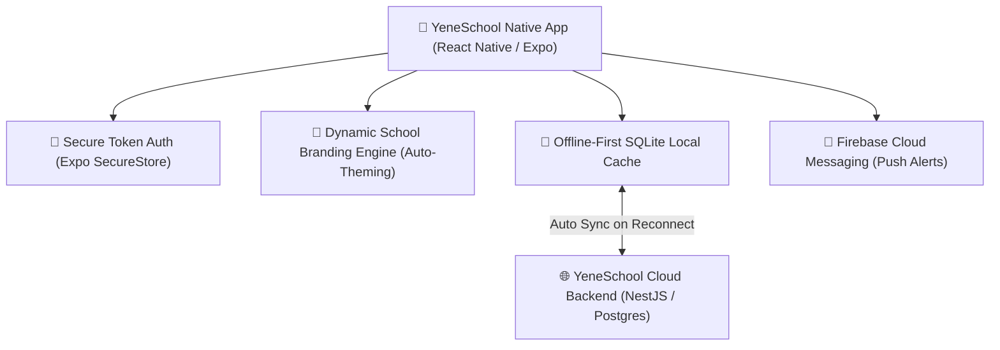

# Mobile App Overview & Architecture

The YeneSchool Mobile App provides a native, high-performance mobile experience for Teachers, Parents, Supervisors, and Students on both **Android** and **iOS** devices. Built using React Native and Expo, the app features an offline-first architecture, local SQLite database storage, dynamic school branding, and instant biometric authentication.

---

## 1. Key Mobile Capabilities

- **Automatic School Branding**: When a user logs in, the app automatically fetches the school's logo, primary brand color, and portal styling, rendering an institutional white-label experience.
- **Offline-First Resilience**: Full support for marking attendance, reviewing student rosters, and entering continuous assessment scores when disconnected from the internet.
- **Multilingual Support**: Instant on-device switching between **Amharic (አማርኛ)**, **Afaan Oromoo**, **Tigrinya**, **Somali**, **Arabic**, and **English**.
- **Biometric Security**: Quick and secure login using Fingerprint / Face ID via device hardware keychains (`Expo SecureStore`).
- **Real-Time Push Notifications**: Instant native alerts for student absenteeism, bus boarding, emergency broadcasts, and fee receipt generation.

---

## 2. Supported Operating Systems & Installation

| Platform | Minimum OS Version | Distribution Channel |
| :--- | :--- | :--- |
| **Android** | Android 8.0 (Oreo) or higher | Google Play Store & Direct APK Download |
| **iOS / iPadOS** | iOS 14.0 or higher | Apple App Store & TestFlight |

### First-Time App Launch & Login
1. Open the **YeneSchool App** on your smartphone or tablet.
2. Enter your **Username, Email, or Student/Teacher ID Code** and **Password**.
   - *Note*: There is no need to enter a school ID code manually — the YeneSchool backend automatically resolves your school association from your unique credentials.
3. If prompted on first login, set a new secure password using the live password strength meter.
4. Enable **Biometric Quick Login** (Fingerprint / Face Unlock) for faster access.

---

## 3. Dark Mode & Theme Customization

The mobile app includes full support for system dark mode:
- **Light Theme**: Clean, modern high-contrast interface designed for outdoor sunlight legibility.
- **Deep Charcoal Dark Theme**: Optimized for battery saving on OLED/AMOLED screens (`#111111` background, `#1A1A1A` cards, and high-contrast text).
- **Auto / System Follow**: Automatically transitions based on your phone's operating system schedule.

---

## Next Steps

- [Teacher Mobile Experience](/mobile/teacher-mobile) — Offline attendance, grade entry, and digital communication
- [Parent Mobile Experience](/mobile/parent-mobile) — Real-time attendance notifications, report cards, and fee payments
- [QR Attendance & ID Scanning](/mobile/qr-attendance) — Fast camera barcode scanning for roll-calls and gate security
