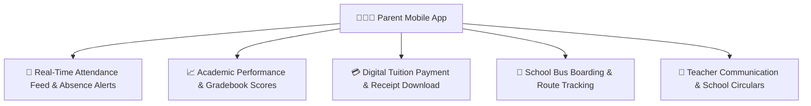

# Parent Mobile Experience

The YeneSchool Parent Mobile App keeps families closely connected with their children's daily educational journey. Parents can monitor live attendance, view test results as soon as they are graded, review digital report cards, track school bus locations, and pay tuition fees securely.

---

## 1. Multi-Child Profile Switcher

For parents with multiple children enrolled in the same school (e.g., one child in Grade 4 and another in Grade 9):
- The top app header displays an active **Child Switcher Carousel**.
- Tap on any child's avatar to instantly switch the entire app view (attendance, grades, timetable, fee balance) without logging out.

---

## 2. Real-Time Attendance & Safety Alerts

- **Morning Arrival Confirmation**: Receive an instant push notification the moment the homeroom teacher marks your child present or when their ID card is scanned at the school gate.
- **Unexcused Absence Alert**: If your child is marked absent, the app immediately dispatches a priority notification requesting prompt confirmation or excuse notes.
- **Monthly Attendance Calendar**: Visual color-coded calendar breakdown showing present days (green), tardy arrivals (yellow), and excused leaves (blue).

---

## 3. Live Academic Performance & Digital Report Cards

- **Instant Assessment Feedback**: View quiz, test, and homework marks with teacher comments as soon as they are entered into the gradebook.
- **Performance Trend Graphs**: Track whether your child's scores are trending upward or need extra support in specific subjects.
- **PDF Report Card Download**: At the end of each academic term, download official, signed and stamped digital terminal report cards directly to your phone's storage.

---

## 4. Mobile Fee Payments & Digital Receipts

1. Tap the **Finances** tab at the bottom navigation bar.
2. View current balance, upcoming installment due dates, and breakdown of fees (Tuition, Transport, Lab fees).
3. Tap **Pay Online** (where digital gateway integration is enabled) or view school bank account numbers and upload bank transfer deposit slips.
4. Instantly view, download, or share official stamped **Payment Receipts** for tax and family records.

---

## Next Steps

- [QR Attendance & ID Scanning](/mobile/qr-attendance) — How student ID badges are scanned at school gates
- [Mobile Offline Sync Engine](/mobile/offline-sync) — Local caching and synchronization architecture
- [Parent & Student Web Portal Guide](/parent/overview) — Full overview of the desktop parent portal
