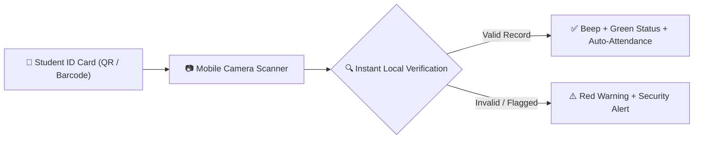

# QR Code & Barcode Attendance Scanning

YeneSchool transforms any Android or iOS smartphone into a high-speed optical barcode scanner. Using the device's native camera, teachers, bus attendants, and security guards can verify identities and record events in milliseconds without specialized external hardware.

---

## 1. Supported Scanning Use Cases

| Workflow | Operating Staff | Action Triggered on Scan |
| :--- | :--- | :--- |
| **Morning Main Gate Entry** | Campus Security Guards | Marks student `Arrived on Campus`, checks active enrollment, and sends parent arrival SMS. |
| **Classroom Roll-Call** | Homeroom Teachers | Rapid check-in for large classrooms (up to 40 students in under 90 seconds). |
| **School Bus Boarding** | Transport Attendants | Confirms student is boarding the correct assigned route and stop. |
| **Cafeteria / Dining Hall** | Catering Staff | Verifies meal plan entitlement and prevents duplicate meal claims. |
| **Examination Hall Check-in** | Exam Invigilators | Verifies student exam admission ticket and seat allocation number. |

---

## 2. Using the Mobile Scanner

### How to Start a Scanning Session
1. Open the **YeneSchool Mobile App**.
2. Tap the **Scanner Icon** floating on the top navbar.
3. Select the scanning mode:
   - `Campus Gate Attendance`
   - `Classroom Roll-Call`
   - `Bus Manifest Check`
4. Point the camera viewfinder at the QR code or Barcode printed on the student's physical ID card.
5. **Instant Feedback**:
   - The phone gives a distinct audio beep and haptic vibration.
   - The student's photo, name, grade, and emergency contact appear on screen.
   - A green checkmark confirms successful attendance recording.

> [!TIP]
> **Continuous Rapid Scan Mode**: Enable *Continuous Scan* in settings to keep the camera active without tapping between scans. You can scan an entire line of students one after another with zero lag.

---

## 3. High-Security Anti-Fraud Features

- **Photo Identity Verification**: The high-resolution student photo stored on the server displays immediately upon scanning, preventing students from swapping cards with friends.
- **Duplicate Scan Block**: If a card is scanned twice within the same morning window, the app alerts: *"Already Scanned at 07:14 AM"*.
- **Offline Scanning Cache**: Gate scans continue operating seamlessly even if school Wi-Fi is temporarily offline. Scans are stored securely in local SQLite and synced when connectivity resumes.

---

## Next Steps

- [Mobile Offline Sync Engine](/mobile/offline-sync) — Learn how local SQLite offline queueing works
- [Registrar Student ID Cards](/registrar/id-cards) — How to generate and print scannable student ID cards
- [Transport Management](/operations/transport) — Real-time bus boarding manifests
