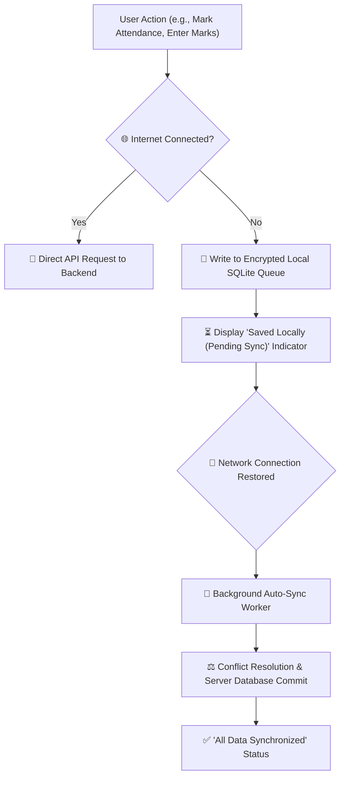

# Mobile Offline Sync Engine & Architecture

Unreliable or fluctuating internet connectivity is a common challenge in educational institutions. YeneSchool is engineered with an **offline-first philosophy**: the mobile application never blocks user productivity when internet connectivity drops.

---

## 1. What Operates Completely Offline on Mobile

The mobile app caches the latest school state on device storage:

- **Full Student Rosters & Photos**: Browse class lists and student profiles without an active connection.
- **Attendance Roll-Call**: Take daily, period, and bus attendance offline.
- **Continuous Assessment & Grade Entry**: Enter exam, quiz, and test scores.
- **Offline Timetable & Class Schedules**: View room assignments and period times.
- **Discipline Incident Logging**: Record student behavioral notes on the spot.

---

## 2. The Local SQLite Sync Queue

When an action is taken while offline:
1. The app serializes the payload (e.g., `attendance_records_batch`) with a local unique UUID, monotonic timestamp, and cryptographic hash.
2. The payload is written to the device's local **SQLite Database**.
3. A subtle Amber cloud indicator in the top navbar indicates: *"3 unsynced actions stored locally"*.
4. The user continues working with zero latency or spinner blocking.

---

## 3. Background Sync & Conflict Resolution Strategies

The moment network connectivity is re-established (via Wi-Fi or cellular data):
1. **Network Listener Trigger**: The app detects the `online` state change.
2. **Sequential Batch Flush**: The sync worker iterates through the SQLite queue in strict chronological order and posts requests to the backend sync endpoint (`POST /sync/batch`).
3. **Conflict Resolution Strategy**:
   - **Last-Write-Wins with Entity Timestamps**: For grade score edits, the most recent verified timestamp prevails.
   - **Server Merge for Attendance**: If attendance was marked on both mobile and web while split-brain, records are merged per student record.
4. **Queue Pruning**: Successfully committed transactions are pruned from local storage to keep the device storage footprint minimal (< 25 MB).
5. The navbar cloud icon turns green with a checkmark: *"All Changes Synced"*.

---

## Next Steps

- [Platform Offline Mode (PWA)](/platform/offline) — Explore how desktop web offline mode operates
- [Mobile App Overview](/mobile/overview) — General mobile app architecture and setup
- [Data Quality & Audits](/operations/data-quality-audit) — Audit synced data integrity
