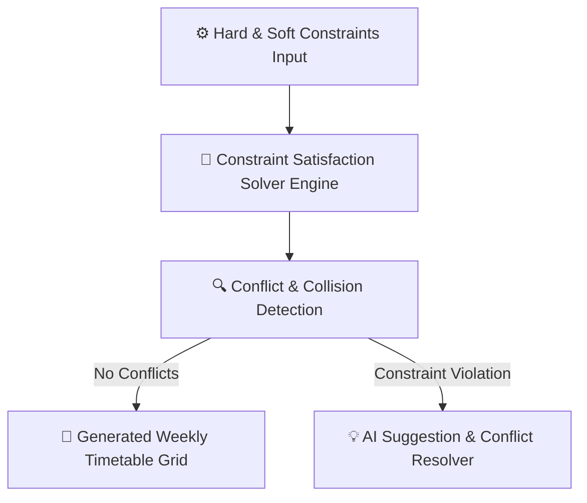

# AI Timetable & Auto-Assignment Engine

Creating conflict-free weekly schedules for dozens of teachers, hundreds of classes, and limited laboratory/hall facilities is one of the most time-consuming administrative tasks. The YeneSchool Auto-Assignment & Timetable Engine solves this constraint-satisfaction challenge in seconds.

---

## 1. How the Constraint Engine Works

The scheduler evaluates two levels of operational rules:

### Hard Constraints (Must NEVER be Violated)
- **Teacher Double-Booking**: A teacher cannot be scheduled in two different classrooms during the same period.
- **Room Collisions**: A physical room or science laboratory cannot host two classes simultaneously.
- **Section Single-Subject**: A class section cannot have two different subjects in the same period.
- **School Bell Windows**: Periods must strictly adhere to the Siren Bell schedule configured by the director.

### Soft Constraints (Optimized for Comfort & Pedagogical Quality)
- **Teacher Workload Balancing**: Distributes teaching periods evenly across Monday–Friday to prevent teacher burnout (e.g., maximum 5 periods per day per teacher).
- **Subject Spacing**: Spreads heavy cognitive subjects (e.g., Mathematics, Physics, Chemistry) across morning periods rather than consecutive late-afternoon slots.
- **Double-Period Grouping**: Automatically pairs Practical Science Labs and Art classes into contiguous double periods.
- **Part-Time Teacher Availability**: Respects external teacher availability windows (e.g., *only available Tuesdays and Thursdays*).

---

## 2. Running Automated Timetable Generation

### Step-by-Step Generation Workflow
1. Navigate to **Academic Management > Timetables > Auto-Generate Schedule**.
2. Select the **Academic Year** and **Term**.
3. Choose the generation scope:
   - `All Grades & Sections (Full School)`
   - `Primary Section (Grades 1–6)`
   - `Secondary / Preparatory Section (Grades 7–12)`
4. Review the **Constraint Weights**:
   - Max periods per teacher per day (Default: `5`)
   - Max consecutive periods without a break (Default: `3`)
   - Double period allowance for Lab subjects (`Enabled`)
5. Click **Run AI Timetable Solver**.
6. The engine executes iterative backtracking algorithms and displays the generated master grid in less than 10 seconds.

---

## 3. Conflict Resolution & Manual Fine-Tuning

Once the schedule is generated, administrators can inspect the interactive grid:

- **Green Slot**: Perfectly allocated, zero conflicts.
- **Amber Slot**: Soft constraint warning (e.g., teacher has 4 consecutive periods).
- **Drag-and-Drop Adjustment**: Drag any period card to a new time slot. As you drag, valid drop zones glow green while invalid/conflicting slots glow red.
- **Click to Swap**: Click a period and select another slot to swap teacher assignments automatically.

---

## 4. Publishing & Syncing Timetables

Once approved:
1. Click **Publish Master Timetable**.
2. The timetable instantly syncs to:
   - **Teacher Portals & Mobile Apps** (personalized personal schedule view).
   - **Student & Parent Portals** (class weekly schedule).
   - **Hardware Siren / School Bell** (triggers automatic period change chimes).

---

## Next Steps

- [School Siren & Automated Bell](/director/siren-bell) — Connect period schedules to physical bell relays
- [Director Academic Timetable](/director/timetable) — View school-wide weekly schedule grids
- [Mobile App Teacher Workflows](/mobile/teacher-mobile) — How teachers access their daily timetable on mobile
