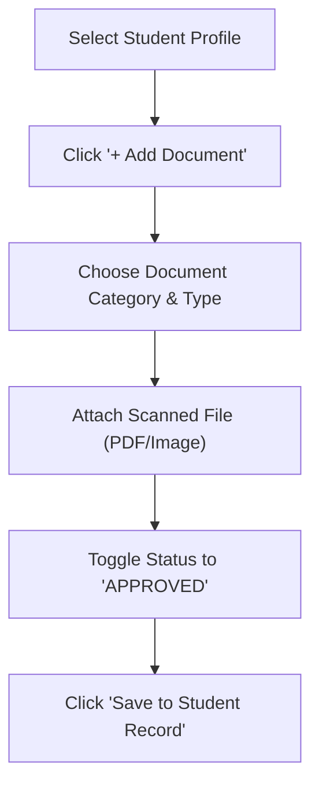

# Student Compliance Tracking

Educational authorities and school accreditation standards require institutions to maintain complete, verified records for every enrolled student. The **Student Compliance Dashboard** (`/documents`) allows Registrars and Directors to monitor document completeness across all grade levels in real time.

---

## Standard Compliance Checklist

When a student enrolls, the system automatically opens a compliance checklist based on the school's configured admission requirements:

| Required Document | Description | Format Accepted | Mandatory? |
| :--- | :--- | :--- | :--- |
| **Birth Certificate** | Official government-issued birth certificate verifying age and legal name | PDF, JPG, PNG | Yes (All Grades) |
| **Immunization Card** | Health and vaccination card signed by a licensed clinic or hospital | PDF, JPG, PNG | Yes (KG – Grade 4) |
| **Transfer Certificate (TC)** | Official clearance certificate from the student's previous school | PDF | Yes (Transfer Students) |
| **Prior Academic Transcript** | Certified report card or transcript from the last completed grade | PDF | Yes (Grades 1 – 12) |
| **Guardian ID / Kebele Card** | Government ID card of the designated primary guardian | PDF, JPG, PNG | Yes (All Students) |
| **Passport Photo** | Recent digital passport photo for ID badge printing | JPG, PNG | Yes (All Students) |

---

## Navigating the Compliance Dashboard

To review student compliance status:

1. Open the left sidebar menu and click **Documents**.
2. Select the **Student Compliance** tab.
3. Use the filter dropdowns to narrow results by **Academic Year**, **Grade Level**, or **Section (e.g. Grade 9A)**.
4. Each student displays a summary badge:
   - 🟢 **Compliant (100%)**: All mandatory files uploaded and verified.
   - 🟡 **Incomplete**: Some mandatory documents are missing or pending review.
   - 🔴 **Non-Compliant**: No verified documents on record.

---

## Step-by-Step: Direct Document Upload by Registrar

While parents can submit documents through their portal, Registrars can also upload physical documents scanned during in-person office visits:

1. Click on a student's row to open their **Compliance Detail Drawer**.
2. Click the **Upload Document** button next to the missing document item.
3. Drag and drop the scanned file (PDF, JPG, or PNG, up to 10MB).
4. Enter any optional notes (e.g., *"Original document verified by Registrar on 2018-01-15 EC"*).
5. Click **Verify & Save**. The document is instantly marked as **Approved**.

---

## Exporting Compliance Audit Rosters

For regulatory inspections or ministry reporting:

1. Click the **Export Report** button at the top right of the table.
2. Choose your preferred format: **Excel (.xlsx)** or **PDF Summary**.
3. The generated roster highlights:
   - Student Full Name and ID Number
   - Grade and Section
   - Checklist status for each mandatory document
   - Date of verification and reviewing registrar's name

---

## Next Steps

- [Parent Uploads & Review Queue](/documents/parent-submissions) — Review pending submissions from parents
- [Institutional Policies & Handbooks](/documents/institutional-policies) — Upload school-wide policies and bylaws
- [Registrar Student Management](/registrar/student-management) — Manage student academic profiles
