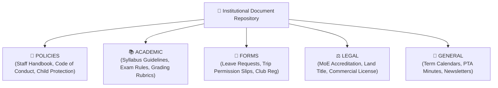

# Institutional Policies & Handbooks

The **Institutional Repository** within the Documents Hub (`/documents`) allows School Directors and Registrars to publish and distribute official school documentation, handbooks, application forms, and regulatory bylaws to teachers, students, and parents.

---

## Document Taxonomy & Organization

Documents can be filtered and managed under five standard categories:

---

## Step-by-Step: Uploading a New Institutional Document

1. Navigate to **Documents** in the navigation sidebar.
2. Ensure you are on the **School Documents** tab.
3. Click the **+ Upload Document** button in the top header.
4. Fill in the document metadata:
   - **Document Title**: Enter a clear name (e.g. *"2018 Academic Year Staff Handbook"*).
   - **Category**: Select `POLICIES`, `ACADEMIC`, `FORMS`, `LEGAL`, or `GENERAL`.
   - **Audience**: Choose who can view and download the file:
     - `PUBLIC` (All parents, students, and staff)
     - `STAFF_ONLY` (Teachers, Registrars, Finance Officers, and Directors)
     - `ADMIN_ONLY` (Directors and Registrars only)
   - **Version / Year**: Specify the academic year or revision version (e.g. *"v2.4 (2018 E.C.)"*).
   - **File Attachment**: Drag and drop the PDF, DOCX, or XLSX file (up to 25MB).
5. Click **Publish Document**. The file is instantly live for the selected audience.

---

## Managing Existing Documents & Revisions

- **Downloading**: Click the **Download (arrow down)** icon to retrieve the original file.
- **Previewing**: Click the **View (eye)** icon to open an in-browser PDF reader without downloading.
- **Updating a File**: When a policy is revised at the start of a new school year, click **Edit**, upload the new file version, and update the version label. The download link automatically reflects the latest version.
- **Archiving / Deleting**: To remove an obsolete document, click the **Trash** icon and confirm deletion.

---

## Accessing Published Documents (For Teachers & Parents)

- **Teachers**: Open the **Documents** link in their teacher sidebar. Teachers see all `PUBLIC` and `STAFF_ONLY` resources including lesson plan templates, grading guidelines, and school handbooks.
- **Parents**: Open the **School Documents** section in the parent portal. Parents have one-click access to downloadable excursion consent forms, fee schedules, uniform policies, and school term calendars.

---

## Next Steps

- [Documents & Compliance Overview](/documents/overview) — Review category types and audience flags
- [Student Compliance Verification](/documents/student-compliance) — Track student admission paperwork
- [Director School Settings](/director/school-settings) — Configure school-wide operational defaults
