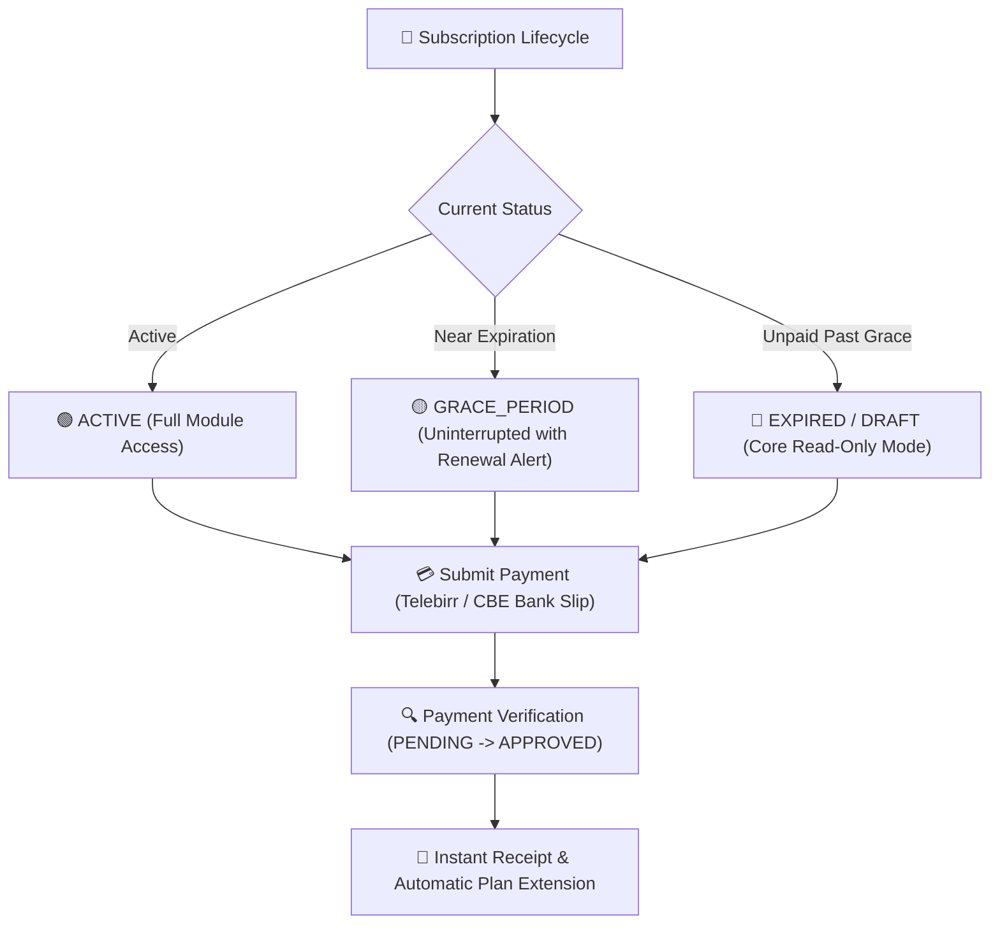

# School Subscription, Plans & Billing

The **Subscription Management Console** (`/director/subscription`) allows School Directors and Administrators to view their school's active subscription tier, track real-time resource quotas (enrolled students, staff accounts, AI tokens, cloud storage), submit renewal payments, request new platform features, and download official receipts.



---

## 1. Official Plan Tiers & Feature Matrix

YeneSchool operates on four distinct plan tiers defined in the core architecture:

| Feature Category / Module | CORE Tier | STANDARD Tier | ULTIMATE Tier | ENTERPRISE Tier |
| :--- | :---: | :---: | :---: | :---: |
| **School Profile & Settings** | Included | Included | Included | Included |
| **User & Staff Account Management** | Included | Included | Included | Included |
| **Academic Structure & Sections** | Included | Included | Included | Included |
| **Attendance Tracking & Daily Registers** | Included | Included | Included | Included |
| **School Calendar & Announcements** | Included | Included | Included | Included |
| **Continuous Assessments & Gradebook** | — | Included | Included | Included |
| **Timetable & Period Management** | — | Included | Included | Included |
| **Lesson Management & Sharing** | — | Included | Included | Included |
| **Offline Exam Management** | — | Included | Included | Included |
| **Student Fee Billing & Receipts** | — | Included | Included | Included |
| **Parent Portal & Messaging Book** | — | Included | Included | Included |
| **Terminal Report Card Generation** | — | Standard Template | Custom Templates | Multi-Branch Templates |
| **Student Promotion & Rankings** | — | — | Included | Included |
| **Student ID Card Barcode Generation** | — | — | Included | Included |
| **Online CBT Examination Portal** | — | — | Included | Included |
| **Automated Siren / Bell Integration** | — | — | Included | Included |
| **AI Assistant & Autopilot Engines** | — | — | Included (Full Quota) | Unlimited Dedicated Quota |
| **Multi-Branch Campus Management** | — | — | Up to 3 Branches | Unlimited Campuses |
| **Support SLA** | Standard Email | Standard Support | Priority Telegram/Phone | 24/7 Dedicated Account Lead |

---

## 2. Subscription Statuses & Grace Period Lifecycle

Your school's subscription moves through explicit states:

| Status Code | Description & Platform Impact |
| :--- | :--- |
| **`ACTIVE`** | All modules corresponding to the school's plan tier are fully functional with unlimited read and write operations. |
| **`GRACE_PERIOD`** | When a subscription reaches its expiration date, YeneSchool activates an automated grace period. Teachers and directors experience **zero interruption** while an amber banner reminds administrators to settle the renewal invoice. |
| **`EXPIRED`** | If payment is not verified before the grace period lapses, write operations (e.g., publishing new report cards or creating new classes) are locked until payment is verified. Historical data remains 100% safe and accessible. |
| **`DRAFT`** | Initial setup state for newly registered institutions awaiting first plan activation. |
| **`CANCELLED`** | Decommissioned institutional account status. |

---

## 3. Real-Time Resource Quotas & Usage Tracking

In the **Director > Subscription** overview, four live meters monitor institutional resource consumption:

```
[ Active Students ]  ████████████░░░░  680 / 1,000 Seats (68%)
[ Staff Accounts  ]  ██████████░░░░░░   42 / 60 Staff (70%)
[ AI Tokens       ]  ██████████████░░  4.2M / 5.0M Tokens (84%)
[ Cloud Storage   ]  ████░░░░░░░░░░░░  12.4 GB / 50.0 GB (25%)
```

- **Quota Threshold Alerts**: When student enrollment reaches 90% of your plan's maximum capacity, the director dashboard displays a proactive prompt to expand the student seat limit.

---

## 4. Submitting Renewal & Upgrade Payments

Directors can renew their current plan or upgrade to a higher tier directly in the portal:

### Step-by-Step Payment Submission Workflow
1. Navigate to **Director > Subscription**.
2. Click **Renew Subscription** or **Upgrade Plan**.
3. Select the desired **Plan Tier** (`STANDARD`, `ULTIMATE`, or `ENTERPRISE`) and billing duration (**Semester** or **Annual** with 15% discount).
4. Choose your payment channel:
   - **Commercial Bank of Ethiopia (CBE) / Bank Transfer**: Transfer the total amount to YeneSchool's institutional account, enter the Bank Reference / FT Number, and upload the scanned deposit slip.
   - **Telebirr / CBE Birr**: Enter your mobile number for instant USSD push authorization.
5. Click **Submit Payment for Verification**.
6. The payment status changes to `PENDING_VERIFICATION`. Once verified by finance, the subscription immediately updates to `ACTIVE` and the renewal expiration date advances automatically.

---

## 5. Direct Feature Request Portal

School Directors can submit feature requests, custom module enhancements, or specific regional reporting requirements directly from the subscription interface:

1. In **Director > Subscription**, scroll to the **Feature Requests** tab.
2. Click **+ Request New Feature**.
3. Provide:
   - **Feature Title**: E.g., *Ministry Zone 4 Custom Quarterly Report Card Template*.
   - **Category**: `Academic`, `Financial`, `AI Assistant`, `Mobile App`, or `Hardware Integration`.
   - **Business Rationale & Description**: Explain how the feature will benefit your school's daily operations.
4. Click **Submit Proposal**.
5. Track your request status (`UNDER_REVIEW`, `PLANNED`, `IN_DEVELOPMENT`, `RELEASED`) with live developer updates.

---

## Next Steps

- [School-Wide Settings & Configuration](/director/school-settings) — Configure academic calendars, branding, and policies
- [Reporting Errors & Getting Support](/guides/support-error-reporting) — Submit support tickets and technical assistance
- [Multi-Branch School Management](/owner/multi-branch) — Manage subscription licenses across multiple campuses
