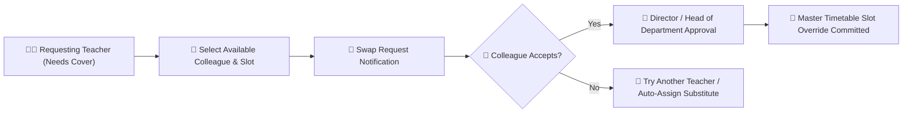

# Timetable Overrides & Period Swap Requests

When a teacher has an emergency, attends training, or falls ill, YeneSchool enables structured, conflict-free period substitutions (`TimetableSwapRequest`, `TimetableSlotOverride`) without disrupting classroom learning or corrupting the master schedule.

---

## 1. How a Teacher Initiates a Period Swap

### Steps to Submit a Swap Request
1. Go to **Teacher Portal > Timetable > My Schedule**.
2. Click on the specific period you cannot teach (e.g., *Tuesday Period 3 — Grade 9A Chemistry*).
3. Click **Request Swap / Substitute**.
4. Fill in the swap request parameters:
   - **Reason for Absence**: Medical appointment, official school workshop, personal leave.
   - **Swap Type**:
     - `1-to-1 Slot Exchange`: "I'll take your Thursday Period 4 if you take my Tuesday Period 3."
     - `Cover / Substitution Only`: Colleague covers the class with pre-prepared lesson worksheets.
   - **Substitute Teacher Selection**: Choose from a list of colleagues who are currently free during that period (the system hides busy teachers to prevent double-booking).
   - **Lesson Instructions**: Attach specific worksheets or instructions for the covering teacher.
5. Click **Submit Swap Request**.

---

## 2. Peer Acceptance & Director Approval Workflow

1. **Colleague Notification**: The chosen substitute receives an instant in-app notification and Telegram alert with the proposed swap details.
2. **Acceptance**: The colleague taps **Accept Swap Request**.
3. **Supervisor / Director Sign-Off**: The Head of Department or School Director reviews the pending substitution on their approval queue and clicks **Approve Override**.
4. **Live Schedule Synchronization**:
   - Both teachers' daily mobile timetables update instantly.
   - The classroom attendance register for that period is automatically assigned to the covering teacher.
   - The school bell and siren schedule continue without interruption.

---

## Next Steps

- [Teacher Mobile Experience](/mobile/teacher-mobile) — Managing your schedule on the go
- [Attendance Marking & Offline Workflow](/teacher/attendance-marking) — How substitute teachers take roll-call
- [Director Siren & Bell Management](/director/siren-management) — Master bell timetable configuration
