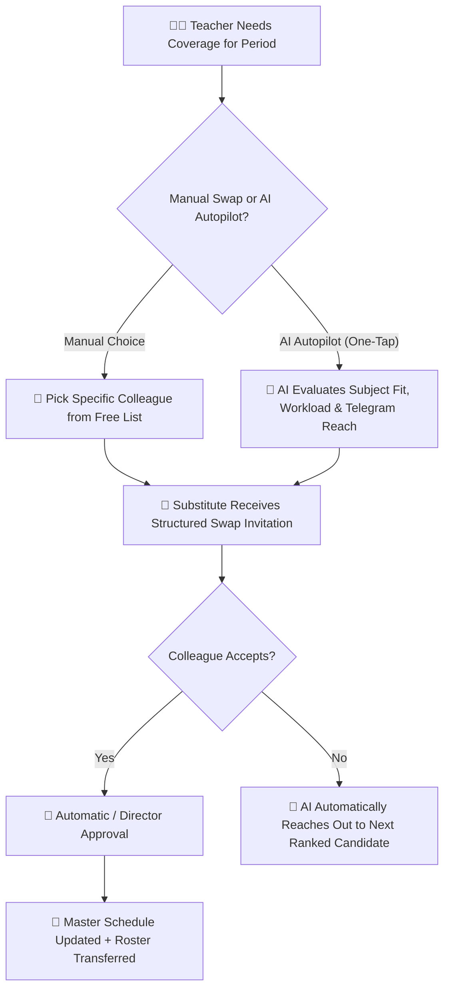

# Timetable Overrides, Period Swaps & AI Substitution

When a teacher has an emergency, attends training, or falls ill, YeneSchool enables structured, conflict-free period substitutions (`TimetableSwapRequest`, `TimetableSlotOverride`). Teachers can either select a colleague manually or delegate the entire substitution process to the **Autonomous AI Copilot**.

---

## 1. Manual Period Swap Workflow

### Steps to Submit a Swap Request Manually
1. Go to **Teacher Portal > Timetable > My Schedule**.
2. Click on the specific period you cannot teach (e.g., *Tuesday Period 3 — Grade 9A Chemistry*).
3. Click **Request Swap / Substitute**.
4. Fill in the swap parameters:
   - **Reason for Absence**: Medical appointment, official school workshop, personal leave.
   - **Swap Type**:
     - `1-to-1 Slot Exchange`: "I'll take your Thursday Period 4 if you take my Tuesday Period 3."
     - `Cover / Substitution Only`: Colleague covers the class with pre-prepared lesson worksheets.
   - **Substitute Teacher Selection**: Choose from a list of colleagues who are currently free during that period (the system hides busy teachers to prevent double-booking).
   - **Lesson Instructions**: Attach specific worksheets or instructions for the covering teacher.
5. Click **Submit Swap Request**.
6. When the colleague accepts and the Director approves, the master schedule updates instantly.

---

## 2. "AI, Find Me a Substitute!" (Autonomous AI Helper)

If you are sick in bed, stuck in heavy traffic, or don't know which colleague is available to cover your class, you don't need to call or text multiple teachers individually. Simply delegate the task to the **Autonomous AI Copilot**:

### How to Use the AI Substitution Helper
1. In the swap dialog or directly inside the **YeneSchool Telegram Bot**, tap **🤖 Let AI Auto-Find Substitute**.
2. State your absence (e.g., *"I have a sudden flat tire and cannot teach Period 1 Math today. Please find a cover."*).
3. The AI takes over immediately:
   - **Instant Faculty Analysis**: The AI scans all teachers' daily workloads, free periods, and subject department qualifications.
   - **Smart Ranking**: It identifies the most qualified and least-burdened colleagues (e.g., matching a Physics teacher to cover a Math class).
   - **Autonomous Outreach**: The AI sends polite Telegram and in-app requests to the top-ranked substitute with your lesson notes attached.
   - **Auto-Failover**: If the first teacher declines or doesn't answer within 5 minutes, the AI seamlessly messages Candidate #2.
4. Once accepted, the AI commits the schedule override, notifies the Director, and sends you a confirmation:
   > *"✅ Solved! Teacher Dawit has agreed to cover your Period 1 Math class. Your lesson notes and attendance roster have been handed over to him."*

---

## 3. Live Timetable & Attendance Handover

Once a substitution is finalized (either manually or via AI):
- The substitute teacher's mobile timetable instantly displays the newly assigned class period.
- The classroom attendance register for that specific period is temporarily reassigned to the substitute, allowing them to take roll-call without needing administrative password overrides.
- The school siren and hardware bell continue operating according to the master schedule.

---

## Next Steps

- [AI Timetable Watchdog Architecture](/ai/ai-timetable-substitution-watchdog) — Detailed deep dive on the AI matching algorithm
- [Teacher Mobile Experience](/mobile/teacher-mobile) — Managing your schedule on mobile
- [Attendance Marking & Offline Workflow](/teacher/attendance-marking) — How substitute teachers take roll-call
