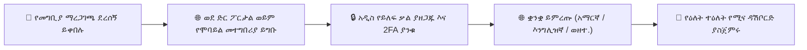

# ከYeneSchool ጋር መጀመር

እንኳን ወደ **YeneSchool** በደህና መጡ — ለኢትዮጵያ የትምህርት ተቋማት የተዘጋጀ ዘመናዊ የትምህርት ቤት አስተዳደር መድረክ። ይህ መመሪያ ለመጀመሪያ ጊዜ እንዲገቡ፣ የቋንቋ ምርጫዎችዎን እንዲያዋቅሩ እና ዕለታዊ ዳሽቦርድዎን እንዲዳስሱ ይረዳዎታል።

---

## 1. ለመጀመሪያ ጊዜ መግባት

እያንዳንዱ ተማሪ፣ ወላጅ፣ መምህር እና አስተዳዳሪ ከትምህርት ቤቱ ሬጅስትራር ልዩ የመግቢያ ስም እና የመጀመሪያ የይለፍ ቃል ይቀበላል፡-

1. የድር አሳሽዎን ይክፈቱ እና ወደ ትምህርት ቤትዎ የYeneSchool ፖርታል አድራሻ ይሂዱ (ለምሳሌ፣ `https://yeneschool.me` ወይም የተቋምዎ ብጁ ዶሜይን)።
2. **የተጠቃሚ ስምዎን፣ ኢሜይልዎን ወይም ልዩ መለያ ኮድዎን** እንዲሁም **የመጀመሪያ ጊዜያዊ የይለፍ ቃልዎን** ያስገቡ።
3. **ጊዜያዊ የይለፍ ቃል ይቀይሩ፦** ለመጀመሪያ ጊዜ ሲገቡ ስርዓቱ ደህንነቱ የተጠበቀ፣ የግል የይለፍ ቃል እንዲፈጥሩ ይጠይቃል።
4. **ባዮሜትሪክ / 2FA ያንቁ፦** ለፈጣን መዳረሻ በሞባይል መሳሪያዎ ላይ የሁለት-ደረጃ ማረጋገጫ (Two-Factor Authentication) ወይም የጣት አሻራ / የፊት መክፈቻ (Fingerprint/Face Unlock) ማዋቀር ይችላሉ።

---

## 2. የሚመርጡትን ቋንቋ መምረጥ

YeneSchool **አማርኛ (አማርኛ)**፣ **አፋን ኦሮሞ**፣ **ትግርኛ**፣ **ሶማሊ**፣ **ዓረብኛ** እና **እንግሊዝኛ**ን የሚደግፍ ሙሉ በሙሉ የተተረጎመ ባለብዙ ቋንቋ በይነገጽ ያቀርባል፦

- **በዴስክቶፕ ድር ላይ፦** በላይኛው ቀኝ የራስጌ አሞሌ ላይ ያለውን **የቋንቋ መራጭ** አዶን ጠቅ ያድርጉ እና ቋንቋዎን ይምረጡ።
- **በሞባይል መተግበሪያ ላይ፦** የመገለጫ አምሳያዎን ይንኩ > **ቋንቋ** በመምረጥ በቅጽበት ይቀይሩ።
- በይነገጹ፣ ቀኖቹ (የኢትዮጵያ / የጎርጎርዮስ አቆጣጠር) እና የገንዘብ ምንዛሪ ቅርጸት ወዲያውኑ ይሻሻላሉ።

---

## 3. የሞባይል መተግበሪያን መጫን

በጉዞ ላይ ለሚገኙ መምህራን፣ ወላጆች እና ተማሪዎች፦
- **Android፦** ይፋዊውን የYeneSchool መተግበሪያ ከGoogle Play መደብር ያውርዱ ወይም በትምህርት ቤትዎ ፖርታል ላይ የቀረበውን የAPK QR ኮድ ይቃኙ።
- **iOS / iPhone፦** በApple App መደብር በኩል ይጫኑ።
- የሞባይል መተግበሪያው **ከመስመር ውጭ (offline) ሁነታን** ያካትታል — ከበይነ መረብ ጋር ሳይገናኙ ሆነው መገኘትን ምልክት ለማድረግ፣ የትምህርት መርሃ ግብሮችን ለማየት እና ውጤቶችን ለመፈተሽ ያስችልዎታል።

---

## 4. የሚና ፖርታሎች በአጭሩ

| ሚና | ዋና ዕለታዊ ተግባራት |
| :--- | :--- |
| **የትምህርት ቤት ዳይሬክተር** | የተቋም ቅንብሮች፣ የመምህራን ግምገማ፣ የስጋት ትንታኔ፣ ሳይረን ደወሎች እና ሪፖርቶች። |
| **መምህር** | ዕለታዊ የክፍል ዝርዝር ጥሪ፣ የውጤት መዝገብ ማስገባት፣ የትምህርት እቅዶች እና ከወላጆች ጋር መግባባት። |
| **ሬጅስትራር** | የተማሪ ምዝገባ፣ የጅምላ CSV ማስመጣት፣ የተማሪ መገለጫዎች እና የውጤት ካርድ ማመንጨት። |
| **የፋይናንስ ኃላፊ** | የትምህርት ክፍያ መሰብሰብ፣ ደረሰኞች፣ የባንክ ማስተላለፍ ማስታረቅ እና የደመወዝ ክፍያ። |
| **ወላጅ** | በቅጽበት የመገኘት መረጃ ማውጣት፣ የውጤት ካርድ ማውረድ፣ የመስመር ላይ ክፍያ መፈጸም እና የአውቶቡስ ክትትል። |
| **ተማሪ** | የትምህርት መርሃ ግብር ማየት፣ ዲጂታል የትምህርት ማስታወሻዎች፣ የቤት ስራ ማቅረብ እና የመስመር ላይ የኮምፒውተር ላይ የተመሰረቱ ፈተናዎች። |

---

## ቀጣይ እርምጃዎች

- [የሚና ላይ የተመሰረተ የመዳረሻ ማትሪክስ](/am/guides/role-based-access) — በእያንዳንዱ ሚና የፈቃድ አጠቃላይ እይታ
- [የዳይሬክተር መመሪያ አጠቃላይ እይታ](/am/director/overview) — የትምህርት እና የአስተዳደር መቆጣጠሪያዎች
- [የመምህር መመሪያ አጠቃላይ እይታ](/am/teacher/overview) — የክፍል ሥራ ፍሰቶች እና ውጤት አሰጣጥ
- [የወላጅ መመሪያ አጠቃላይ እይታ](/am/parent/overview) — የልጅዎን የትምህርት እድገት መከታተል