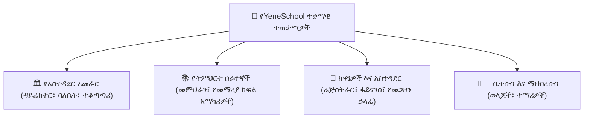

# በሚና ላይ የተመሰረተ መዳረሻ እና የተጠቃሚ ፖርታሎች

YeneSchool የተገነባው ደህንነቱ በተጠበቀ፣ በሚና ላይ በተመሰረተ አርክቴክቸር ነው። እያንዳንዱ ተጠቃሚ ለዕለታዊ ተግባራቱ እና የግላዊነት ወሰኖቹ በተለየ ሁኔታ ወደ ተዘጋጀ ብጁ የስራ ቦታ ይገባል።

---

## 1. የተጠቃሚ ሚናዎች እና የፈቃድ ማትሪክስ

| የተጠቃሚ ሚና | ዋና ኃላፊነቶች | የስራ ቦታ አገናኝ |
| :--- | :--- | :--- |
| **የትምህርት ቤት ዳይሬክተር** | አጠቃላይ የትምህርት ቤት አስተዳደር፣ የትምህርት አቆጣጠር፣ የጊዜ ሰሌዳዎች፣ ሳይረን ደወሎች፣ የመምህራን ግምገማ፣ የስጋት ትንታኔ እና የተቋም ቅንብሮች። | [የዳይሬክተር መመሪያ](/am/director/overview) |
| **መምህር** | የክፍል መገኘት (በመስመር/ከመስመር ውጭ)፣ የውጤት መዝገብ ማስገባት፣ የትምህርት እቅድ ማውጣት፣ የቤት ስራ መመደብ፣ የተማሪ ስነ-ምግባር እና ከወላጆች ጋር መግባባት። | [የመምህር መመሪያ](/am/teacher/overview) |
| **ሬጅስትራር** | የአዲስ ተማሪ መግቢያ፣ የጅምላ CSV ማስመጣት፣ የተማሪ መዝገቦች፣ የመለያ ካርድ ማመንጨት፣ የወቅት ማጠቃለያ የውጤት ካርድ ማተም እና የክፍል ማደግ። | [የሬጅስትራር መመሪያ](/am/registrar/overview) |
| **የፋይናንስ ኃላፊ** | የክፍያ መዋቅር ትርጉሞች፣ የትምህርት ክፍያ መሰብሰብ፣ ዲጂታል እና የገንዘብ ደረሰኞች፣ የወንድም/እህት ቅናሾች፣ የጊዜ ማብቂያ ሪፖርቶች እና ወርሃዊ የደመወዝ ክፍያ ስርጭት። | [የፋይናንስ መመሪያ](/am/finance/overview) |
| **ወላጅ / አሳዳጊ** | የቀጥታ መገኘት ክትትል፣ የቀጣይ ግምገማ ውጤቶች፣ ዲጂታል የውጤት ካርዶች፣ የመስመር ላይ የትምህርት ክፍያ፣ የመግባቢያ መጽሐፍ እና የአውቶቡስ ክትትል። | [የወላጅ መመሪያ](/am/parent/overview) |
| **ተማሪ** | ዕለታዊ የጊዜ ሰሌዳ፣ ዲጂታል የትምህርት ቁሳቁሶች፣ የተመደቡ ስራዎች ማቅረቢያ፣ የCBT የመስመር ላይ ፈተናዎች እና የወቅት የእድገት ሪፖርቶች። | [የተማሪ መመሪያ](/am/student/overview) |
| **የመጋዘን ኃላፊ / ኢንቬንቶሪ** | የመጋዘን ኢንቬንቶሪ፣ የመማሪያ መጽሐፍ እና የዩኒፎርም ሽያጭ፣ የፍጆታ ዕቃዎች ጥያቄዎች፣ የክምችት ግብይቶች እና ዝቅተኛ ክምችት ማንቂያዎች። | [የኢንቬንቶሪ መመሪያ](/am/inventory/overview) |
| **የትምህርት ተቆጣጣሪ** | ባለብዙ ቅርንጫፍ የጥራት ማረጋገጫ ኦዲት፣ የክፍል ምልከታ መስፈርቶች፣ የመምህራን አፈጻጸም ደረጃ ዝርዝር እና የስርዓተ-ትምህርት እድገት ግምገማዎች። | [የተቆጣጣሪ መመሪያ](/am/supervisor/overview) |
| **የትምህርት ቤት ባለቤት** | የሥራ አስፈጻሚ ባለብዙ ካምፓስ ቁጥጥር፣ የፋይናንስ ጤና አመላካቾች፣ የካፒታል ወጪ እና የምዝገባ ፈቃድ አስተዳደር። | [የባለቤት መመሪያ](/am/owner/overview) |

---

## 2. ግላዊነት እና የብዙ ቅርንጫፍ ውሂብ ወሰን

- **የውሂብ መገለል፦** መምህራን ለሚያስተምሩት ክፍሎች ብቻ የተማሪ መዝገቦችን እና ዝርዝሮችን ያገኛሉ።
- **የፋይናንስ ምስጢራዊነት፦** የተማሪ ክፍያ መዝገቦች፣ የክፍያ ቀሪ ሂሳቦች እና የሰራተኛ ደመወዝ መረጃ በጥብቅ ለፋይናንስ ኃላፊ፣ ዳይሬክተር እና የትምህርት ቤት ባለቤት ብቻ የተገደበ ነው።
- **የቅርንጫፍ ወሰን፦** ለተወሰነ የካምፓስ ቅርንጫፍ የተመደቡ ሰራተኞች የዚያን ቅርንጫፍ መዝገቦችን ብቻ ማየት ይችላሉ።

---

## ቀጣይ እርምጃዎች

- [የመጀመሪያ መመሪያ](/am/guides/getting-started) — የመለያ ማዋቀር እና የመጀመሪያ ጊዜ መግቢያ
- [ችግሮችን ሪፖርት ማድረግ እና ድጋፍ ማግኘት](/am/guides/support-error-reporting) — የእርዳታ ትኬቶችን እንዴት ማስገባት እንደሚቻል
- [የዳይሬክተር መመሪያ አጠቃላይ እይታ](/am/director/overview) — የትምህርት እና የአስተዳደር መቆጣጠሪያዎች