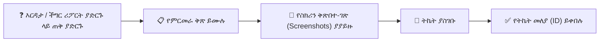

# ድጋፍ፣ ስህተት ሪፖርት ማድረግ እና የባህሪ ጥያቄዎች

YeneSchool ከትምህርት ቤት ዳይሬክተሮች፣ መምህራን፣ ሬጅስትራሮች እና ወላጆች በቀጥታ በሚሰጥ ግብረ መልስ ላይ በመመስረት ለ99.9% የስርዓት ተገኝነት እና ቀጣይነት ያለው የምርት ማሻሻያ ቁርጠኛ ነው። ይህ መመሪያ የስህተት ሪፖርቶችን እንዴት ማስገባት፣ የምርመራ መዝገቦችን ማያያዝ፣ ብጁ ባህሪያትን መጠየቅ እና ይፋዊ የደንበኛ ድጋፍን ማነጋገር እንደሚቻል ያስረዳል።

---

## 1. ስህተት ወይም ብግ (Bug) ሪፖርት ማድረግ

ያልተጠበቀ ስህተት፣ ያልተሳካ ማስገቢያ ወይም የስሌት ልዩነት ካጋጠምዎት፦

### ደረጃ በደረጃ የስህተት ማስገቢያ፦
1. በላይኛው የአሰሳ አሞሌ ላይ ያለውን **የእርዳታ እና ድጋፍ አዶ (`?`)** ጠቅ ያድርጉ፣ ወይም ወደ **ዳይሬክተር → ምዝገባ (Subscription) → ችግር ሪፖርት ያድርጉ** ይሂዱ።
2. የምርመራ ሪፖርት ቅጹን ይሙሉ፦
   - **የችግሩ ርዕስ፦** አጭር፣ ገላጭ ማጠቃለያ (ለምሳሌ፣ *የ9ኛ ክፍል B መገኘት በከመስመር ውጭ ሁነታ ማመሳሰል አልተሳካም*)።
   - **የተጎዳው ሞጁል፦** ከተቆልቋይ ምናሌ ይምረጡ (*መገኘት፣ የውጤት መዝገብ (Gradebook)፣ የመስመር ላይ ፈተናዎች፣ ፋይናንስ/ክፍያ፣ ሳይረን፣ የውጤት ካርዶች*)።
   - **ክብደት / ቅድሚያ፦**
     - `ወሳኝ / አጋጅ (Critical / Blocker)፦` ዋና ክዋኔዎችን የሚያግድ (ለምሳሌ፣ የመጨረሻ ፈተና ውጤቶችን ማስገባት አለመቻል፣ አገልጋይ መውደቅ)።
     - `ከፍተኛ (High)፦` ባህሪው ከፍተኛ ችግር በመፍጠር በስህተት የሚሰራ።
     - `መካከለኛ / ዝቅተኛ (Medium / Low)፦` የእይታ ብልሽት፣ የትርጉም ስህተት ወይም ትንሽ ምቾት የሚፈጥር።
   - **የመራባት እርምጃዎች፦** ስህተቱ ከመከሰቱ በፊት የጠቀሙዋቸውን ደረጃዎች የሚገልጽ ቁጥር ያለው ዝርዝር።
   - **የሚጠበቅ ከተግባር ውጤት ጋር ሲነጻጸር፦** ምን መከሰት ነበረበት ከሚታየው ነገር ጋር ሲነጻጸር።
3. **የስክሪን ቅጽበተ-ገጽ ወይም የስህተት መዝገቦችን ይጫኑ፦** የስህተት ባነር ወይም መገናኛ ሳጥን የሚያሳዩ PNG/JPG ስክሪን ቅጽበተ-ገጾችን ጎትተው ይጣሉ።
4. **የስህተት ሪፖርት አስገባ** የሚለውን ጠቅ ያድርጉ።
5. ወዲያውኑ **የትኬት መከታተያ መለያ (ID)** ይቀበላሉ (ለምሳሌ፣ `#YS-8492`)፤ የሁኔታ ማሻሻያዎች በኢሜይል እና በቴሌግራም ይደርስዎታል።

---

## 2. ብጁ ባህሪያት እና የምርት ማሻሻያዎችን መጠየቅ

የትምህርት ቤትዎን የስራ ፍሰት የሚያሻሽል የባህሪ ሀሳብ አለዎት? YeneSchool ከሁሉም አጋር ትምህርት ቤቶች የባህሪ ጥያቄዎችን በደስታ ይቀበላል!

1. **ዳይሬክተር → ምዝገባ (Subscription) → ባህሪ ይጠይቁ** ን ይክፈቱ።
2. የባህሪ ሀሳብዎን ይሙሉ፦
   - **የባህሪ ስም፦** (ለምሳሌ፣ *የመጻሕፍት ቤት መጻሕፍት ለ3 ቀናት ሲዘገዩ ራስ-ሰር የSMS ማንቂያ*)።
   - **ዒላማ የተጠቃሚ ሚና፦** ይህን ማን ይጠቀማል (*መምህራን፣ ሬጅስትራሮች፣ ወላጆች፣ ዳይሬክተሮች*)።
   - **የንግድ ማረጋገጫ፦** ይህ ባህሪ የአስተዳደር ጊዜን እንዴት እንደሚቆጥብ ወይም የትምህርት ውጤቶችን እንደሚያሻሽል።
   - **የስራ ፍሰት መግለጫ፦** የሚፈለገው ስክሪን ወይም አዝራር እንዴት መስራት እንዳለበት ደረጃ በደረጃ መግለጫ።
3. **የባህሪ ጥያቄ አስረክብ** የሚለውን ጠቅ ያድርጉ።
4. የYeneSchool የምርት ምህንድስና ቦርድ በሳምንታዊ የስፕሪንት እቅድ ወቅት ጥያቄዎችን ይገመግማል። የሀሳብዎን ሁኔታ መከታተል ይችላሉ፦ `በግምገማ ላይ (Under Review)`፣ `ለቀጣይ ልቀት የታቀደ (Planned for Next Release)`፣ `በልማት ላይ (In Development)`፣ ወይም `የተለቀቀ (Shipped)`።

---

## 3. ይፋዊ የድጋፍ መስመሮች

አስቸኳይ እርዳታ ወይም ከትምህርት ቴክኖሎጂ ስፔሻሊስት ጋር ቀጥተኛ ምክክር ይፈልጋሉ?

| የድጋፍ መስመር | ተገኝነት | የመገናኛ መረጃ / አገናኝ |
| :--- | :--- | :--- |
| **በመተግበሪያው ውስጥ የትኬት ጠረጴዛ** | 24/7 ማስገቢያ | በላይኛው የአሰሳ አሞሌ ውስጥ ያለው የእርዳታ ምናሌ |
| **ይፋዊ የቴሌግራም ድጋፍ** | ሰኞ–ቅዳሜ (08:00 – 18:00 EAT) | [`@YeneSchoolSupport`](https://t.me/yeneschool) |
| **ይፋዊ የድጋፍ ኢሜይል** | የ24-ሰዓት SLA ምላሽ | `support@yeneschool.me` |
| **የአስቸኳይ ስልክ መስመር** | ለወሳኝ መቋረጦች ብቻ | `+251 91 100 0000` |

---

## ቀጣይ እርምጃዎች እና ተዛማጅ መመሪያዎች

- [የተጠቃሚ መገለጫ እና የ2FA ደህንነት](/am/platform/user-profile-security) — የመለያ ማረጋገጫዎን መጠበቅ።
- [የዳይሬክተር ዳሽቦርድ አጠቃላይ እይታ](/am/director/overview) — የትምህርት ቤት የትዕዛዝ ማዕከላትን ማሰስ።
- [የመስመር ውጭ ሁነታ እና የውሂብ ማመሳሰል](/am/platform/offline) — የመስመር ውጭ የPWA ውሂብ ማመሳሰል ችግሮችን መፍታት።