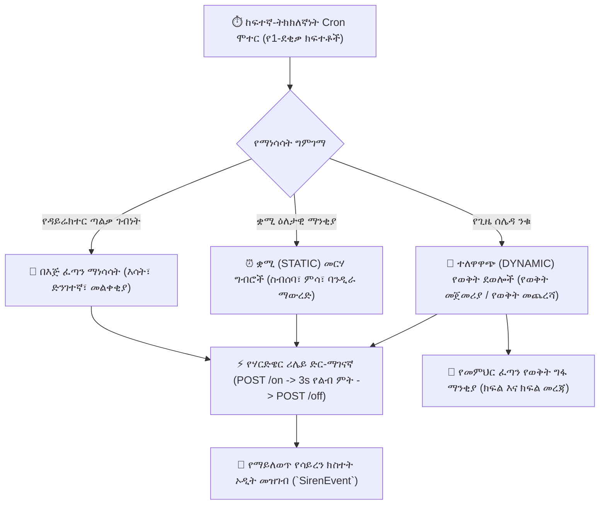

# አውቶማቲክ ሳይረን፣ ደወል እና የሃርድዌር ሪሌይ አስተዳደር

የ**YeneSchool ሳይረን እና የትምህርት ቤት ደወል ስርዓት** (`SirenSchedule`, `SirenEvent`, `SirenHardwareConfig`, `siren.service.ts`) የካምፓስ ደወል መምታትን በራስ-ሰር ያከናውናል፣ የትምህርት ዘመን ሽግግሮችን ከንቁ የጊዜ ሰሌዳዎች ጋር ያመሳስላል፣ የታቀዱ መምህራንን በሞባይል ያሳውቃል እንዲሁም በIoT ድር-ማገናኛዎች አማካኝነት የኤሌክትሪክ ደወል ሪሌዮችን ያነሳሳል።



---

## 1. ተለዋዋጭ የወቅት ደወሎች እና ቋሚ የማንቂያ መርሃ ግብሮች

YeneSchool ሁለት ተጓዳኝ አውቶማቲክ የደወል ሞተሮችን ይሰራል፦

### 1. ተለዋዋጭ የጊዜ ሰሌዳ የወቅት ደወሎች (`DYNAMIC`)
- **ዋና የጊዜ ሰሌዳ ማመሳሰል፦** በማስተማር የስራ ቀናት (ሰኞ እስከ ዓርብ) በ**የወቅት ጊዜዎች** (`periodTime`) ውስጥ በተገለጹት ትክክለኛ `startTime` እና `endTime` ላይ በራስ-ሰር ይደውላል።
- **የወቅት ማረጋገጫ፦** ለዚያ ወቅት በ`timetableSlot` ውስጥ ንቁ የክፍል ትምህርት ካለ ብቻ ይደውላል — በነጻ ወቅቶች ወይም የጥናት ክፍሎች ወቅት ያልተፈለጉ ደወሎች እንዳይደውሉ ይከላከላል።
- **የመምህር ሞባይል ማንቂያ፦** በ`PERIOD_START` ላይ ስርዓቱ የታቀደውን መምህር (ወይም የጊዜ ሰሌዳ ለውጥ ንቁ ከሆነ የሚተካውን መምህር) የክፍሉን ስም፣ ክፍለ-ክፍል፣ የትምህርት ዓይነት እና የክፍል ቁጥር የሚገልጽ የግፋ ማሳወቂያ በራስ-ሰር ይልካል።
- **የበዓላት እና የመዝጊያ ጥበቃ፦** ስርዓቱ `SchoolEvent` ን በራስ-ሰር ይጠይቃል እና በብሔራዊ በዓላት፣ በወቅት እረፍቶች እና በታወጁ የካምፓስ መዝጊያዎች (`isSchoolClosedToday`) **ሁሉንም የደወል መምታት ያስቆማል**።

### 2. ቋሚ ዕለታዊ የማንቂያ መርሃ ግብሮች (`STATIC`)
ከመደበኛ የወቅት ሽግግሮች ውጭ ለሚከሰቱ ተደጋጋሚ ዕለታዊ ክስተቶች፦
1. ወደ **ዳይሬክተር > የሳይረን አስተዳደር > መርሃ ግብሮች** ይሂዱ።
2. **+ ብጁ መርሃ ግብር ያክሉ** ላይ ጠቅ ያድርጉ፦
   - **የመርሃ ግብር ስም፦** ለምሳሌ፣ *የጠዋት የካምፓስ ስብሰባ*፣ *የመጀመሪያ ደረጃ የምሳ እረፍት*፣ *ብሔራዊ መዝሙር እና የባንዲራ ስነ-ስርዓት*።
   - **የደወል ጊዜ፦** በ24-ሰዓት ቅርጸት ትክክለኛው የግድግዳ ሰዓት ጊዜ (ለምሳሌ፣ `07:45`፣ `12:15`፣ `15:45`)።
   - **የስራ ቀናት፦** ንቁ ቀናትን ባለብዙ-ምርጫ ይምረጡ (ለምሳሌ፣ *ሰኞ፣ እሮብ፣ ዓርብ*)።
   - **የሳይረን አይነት፦** `GENERAL`, `PERIOD_START`, `PERIOD_END`, `DISMISSAL`, `WARNING`.
3. **ንቁ** የሚለውን ይቀይሩ እና **መርሃ ግብር ያስቀምጡ** ላይ ጠቅ ያድርጉ።

---

## 2. የድንገተኛ አደጋ ማንቂያዎች እና በእጅ ፈጣን ማነሳሳት

በአስቸኳይ ሁኔታዎች ውስጥ የትምህርት ቤት ዳይሬክተሮች እና የተፈቀደላቸው ተቆጣጣሪዎች በቀጥታ ከዳሽቦርዱ ፈጣን ሳይረኖችን ማስነሳት ይችላሉ፦

| በእጅ የሳይረን አይነት | የሚመከር የአጠቃቀም ሁኔታ | የእይታ እና የድምጽ ማንቂያ ባህሪ |
| :--- | :--- | :--- |
| **`FIRE`** | የእሳት ማንቂያ ወይም የአደጋ ጊዜ መልቀቂያ። | ቀጣይነት ያለው ተዘዋዋሪ የልብ ምት፤ በሁሉም የሰራተኞች ስክሪኖች ላይ የአደጋ ጊዜ ቀይ ባነር። |
| **`EMERGENCY`** | የካምፓስ መቆለፊያ ወይም ከባድ የአየር ሁኔታ ማንቂያ። | ከተገናኙት ድምጽ ማጉያዎች ሁሉ የሚተላለፍ ከፍተኛ-ቅድሚያ የሳይረን ቃና። |
| **`DISMISSAL`** | የዝናብ ቀን ቀደም ብሎ መልቀቂያ ወይም ልዩ ስብሰባ። | ድርብ-ቺም የመልቀቂያ ንድፍ። |
| **`PERIOD_START` / `PERIOD_END`** | በአጋጣሚ መርሃ ግብር ፈረቃዎች ወቅት በእጅ የወቅት ቺም። | መደበኛ የ3-ሰከንድ የሽግግር ደወል። |
| **`WARNING`** | የጠዋት መተላለፊያ በር ከመዘጋቱ በፊት የ5-ደቂቃ ማስጠንቀቂያ ደወል። | አጭር የማስጠንቀቂያ ቺም። |
| **`GENERAL`** | አጠቃላይ የካምፓስ ማስታወቂያ ቺም። | ነጠላ ቺም። |

---

## 3. የIoT ሃርድዌር ሪሌይ ውህደት (ESP32 / Raspberry Pi / Shelly)

በካምፓሱ ውስጥ ሜካኒካል ወይም ኤሌክትሮኒክ የትምህርት ቤት ደወሎችን በአካል ለማስደወል፦

```mermaid
flowchart LR
    A["የYeneSchool ክላውድ አገልጋይ"] -->|HTTP POST <webhookUrl>/on| B["🔌 የIoT ሪሌይ መቆጣጠሪያ (ESP32 / Shelly)"]
    B -->|የሪሌይ ግንኙነት ዝጋ (220V AC)| C["🔔 የአካል የትምህርት ቤት ደወል ይደውላል"]
    A -->|የ3 ሰከንድ የልብ ምት ጊዜ ይጠብቁ| D["⏱️ ቆጣሪ"]
    D -->|HTTP POST <webhookUrl>/off| B
    B -->|የሪሌይ ግንኙነት ክፈት| E["🔕 ደወል ተዝግቷል"]
```

### አካላዊ ሃርድዌርን ማዋቀር
1. በ**ዳይሬክተር > የሳይረን አስተዳደር** ውስጥ **የሃርድዌር ውህደት** ትርን ይክፈቱ።
2. የአካላዊ ሪሌይ መሳሪያዎን ቅንብሮች ያስገቡ፦
   - **የሃርድዌር ድር-ማገናኛ URL፦** የIoT ሪሌይዎ የአካባቢ IP ወይም የተለዋዋጭ DNS URL (ለምሳሌ፣ `http://192.168.1.150:8080/relay` ወይም `https://relay.yeneschool-device.net`)።
   - **የጥያቄ ጊዜ ማብቂያ (ms)፦** ከፍተኛው የአውታረ መረብ መጠበቂያ ጊዜ (ነባሪ፦ `5000` ms)።
   - **የሃርድዌር ማነሳሳት ያንቁ፦** ወደ `ንቁ (Active)` ይቀይሩ።
3. **የሃርድዌር ግንኙነት ይሞክሩ** ላይ ጠቅ ያድርጉ፦
   - አገልጋዩ የሙከራ የልብ ምት ይልካል (`/on` በመቀጠል ከ2 ሰከንድ በኋላ `/off`)።
   - ስክሪኑ የሃርድዌር ሪሌዩ በተሳካ ሁኔታ ምላሽ መስጠቱን ያረጋግጣል።

---

## 4. አስተማማኝነት እና ማንነት-ነክ (Idempotency) አርክቴክቸር

- **የPostgreSQL አማካሪ መቆለፊያ፦** እያንዳንዱ የደቂቃ cron ግምገማ የታሸጉ የአገልጋይ አባላት (clusters) የደወል ማነሳሳትን በጭራሽ እንዳይባዙ ለማረጋገጥ `pg_try_advisory_lock` ን ይጠቀማል።
- **የጊዜ ሰቅ መፍታት፦** የትምህርት ቤቱን የአካባቢ የግድግዳ ሰዓት ጊዜ በ`Africa/Addis_Ababa` የጊዜ ሰቅ ውስጥ በራስ-ሰር ይፈታል።
- **የኦዲት ምዝገባ፦** እያንዳንዱ የደወል ክስተት (በእጅ፣ ቋሚ ወይም ተለዋዋጭ) በ`SirenEvent` ውስጥ የማስፈጸም የጊዜ ማህተሞች፣ የመላኪያ ባንዲራዎች (`webhookSent`, `pushSent`) እና የኦፕሬተር መለያ ጋር በቋሚነት ይመዘገባል።

---

## ቀጣይ እርምጃዎች

- [የAI የጊዜ ሰሌዳ እና የመተካካት ጠባቂ](/am/ai/timetable-watchdog) — በመቅረት ጊዜ መምህራንን በራስ-ሰር መተካት
- [የወቅት ጊዜዎች እና የክፍል ቆይታ ማዋቀር](/am/academic/timetable) — የወቅት መጀመሪያ እና መጨረሻ ጊዜዎችን ማዘጋጀት
- [የመላ ትምህርት ቤት ቅንብሮች እና ውቅር](/am/director/school-settings) — የካምፓስ የስራ ሰዓቶች እና የጊዜ ሰቅ ነባሪዎች