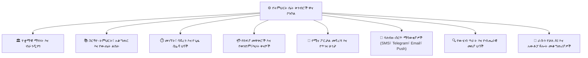
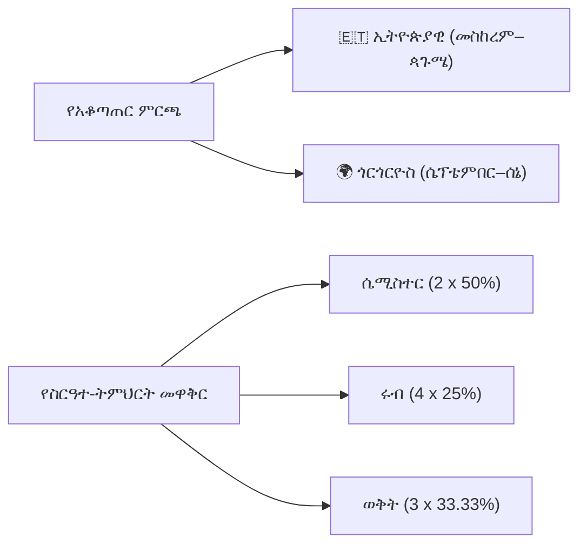
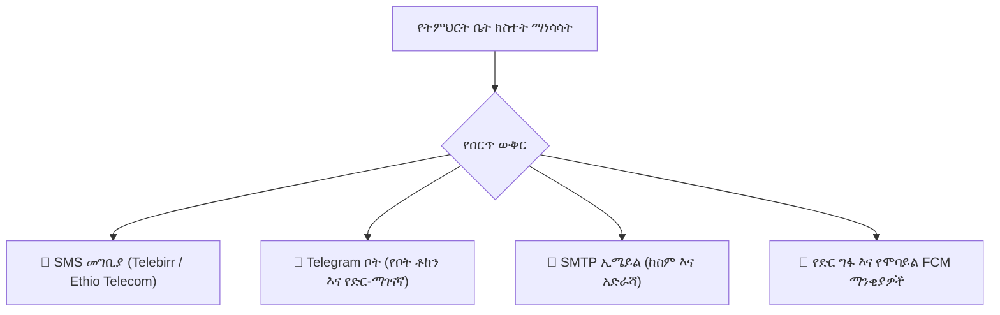

# የመላ ትምህርት ቤት ቅንብሮች እና ውቅር

የ**ትምህርት ቤት ቅንብሮች አስተዳደር ማዕከል** (`/director/school-settings` ወይም `PATCH /school-settings`) ለትምህርት ቤት ዳይሬክተር ዋናው የአስተዳደር መቆጣጠሪያ ፓነል ነው። እያንዳንዱ የትምህርት ፖሊሲ፣ የውጤት ደረጃ፣ የፋይናንስ ስራ ፍሰት፣ የመግባቢያ መግቢያ እና ራሱን የቻለ የAI ባህሪ እዚህ ይዋቀራል እና ይተገበራል።

---

## 1. ተቋማዊ ማንነት፣ ብራንዲንግ እና ማህበራዊ አገናኞች

በሁሉም የተማሪ ትራንስክሪፕቶች፣ ይፋዊ የውጤት ካርዶች፣ መለያ ካርዶች፣ ደረሰኞች እና የፖርታል መግቢያ ስክሪኖች ላይ የሚታዩትን ይፋዊ የብራንድ ንብረቶች፣ ሜታዳታ እና የመገናኛ ነጥቦችን ይገልጻል።

| የቅንብር ቁልፍ | ዓይነት / ቅርጸት | መግለጫ እና የክዋኔ ተጽእኖ |
| :--- | :--- | :--- |
| `school_name` | String | በትምህርት ሚኒስቴር እውቅና ያገኘ ይፋዊ የተመዘገበ ስም። |
| `school_motto` | String | በሰነድ ራስጌዎች እና የተማሪ ፖርታሎች ላይ የሚታይ የተቋም መሪ ቃል። |
| `school_address` | String | አካላዊ የካምፓስ አካባቢ፣ ክፍለ ከተማ፣ ወረዳ እና የቤት ቁጥር። |
| `school_phone` | Phone | በተማሪ መለያ ካርዶች እና ቫውቸሮች ላይ የሚታተም ዋና የተቋም ሆትላይን። |
| `school_email` | Email | ለስርዓቱ የሚወጡ ይፋዊ መልእክቶች ይፋዊ የአስተዳደር ኢሜይል። |
| `logo_url` | Image (PNG/SVG) | ለብርሃን እና ለጨለማ ገጽታዎች ከፍተኛ-ጥራት ያለው ግልጽ የአርማ ምልክት። |
| `login_image_url`| Image URL | በትምህርት ቤቱ ይፋዊ የመግቢያ ፖርታል ላይ የሚታይ ብጁ የበስተጀርባ ባነር። |
| `theme_color` | Hex Code (`#hex`) | በድር እና በሞባይል ላይ በተለዋዋጭ ሁኔታ የሚተገበር ዋና የተቋም ብራንድ ቀለም። |
| `BRAND_COLOR_IN_NAVIGATION` | Boolean (`true/false`) | የጎን አሰሳ ሀዲዶችን እና ንቁ ራስጌዎችን በትምህርት ቤት ብራንድ ቀለም ያሸብራል። |
| `CUSTOM_BRANDING` | Boolean | ነጭ-መለያ (white-label) ብጁ ዶሜይን እና ብጁ የመግቢያ ብራንዲንግ ያንቃል። |
| `social_telegram` | URL / Username | የትምህርት ቤቱ ይፋዊ የቴሌግራም ሰርጥ ወይም ቡድን አገናኝ። |
| `social_facebook` | URL | ይፋዊ የተቋሙ የፌስቡክ ማህበረሰብ ገጽ። |

---

## 2. የትምህርት ስርዓተ-ትምህርት፣ አቆጣጠር እና የውጤት ስርዓቶች

የትምህርት ዘመኑን፣ የግምገማ ወቅቶችን እና የማደግ መስፈርቶችን መሰረታዊ የፔዳጎጂካል መዋቅር ይቆጣጠራል።

### የሚደገፉ የስርዓተ-ትምህርት ዓይነቶች (`curriculum_type`)
- **`SEMESTER`** (ነባሪ)፦ በየትምህርት ዘመኑ ሁለት ወቅቶች (ሴሚስተር 1 - 50%፣ ሴሚስተር 2 - 50%)።
- **`QUARTER`**፦ በየትምህርት ዘመኑ አራት ወቅቶች (በየሩብ 25% ክብደት)።
- **`TERM`**፦ በየትምህርት ዘመኑ ሶስት ወቅቶች (33.33%፣ 33.33%፣ 33.34% ክፍፍል)።
- **`CUSTOM`**፦ ብጁ የወቅት የቀን ክልሎች እና ተለዋዋጭ የመቶኛ ክብደቶች።

### የሚደገፉ የውጤት ስርዓቶች (`grade_system`)
የተቋሙን የትምህርት ወሰን ይምረጡ፦
- `1-8` | `1-10` | `1-12` | `9-12`
- `K-4` | `K-8` | `KG-8` | `K-12` | `KG-12` | `PRE-K-12`
- `KG-ONLY` | `EARLY-CHILDHOOD` | `NURSERY-KG3` | `KG1-KG3`

### የውጤት ልኬት እና የማደግ ፖሊሲ ቁልፎች
- **`PASSING_MARK_THRESHOLD`**፦ ለማለፍ የሚያስፈልገው ዝቅተኛ አጠቃላይ መቶኛ (ለምሳሌ፣ `50%` ወይም `60%`)።
- **`MIN_PASSING_MARK_SECONDARY`**፦ ለሁለተኛ ደረጃ እና መሰናዶ ክፍሎች (7–12) የሚተገበር ልዩ የማለፊያ ገደብ።
- **`SHOW_LETTER_GRADES`**፦ በውጤት ካርዶች ላይ ከቀሪ መቶኛ ቁጥሮች ጋር በፊደል የሚገለጹ ውጤቶችን (`A`, `B`, `C`, `D`, `F`) ያሳያል።
- **`ENABLE_CONDUCT_GRADING`**፦ በውጤት ካርዶች ላይ የባህሪ ውጤት አሰጣጥን (`A=እጅግ ጥሩ`፣ `B=በጣም ጥሩ`፣ `C=አጥጋቢ`፣ `U=አጥጋቢ ያልሆነ`) ያክላል።
- **`PROMOTION_MIN_AVERAGE_GRADE`**፦ በዓመቱ መጨረሻ ለራስ-ሰር የክፍል ማደግ የሚያስፈልገው የመቁረጫ ውጤት።
- **`PROMOTION_MIN_ATTENDANCE`**፦ ለማደግ ብቁ ለመሆን የሚያስፈልገው ዝቅተኛ የመገኘት መቶኛ (ለምሳሌ፣ `80%`)።
- **`PROMOTION_ALLOW_FAILED_SUBJECTS`**፦ ተማሪ ከመቆየቱ በፊት ይፈቀደው የከፋፈሉ ዋና ያልሆኑ የትምህርት ዓይነቶች ከፍተኛ ቁጥር (ለምሳሌ፣ `0` ወይም `1`)።
- **`GRADE_EDIT_WINDOW_DAYS`**፦ የውጤት መዝገቡ በራስ-ሰር ከመቆለፉ በፊት መምህራን ከምዘና ቀን በኋላ ውጤቶችን ለማረም የሚኖራቸው የቀናት ብዛት (ለምሳሌ፣ `7` ቀናት)።

---

## 3. የመገኘት፣ የጊዜ ሰሌዳ እና የክዋኔ ህጎች

የክፍል መገኘት የመቁረጫ ነጥቦችን፣ የመምህር የስራ ጫና ገደቦችን እና የጊዜ ሰሌዳ ገደቦችን ይቆጣጠራል።

| የቅንብር ቁልፍ | ነባሪ | መግለጫ |
| :--- | :--- | :--- |
| `SCHOOL_START_TIME` | `08:00` | ለካምፓስ ክዋኔዎች ይፋዊ የጠዋት መጀመሪያ ሰዓት። |
| `SCHOOL_END_TIME` | `15:30` | ለመደበኛ የክፍል ወቅቶች ይፋዊ የመልቀቂያ ሰዓት። |
| `ATTENDANCE_CUTOFF_TIME` | `08:15` | ከዚህ ሰዓት በኋላ የገቡ ተማሪዎች በራስ-ሰር **ዘግይቷል** ተብለው ምልክት ይደረግባቸዋል። |
| `LATE_THRESHOLD_MINUTES` | `15` | የተማሪ መግቢያ እንደ ዘግይቶ ከመመደቡ በፊት ያለው የእረፍት ጊዜ በደቂቃ። |
| `CONSECUTIVE_ABSENCE_ALERT_DAYS`| `3` | ተማሪ ለተከታታይ X ቀናት ሲቀር ለዳይሬክተር ከፍተኛ-ቅድሚያ ማንቂያ ያስነሳል። |
| `ATTENDANCE_DAILY_LOCK_TIME` | `17:00` | ዕለታዊ የመገኘት መዝገቦች የሚቆለፉበት ሰዓት፤ የኋላ ወደ ኋላ የመምህር ማረምን ይከለክላል። |
| `ATTENDANCE_EDIT_WINDOW_DAYS` | `3` | በተቆጣጣሪ ፈቃድ ለመገኘት መዝገብ ማስተካከያ የሚፈቀድ ከፍተኛ የቀናት ብዛት። |
| `MAX_PERIODS_PER_DAY` | `7` | በአውቶማቲክ የጊዜ ሰሌዳ አመንጪ ውስጥ የሚታቀድ ከፍተኛ የዕለት የክፍል ወቅት ብዛት። |
| `DEFAULT_SECTION_CAPACITY` | `40` | ከመከፋፈል ማስጠንቀቂያ በፊት በአንድ የክፍል ክፍል የሚፈቀድ ከፍተኛ የተማሪ አቅም። |

---

## 4. የክፍያ መዋቅሮች፣ የወንድም/እህት ቅናሾች እና የክፍል መዳረሻ ፖሊሲዎች

የትምህርት ክፍያ የሂሳብ አከፋፈል ዑደቶችን፣ አውቶማቲክ የዘገየ ቅጣቶችን፣ የወንድም/እህት ቅናሽ ቀመሮችን እና የውጤት ካርድ የፋይናንስ መቆለፊያዎችን ይገልጻል።

### የክፍያ መዋቅር ሁነታዎች (`fee_structure_mode`)
- **`MONTHLY`**፦ በየአቆጣጠሩ ዓመት 12 ወርሃዊ የክፍያ ዑደቶች።
- **`MONTHLY_10`**፦ 10 የትምህርት ወርሃዊ የክፍያ ዑደቶች (የበጋ የበዓል ወራትን ሳይጨምር)።
- **`QUARTERLY`**፦ 4 የሩብ ሂሳብ ደረሰኞች።
- **`SEMESTER`**፦ 2 የሴሚስተር ሂሳብ ደረሰኞች።
- **`TERM`**፦ 3 የወቅት ሂሳብ ደረሰኞች።
- **`YEARLY`**፦ ነጠላ ዓመታዊ የትምህርት ክፍያ ሂሳብ።

### የወንድም/እህት እና የቤተሰብ ቅናሽ ፖሊሲ
- **`family_discount_enabled`** (`true/false`)፦ ብዙ የተመዘገቡ ልጆች ላሏቸው ቤተሰቦች ራስ-ሰር የትምህርት ክፍያ ቅነሳን ያንቃል።
- **`family_discount_min_students`**፦ ቅናሹን ለማንቃት የሚያስፈልጉ ዝቅተኛ የተመዘገቡ ወንድም/እህቶች ብዛት (ለምሳሌ፣ `2` ወይም `3`)።
- **`family_discount_percent`**፦ ብቁ ለሆኑ ወንድም/እህቶች ከትምህርት ክፍያ የሚቀነስ መቶኛ (ለምሳሌ፣ `10%` ወይም `15%`)።
- **`family_discount_fee_types`**፦ ለቅናሽ ብቁ የክፍያ ምድቦች ድርድር (ለምሳሌ፣ `["TUITION"]`)።

### የፋይናንስ የክፍል መዳረሻ ቁጥጥሮች
- **`parent_view_grades`** (`true/false`)፦ ወላጆች የቀጣይ ግምገማ ውጤቶችን በቀጥታ እንዲመለከቱ ያስችላል።
- **`parent_grades_without_payment`** (`true/false`)፦ ወደ `false` ሲዋቀር፣ ያልተከፈለ ቀሪ ሂሳብ ያላቸው ወላጆች ክፍያዎቻቸውን እስኪፈጽሙ ድረስ የወቅት መጨረሻ የውጤት ካርዶችን ማየት ወይም ማውረድ አይችሉም።

---

## 5. የፖርታል መዳረሻ ቁጥጥሮች እና የጥገና ሁነታ

ዳይሬክተሮች በተጠቃሚ ሚና መሰረት የስርዓት መዳረሻን መስጠት፣ መገደብ ወይም ማገድ ይችላሉ፦

| የመዳረሻ ቁጥጥር መቀያየሪያ | ነባሪ | መግለጫ |
| :--- | :--- | :--- |
| `TEACHER_PORTAL_ACCESS` | `true` | የማስተማር ሰራተኞች እንዲገቡ፣ መገኘት እንዲወስዱ እና ውጤቶችን እንዲያስገቡ ያስችላል። |
| `STUDENT_PORTAL_ACCESS` | `true` | ተማሪዎች የመስመር ላይ ፈተናዎችን፣ ስራዎችን እና የጊዜ ሰሌዳዎችን እንዲያገኙ ያስችላል። |
| `PARENT_PORTAL_ACCESS` | `true` | ወላጆች መገኘትን እንዲከታተሉ፣ የውጤት ካርዶችን እንዲያዩ እና ክፍያ እንዲፈጽሙ ያስችላል። |
| `FINANCE_PORTAL_ACCESS` | `true` | ለክፍያ እና ደረሰኝ የፋይናንስ ካሽየር መዳረሻን ያንቃል። |
| `REGISTRAR_PORTAL_ACCESS` | `true` | ለመግቢያ እና መዝገብ ማረም የሬጅስትራር ሰራተኛ መዳረሻን ያንቃል። |
| `MAINTENANCE_MODE` | `false` | በዳታቤዝ ማሻሻያ ወቅት ሁሉንም የተጠቃሚ ፖርታሎች በወዳጃዊ የጥገና ባነር ይቆልፋል። |
| `PORTAL_MAINTENANCE_MESSAGE` | String | በጥገና ወቅቶች በመግቢያ ስክሪን ላይ የሚታይ ብጁ መልእክት። |

---

## 6. ባለብዙ-ሰርጥ የማሳወቂያ መግቢያዎች

በሁሉም የትምህርት ቤት ክስተቶች ላይ SMS፣ Telegram ቦት፣ ኢሜይል እና የድር ግፋ ማሳወቂያዎችን ያዋቅሩ፦

### የክስተት ማሳወቂያ ማትሪክስ
እያንዳንዱ የመገናኛ ሰርጥ ዝርዝር የርዕስ-ደረጃ ማነሳሳቶችን ይደግፋል፦
- **`*_ON_ATTENDANCE`**፦ ለወላጆች የሚላኩ በቅጽበት የመቅረት/የመዘግየት ማሳወቂያዎች።
- **`*_ON_FEES`**፦ የክፍያ ቀነ-ገደብ ማሳሰቢያዎች፣ የዘገየ ማስጠንቀቂያዎች እና የክፍያ ደረሰኞች።
- **`*_ON_ACADEMICS`**፦ የታተሙ የፈተና ውጤቶች፣ የውጤት ካርድ ልቀቶች እና የተመደቡ ስራዎች ቀነ-ገደቦች።
- **`*_ON_COMMUNICATION`**፦ የመላ ትምህርት ቤት ክብረ-ወረቀቶች፣ የአደጋ ጊዜ መዝጊያዎች እና የወላጅ-መምህር ስብሰባ ማስታወቂያዎች።

### የTelegram ቦት ውህደት ቁልፎች
- **`TELEGRAM_NOTIFICATIONS_ENABLED`**፦ አብሮ የተሰራ የTelegram ቦት ማሳወቂያዎችን ያንቃል።
- **`TELEGRAM_BOT_TOKEN`**፦ በTelegram `@BotFather` በኩል የሚነገነገግ ደህንነቱ የተጠበቀ የቦት API ቶከን።
- **`TELEGRAM_BOT_USERNAME`**፦ የትምህርት ቤትዎ የተረጋገጠ የTelegram ቦት ይፋዊ የተጠቃሚ ስም።
- **`TELEGRAM_WEBHOOK_SECRET`**፦ የሚገቡ የድር-ማገናኛ ጥያቄዎችን ለማረጋገጥ የHMAC ፊርማ ሚስጥር።
- **`TELEGRAM_CHANNEL_ID`**፦ ለመላ ትምህርት ቤት የስርጭት ክብረ-ወረቀቶች አማራጭ የትምህርት ቤት ይፋዊ ሰርጥ መለያ።

---

## 7. የውሂብ ጥራት እና የብሔራዊ መለያ (Fayda) ማስፈጸሚያ

በተማሪ እና በሰራተኛ ምዝገባ ወቅት የዳታቤዝ ትክክለኛነትን ይጠብቃል እና የትምህርት ሚኒስቴር ደረጃዎችን ያስፈጽማል፦

- **`DATA_QUALITY_REQUIRE_FAYDA`** (`true/false`)፦ ለሁሉም የተመዘገቡ ተማሪዎች የኢትዮጵያ ብሔራዊ ዲጂታል መለያ (Fayda Identification Number) ማስገባትን አስገዳጅ ያደርጋል።
- **`DATA_QUALITY_REQUIRE_MOTHER_NAME`** (`true/false`)፦ በተማሪ ምዝገባ ቅጾች ላይ የእናትን ሙሉ ህጋዊ ስም መመዝገብ ያስፈልጋል።
- **`DATA_QUALITY_REQUIRE_PARENT`** (`true/false`)፦ ትክክለኛ የስልክ ቁጥር ያለው ቢያንስ አንድ ዋና አሳዳጊ ሳይገናኝ የተማሪ መግቢያን እንዳይጠናቀቅ ይከለክላል።
- **`DATA_QUALITY_CHECK_DUPLICATE_CODE`** (`true/false`)፦ በካምፓሶች መካከል የተባዙ የተማሪ መለያ ኮዶችን የሚከላከል በቅጽበት ማረጋገጫ።
- **`RESTRICT_STUDENT_DATA_EXPORT`** (`true/false`)፦ የጅምላ የCSV የተማሪ ውሂብ ማላክን በተለይ ለትምህርት ቤት ዳይሬክተር ብቻ ይገድባል።

---

## 8. ራሱን የቻለ AI ሞተር እና ንቁ አውቶፓይሎት መቆጣጠሪያዎች

የYeneSchool የበስተጀርባ AI ረዳቶች፣ አውቶማቲክ የግንኙነት ቦቶች እና ብልህ ጠባቂዎች በመላ ተቋሙ እንዴት እንደሚሰሩ ይቆጣጠራል፦

### የነጻነት ደረጃዎች (`AI_PROACTIVE_AUTONOMY_LEVEL`)
- **`SUPERVISED`** (ነባሪ)፦ AI ረቂቆችን ያመነጫል (የመገኘት SMS፣ የትምህርት እቅዶች፣ የጊዜ ሰሌዳ ሀሳቦች) ነገር ግን ከመላኩ በፊት የዳይሬክተር/የመምህር ማረጋገጫ ይጠይቃል።
- **`AUTONOMOUS`**፦ AI ያለ በእጅ ጣልቃ ገብነት የታቀዱ የበስተጀርባ ተግባራትን በራስ-ሰር ያከናውናል (የመቅረት ማሳወቂያዎችን መላክ፣ የጠዋት ማጠቃለያዎች፣ የጊዜ ሰሌዳ ግጭት መፍታት)።
- **`ADVISORY`**፦ AI በዳሽቦርድ ላይ ብቻ የትንታኔ ግንዛቤዎችን እና ምክሮችን ያቀርባል።

### የቃና እና የመገናኛ ዘይቤ (`AI_TONE_FRIENDLINESS`)
- **`WARM_EMPATHETIC`**፦ የወላጅ ማረጋገጫን እና የጋራ ችግር አፈታትን ቅድሚያ የሚሰጥ ርህሩህ፣ አጋዥ ቃና።
- **`BALANCED_PROFESSIONAL`**፦ ግልጽ፣ ጨዋ፣ ሙያዊ የትምህርት ግንኙነት።
- **`FORMAL_ACADEMIC`**፦ ለጥብቅ የተገዢነት ክብረ-ወረቀቶች ተስማሚ የሆነ የተዋቀረ ተቋማዊ አገላለጽ።
- **`ENTHUSIASTIC_COACH`**፦ ለተማሪ የጥናት አሰልጣኞች የተዘጋጀ አበረታች፣ የሚያነቃቃ ቃና።

### ንቁ የበስተጀርባ ጠባቂዎች እና የርዕስ መቀያየሪያዎች
- **`AI_PROACTIVE_KILL_SWITCH`** (`true/false`)፦ በመላ ትምህርት ቤቱ ሁሉንም ራሱን የቻለ የAI የበስተጀርባ ስራ ፍሰቶችን በቅጽበት የሚያቆም ዋና የአስቸኳይ ጊዜ መቆራረጫ መቀየሪያ።
- **`AI_PROACTIVE_TIMETABLE_WATCHDOG`**፦ የመምህር ፈቃዶችን በተከታታይ ይከታተላል እና በራስ-ሰር የመተካካት መርሃ ግብሮችን ያመነጫል።
- **`AI_PROACTIVE_ATTENDANCE_NUDGES`**፦ የወቅቱ መጀመሪያ ከሆነ በ20 ደቂቃ ውስጥ የጠዋት ጥሪያቸውን ላላስገቡ መምህራን ወዳጃዊ አስታዋሾችን ይልካል።
- **`AI_PROACTIVE_MIDNIGHT_RECON`**፦ የምሽት የውሂብ ትክክለኛነት ምርመራዎችን ያካሂዳል፣ የተማሪ ቀደምት-ማስጠንቀቂያ የስጋት ውጤቶችን በድጋሚ ያሰላል እና የዳይሬክተርን የጠዋት ማጠቃለያ ያዘጋጃል።

---

## ቀጣይ እርምጃዎች

- [የAI ውቅር እና የሞዴል ቅንብሮች](/am/ai/ai-settings) — የOpenRouter ሞዴሎችን፣ የAPI ቁልፎችን እና ራሱን የቻለ የcron መቀያየሪያዎችን ማዋቀር
- [የትምህርት ዘመናት እና የወቅት ማዕቀፍ](/am/academic/academic-years) — የወቅት ቀኖችን እና የትምህርት አቆጣጠርን ማዋቀር
- [ሳይረን እና የሃርድዌር ደወል አስተዳደር](/am/director/siren-management) — የወቅት መርሃ ግብሮችን ከአካላዊ ደወል ሪሌዮች ጋር ማገናኘት
- [የቀደምት ማስጠንቀቂያ የተማሪ ስጋት ዳሽቦርድ](/am/director/student-risk) — የተትረወረወ የተማሪ መውጫ እና የመውደቅ አመላካቾችን መከታተል
- [የተጠቃሚ መገለጫ እና የ2FA ደህንነት](/am/platform/user-profile-security) — የዳይሬክተር መለያዎን በሁለት-ደረጃ ማረጋገጫ ያስጠብቁ