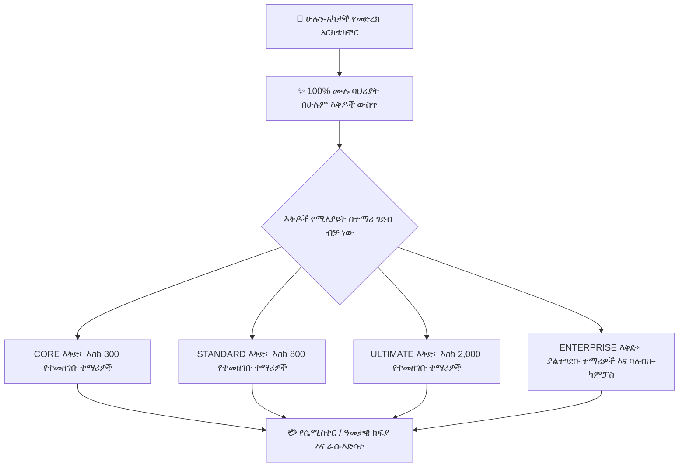

# የትምህርት ቤት ምዝገባ፣ እቅዶች እና ክፍያ

የ**ምዝገባ አስተዳደር ኮንሶል** (`/director/subscription`) የትምህርት ቤት ዳይሬክተሮች እና አስተዳዳሪዎች የትምህርት ቤታቸውን ንቁ የምዝገባ ደረጃ እንዲያዩ፣ በቅጽበት የተማሪ መቀመጫ አጠቃቀምን እንዲከታተሉ፣ የእድሳት ክፍያዎችን እንዲያቀርቡ፣ አዳዲስ የመድረክ ባህሪያትን እንዲጠይቁ እና ይፋዊ ደረሰኞችን እንዲያወርዱ ያስችላል።



---

## 1. እኩል ሁሉን-አካታች ባህሪያት (በተማሪ ገደብ ዋጋ)

የላቁ ባህሪያትን ከፍተኛ ዋጋ ባላቸው ደረጃዎች በስተጀርባ የሚቆልፍ ባህላዊ ሶፍትዌር በተቃራኒ፣ **YeneSchool በእያንዳንዱ እቅድ ውስጥ ለሁሉም ባህሪያት እና ሞጁሎች 100% እኩል መዳረሻ ይሰጣል**። እያንዳንዱ የተመዘገበ ተቋም — የእቅድ መጠኑ ምንም ይሁን ምን — ሁሉንም የትምህርት፣ የአስተዳደር፣ የAI እና የሞባይል አቅሞችን ይቀበላል።

**በእቅድ ደረጃዎች መካከል ያለው ብቸኛው ልዩነት የሚፈቀዱ የተመዘገቡ ተማሪዎች ከፍተኛ ብዛት ነው**፦

| የእቅድ ደረጃ | ከፍተኛ የተማሪ አቅም ገደብ | የተካተቱ ሞጁሎች እና ባህሪያት |
| :--- | :--- | :---: |
| **`CORE` ደረጃ** | **እስከ 300 ተማሪዎች** | **100% ሁሉም ባህሪያት ተካትተዋል** |
| **`STANDARD` ደረጃ** | **እስከ 800 ተማሪዎች** | **100% ሁሉም ባህሪያት ተካትተዋል** |
| **`ULTIMATE` ደረጃ** | **እስከ 2,000 ተማሪዎች** | **100% ሁሉም ባህሪያት ተካትተዋል** |
| **`ENTERPRISE` ደረጃ** | **ያልተገደቡ ተማሪዎች** (ባለብዙ-ካምፓስ) | **100% ሁሉም ባህሪያት ተካትተዋል** + የተወሰነ SLA |

### እያንዳንዱ እቅድ የሚያካትተው፦
- **ዋና ትምህርት፦** ክፍሎች፣ ክፍለ-ክፍሎች፣ የትምህርት ዓይነቶች፣ ወቅቶች እና ራስ-አቅርቦት።
- **መገኘት፦** ዕለታዊ የመማሪያ ክፍል፣ ወቅት-በ-ወቅት፣ ያለግንኙነት NFC መታ እና ከመስመር ውጭ PWA።
- **ውጤት አሰጣጥ እና የውጤት ካርዶች፦** የቀጣይ ግምገማ የውጤት መዝገብ፣ ሊበጁ የሚችሉ የውጤት ካርድ አብነቶች እና ትራንስክሪፕቶች።
- **ፈተናዎች፦** ከመስመር ውጭ የፈተና መርሃ ግብሮች፣ ፀረ-ማጭበርበር ዚግዛግ የመቀመጫ አመንጪ እና የመስመር ላይ የኮምፒውተር ላይ የተመሰረተ ፈተና (CBT)።
- **መግባባት እና AI፦** ማስታወቂያዎች፣ ዲጂታል የመግባቢያ መጽሐፍ፣ የTelegram ቦት ውህደት እና ራሱን የቻለ AI ረዳቶች (Copilots)።
- **የትምህርት ቤት ክዋኔዎች፦** አውቶማቲክ ሳይረን ደወል የሃርድዌር ሪሌዮች፣ የመርከብ ክትትል፣ የመጻሕፍት መደብር POS እና የውሂብ ጥራት ኦዲቶች።
- **የሞባይል መተግበሪያዎች፦** ለሁሉም መምህራን፣ ወላጆች እና ተማሪዎች ሙሉ የAndroid እና iOS የሞባይል መተግበሪያ መዳረሻ።
- **ፋይናንስ፦** የተማሪ ክፍያ መዋቅሮች፣ የክፍያ እቅድ ክትትል እና የሰራተኛ ደመወዝ ስሌቶች።

---

## 2. የምዝገባ ሁኔታዎች እና የእረፍት ጊዜ ሕይወት ዑደት

የትምህርት ቤትዎ ምዝገባ ግልጽ በሆኑ የሕይወት ዑደት ሁኔታዎች ውስጥ ያልፋል፦

| የሁኔታ ኮድ | መግለጫ እና የመድረክ ተጽእኖ |
| :--- | :--- |
| **`ACTIVE`** | የትምህርት ቤቱ ምዝገባ ሙሉ በሙሉ ንቁ ነው። ሁሉም የአስተዳደር እና የክፍል ባህሪያት ያለገደብ የመጻፍ መዳረሻ ይሰራሉ። |
| **`GRACE_PERIOD`** | ምዝገባው የእድሳት ቀኑ ላይ ሲደርስ፣ YeneSchool ራስ-ሰር የእረፍት ጊዜን ያንቃል። መምህራን እና ዳይሬክተሮች **ምንም መቆራረጥ ሳይገጥማቸው** ይቀጥላሉ፤ በሙሉ፣ የአምበር ባነር አስተዳዳሪዎች የእድሳት ሂሳቡን እንዲፈጽሙ ያስታውሳል። |
| **`EXPIRED`** | የእረፍት ጊዜው ከማለፉ በፊት ክፍያው ካልተረጋገጠ፣ የመጻፍ ክዋኔዎች (ለምሳሌ፣ አዲስ የውጤት ካርዶችን ማተም ወይም አዲስ ክፍሎችን መፍጠር) ክፍያው እስኪረጋገጥ ድረስ ይቆለፋሉ። የታሪካዊ ውሂብ 100% ደህንነቱ የተጠበቀ እና ተደራሽ ሆኖ ይቆያል። |
| **`DRAFT`** | የመጀመሪያ እቅድ ማንቃትን በመጠባበቅ ለአዲስ የተመዘገቡ ተቋማት የመጀመሪያ ማዋቀር ሁኔታ። |
| **`CANCELLED`** | የተቋረጠ የተቋም መለያ ሁኔታ። |

---

## 3. በቅጽበት የሀብት ኮታዎች እና የአጠቃቀም ክትትል

በ**ዳይሬክተር > ምዝገባ** አጠቃላይ እይታ ውስጥ የቀጥታ መለኪያዎች የተቋሙን የሀብት ፍጆታ ይከታተላሉ፦

```
[ Active Students ]  ████████████░░░░  680 / 800 Seats (85%)
[ Staff Accounts  ]  ██████████░░░░░░   42 / 60 Staff (70%)
[ AI Tokens       ]  ██████████████░░  4.2M / 5.0M Tokens (84%)
[ Cloud Storage   ]  ████░░░░░░░░░░░░  12.4 GB / 50.0 GB (25%)
```

- **የተማሪ መቀመጫ ማንቂያ፦** ንቁ ምዝገባ የእቅድዎ ከፍተኛ አቅም 90% ላይ ሲደርስ፣ የዳይሬክተር ዳሽቦርድ ወደ ቀጣዩ ደረጃ እንዲያሻሽሉ ጥያቄ ያቀርባል — አዳዲስ የተማሪ መግቢያዎች በጭራሽ እንዳይታገዱ።

---

## 4. የእድሳት እና የማሻሻያ ክፍያዎችን ማቅረብ

ዳይሬክተሮች የአሁኑን እቅዳቸውን ማደስ ወይም በቀጥታ በፖርታሉ ውስጥ ወደ ከፍተኛ የተማሪ አቅም ደረጃ ማሻሻል ይችላሉ፦

### ደረጃ በደረጃ የክፍያ ማቅረቢያ የስራ ፍሰት
1. ወደ **ዳይሬክተር > ምዝገባ** ይሂዱ።
2. **ምዝገባ አድስ** ወይም **እቅድ አሻሽል** ላይ ጠቅ ያድርጉ።
3. በታቀደው የተማሪ ምዝገባዎ ላይ በመመስረት የሚፈለገውን **የእቅድ ደረጃ** ይምረጡ፦
   - **የሴሚስተር ክፍያ፦** በወቅቱ መጀመሪያ በዓመት ሁለት ጊዜ የሚከፈል።
   - **ዓመታዊ እቅድ (የሚመከር)፦** **15% ቅናሽ** እና ቅድሚያ የመግቢያ ድጋፍ ያካትታል።
4. የክፍያ ሰርጥዎን ይምረጡ፦
   - **የኢትዮጵያ ንግድ ባንክ (CBE) / የባንክ ማስተላለፍ፦** አጠቃላይ መጠኑን ወደ YeneSchool ተቋማዊ ሂሳብ ያስተላልፉ፣ የባንክ ማጣቀሻ / FT ቁጥር ያስገቡ እና የተቃኘውን የተቀማጭ ደረሰኝ ይጫኑ።
   - **Telebirr / CBE Birr፦** ለፈጣን የUSSD ግፋ ፈቃድ የሞባይል ቁጥርዎን ያስገቡ።
5. **ለማረጋገጫ ክፍያ ያቅርቡ** ላይ ጠቅ ያድርጉ።
6. የክፍያ ሁኔታው ወደ `PENDING_VERIFICATION` ይቀየራል። በፋይናንስ ከተረጋገጠ በኋላ ምዝገባው ወዲያውኑ ወደ `ACTIVE` ይሻሻላል እና የእድሳት ጊዜ ማብቂያ ቀኑ በራስ-ሰር ይራመዳል።

---

## 5. ቀጥተኛ የባህሪ ጥያቄ ፖርታል

የትምህርት ቤት ዳይሬክተሮች ከምዝገባ በይነገጹ በቀጥታ የባህሪ ጥያቄዎችን፣ ብጁ የሞጁል ማሻሻያዎችን ወይም ልዩ የክልል ሪፖርት መስፈርቶችን ማቅረብ ይችላሉ፦

1. በ**ዳይሬክተር > ምዝገባ** ውስጥ ወደ **የባህሪ ጥያቄዎች** ትር ይሸብልሉ።
2. **+ አዲስ ባህሪ ይጠይቁ** ላይ ጠቅ ያድርጉ።
3. ያቅርቡ፦
   - **የባህሪ ርዕስ፦** ለምሳሌ፣ *የሚኒስቴር ዞን 4 ብጁ የሩብ የውጤት ካርድ አብነት*።
   - **ምድብ፦** `ትምህርት`, `ፋይናንስ`, `የAI ረዳት`, `የሞባይል መተግበሪያ`, ወይም `የሃርድዌር ውህደት`.
   - **የንግድ ምክንያት እና መግለጫ፦** ባህሪው የትምህርት ቤትዎን ዕለታዊ ክዋኔዎች እንዴት እንደሚጠቅም ያብራሩ።
4. **ሀሳብ ያስረክቡ** ላይ ጠቅ ያድርጉ።
5. ጥያቄዎን (`UNDER_REVIEW`, `PLANNED`, `IN_DEVELOPMENT`, `RELEASED`) በቀጥታ ከገንቢዎች ማሻሻያዎች ጋር ይከታተሉ።

---

## ቀጣይ እርምጃዎች

- [የመላ ትምህርት ቤት ቅንብሮች እና ውቅር](/am/director/school-settings) — የትምህርት አቆጣጠሮችን፣ ብራንዲንግ እና ፖሊሲዎችን ማዋቀር
- [ስህተቶችን ሪፖርት ማድረግ እና ድጋፍ ማግኘት](/am/guides/support-error-reporting) — የድጋፍ ትኬቶችን እና ቴክኒካል እርዳታን ማስገባት
- [ባለብዙ-ቅርንጫፍ የትምህርት ቤት አስተዳደር](/am/owner/multi-branch) — በበርካታ ካምፓሶች ውስጥ የምዝገባ ፈቃዶችን ማስተዳደር