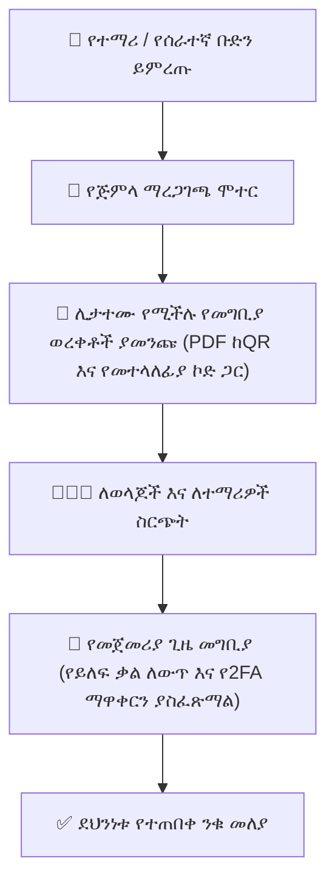

# የተጠቃሚ ማረጋገጫዎች እና የመግቢያ ወረቀቶች አስተዳደር

በትምህርት ዘመን መጀመሪያ ላይ ወይም አዲስ የተማሪ እና ሰራተኛ ቡድኖችን ሲቀበሉ፣ የትምህርት ቤት አስተዳዳሪዎች የመግቢያ ማረጋገጫዎችን (`CredentialGenerationLog`, `PendingCredential`, `PasswordResetToken`) በደህንነት ማሰራጨት ይኖርባቸዋል። YeneSchool የጅምላ አመንጪ መሳሪያዎችን እና ሊታተሙ የሚችሉ የPDF የመግቢያ ወረቀቶችን ያቀርባል።

---

## 1. የጅምላ ማረጋገጫ አመንጨት

### ለክፍል ቡድን የይለፍ ቃሎችን የማመንጨት እርምጃዎች
1. ወደ **ዳይሬክተር > ማረጋገጫዎች እና መለያዎች** (ወይም **ሬጅስትራር > የማረጋገጫ አስተዳዳሪ**) ይሂዱ።
2. **የዒላማ ሚናውን** ይምረጡ (`ተማሪ`, `ወላጅ`, ወይም `መምህር`)።
3. በ**የትምህርት ዘመን**፣ **የክፍል ደረጃ** እና **ክፍለ-ክፍል** ያጣሩ (ለምሳሌ፣ *7ኛ A*)።
4. የአመንጨት ሁነታውን ይምረጡ፦
   - **አዲስ መለያዎች ብቻ፦** መቼም ላልገቡ ተማሪዎች ብቻ ማረጋገጫዎችን ያመነጫል።
   - **የባች የይለፍ ቃል ዳግም ማስጀመር፦** ለሁሉም የተመረጡ መለያዎች የተረሱ ማረጋገጫዎችን ያስጀምራል።
5. የይለፍ ቃል ውስብስብነት መስፈርቶችን ይምረጡ፦
   - `የሚታወሱ የአነባበብ የይለፍ ቃሎች` (ለአንደኛ ደረጃ ተማሪዎች ተስማሚ፣ ለምሳሌ፣ `BlueLion82`)።
   - `ከፍተኛ-ኤንትሮፒ የዘፈቀደ ሕብረቁምፊዎች` (ለሁለተኛ ደረጃ ተማሪዎች እና ሰራተኞች)።
6. **የማረጋገጫ ባች ያመንጩ** ላይ ጠቅ ያድርጉ።

---

## 2. ግላዊ የመግቢያ ወረቀቶችን ማተም

አንዴ ከመነጨ በኋላ አስተዳዳሪዎች የኪስ-መጠን ወይም የግማሽ-ገጽ አካላዊ የማረጋገጫ ወረቀቶችን ማተም ይችላሉ፦

1. **ሊታተሙ የሚችሉ የመግቢያ ወረቀቶች (PDF) አላክ** ላይ ጠቅ ያድርጉ።
2. ስርዓቱ ወረቀቶቹን በሚከተለው ያቀርጻል፦
   - የትምህርት ቤት አርማ፣ ስም እና ይፋዊ መሪ ቃል።
   - የተማሪ ሙሉ ስም፣ የተማሪ ኮድ እና ክፍለ-ክፍል።
   - የተመደበ የተጠቃሚ ስም እና የመጀመሪያ የአንድ-ጊዜ የይለፍ ቃል።
   - በቀጥታ ወደ ትምህርት ቤቱ የሞባይል መግቢያ ፖርታል የሚያገናኝ QR ኮድ።
   - ለመጀመሪያ ጊዜ የይለፍ ቃል ማዋቀር በአማርኛ እና በእንግሊዝኛ ደረጃ በደረጃ መመሪያዎች።
3. ያትሙ እና በአቅንቴሽን ቀን ለወላጆች ያከፋፍሉ ወይም በታሸጉ ኤንቨሎፖች ውስጥ ያስገቡ።

---

## 3. የመጀመሪያ ጊዜ መግቢያ እና የደህንነት ማስፈጸሚያ

ተጠቃሚው በጊዜያዊ ማረጋገጫው ሲገባ፦
- ስርዓቱ በራስ-ሰር **የግዳጅ የይለፍ ቃል ለውጥ ጠባቂውን** (`mustChangePassword: true`) ያነሳሳል።
- ተጠቃሚው በቀጥታ የጥንካሬ መለኪያ በመጠቀም ጠንካራ፣ የግል የይለፍ ቃል መፍጠር አለበት።
- ጊዜያዊ የይለፍ ቃል መዝገቡ ወዲያውኑ ከ`PendingCredential` ምዝገባዎች ይፀዳል እና ይወገዳል።
- አስተዳዳሪው የመለያ ማንቃት መጠኖችን በ**የመግቢያ ሂደት እድገት ዳሽቦርድ** ላይ መከታተል ይችላል።

---

## ቀጣይ እርምጃዎች

- [የመምህር አፈጻጸም እና ግምገማ](/am/director/teacher-evaluation) — የመምህር መገኘትን፣ የትምህርት ማጠናቀቅን እና ደረጃዎችን መከታተል
- [የመላ ትምህርት ቤት ቅንብሮች እና ውቅር](/am/director/school-settings) — የይለፍ ቃል ውስብስብነት ህጎችን እና የክፍለ-ጊዜ ጊዜ ማብቂያዎችን መግለጽ
- [የተጠቃሚ መገለጫ እና የ2FA ደህንነት](/am/platform/user-profile-security) — የሁለት-ደረጃ ማረጋገጫ እና የታመኑ መሳሪያዎች ማዋቀር