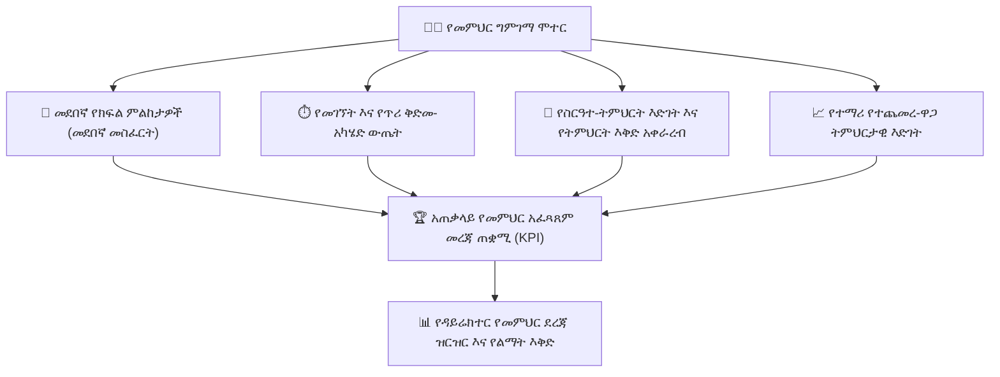

# የመምህር አፈጻጸም፣ ግምገማ እና ደረጃ ዝርዝር

የ**መምህር አፈጻጸም እና የጥራት ማረጋገጫ ሞጁል** ለትምህርት ቤት ዳይሬክተሮች እና ተቆጣጣሪዎች ተጨባጭ፣ በውሂብ ላይ የተመሰረቱ የግምገማ መሳሪያዎችን ያቀርባል። የክፍል ምልከታ መስፈርቶችን፣ የመገኘት ቅድመ-አካሄድን፣ የስርዓተ-ትምህርት ማጠናቀቅ መጠኖችን እና የተማሪ ትምህርታዊ እድገትን ወደ አጠቃላይ የመምህር አፈጻጸም መገለጫዎች ያዋህዳል።

---

## 1. የመምህር ግምገማ አራቱ ምሰሶዎች

YeneSchool በአራት ክብደት ያላቸው ልኬቶች ላይ በመመስረት የተቋም የመምህር አፈጻጸም ውጤት (0% – 100%) ያሰላል፦

| ልኬት | ክብደት | በስርዓቱ የሚተነተኑ መለኪያዎች |
| :--- | :--- | :--- |
| **1. የክፍል ምልከታ መስፈርቶች** | 40% | በዳይሬክተር ወይም በክፍል ኃላፊ በ5 የፔዳጎጂካል ደረጃዎች የሚካሄዱ ቀጥተኛ የክፍል ግምገማዎች። |
| **2. የክዋኔ ቅድመ-አካሄድ** | 25% | ወቅታዊ የጠዋት መግቢያ፣ ዜሮ ያለምክንያት የተሳሳቱ የወቅት ጥሪዎች እና በተቆራረጡ ጊዜያት ውስጥ የዕለታዊ ጥሪዎች ፈጣን አቀራረብ። |
| **3. ስርዓተ-ትምህርት እና የስርዓተ-ትምህርት እድገት** | 20% | በትምህርት አቆጣጠሩ መሰረት የተጠናቀቁ የመማሪያ መጽሐፍ ምዕራፎች እና የስርዓተ-ትምህርት ቋቶች መቶኛ። |
| **4. የተማሪ ትምህርታዊ እድገት** | 15% | በተማሪ የቀጣይ ግምገማ ውጤቶች፣ የቤት ስራ ማዞሪያ እና የፈተና ማለፊያ መጠኖች ውስጥ የተጨመረ-ዋጋ እድገት። |

---

## 2. የክፍል ምልከታ ማካሄድ

### የምልከታ የስራ ፍሰት
1. ወደ **ዳይሬክተር > የመምህር አፈጻጸም > + አዲስ ምልከታ** ይሂዱ።
2. **መምህሩን**፣ **የትምህርት ዓይነቱን**፣ **የክፍል ክፍሉን** እና **ቀን/ወቅቱን** ይምረጡ።
3. መምህሩን ከሚኒስቴር ጋር በተሰለፉ መደበኛ መስፈርቶች (ከ1 እስከ 5 ደረጃ የተሰጠ) ይገምግሙ፦
   - **የማስተማር ግልጽነት እና የዓላማ አወጣጥ፦** የትምህርት ዓላማዎች በግልጽ ተገናኝተዋል?
   - **የተማሪ ተሳትፎ እና ንቁ ተሳትፎ፦** ተማሪዎች በእንቅስቃሴዎቹ ውስጥ በንቃት ተሳትፈዋል?
   - **የክፍል አስተዳደር እና የትምህርት አካባቢ፦** ስርዓት እና ስነ-ምግባር በአክብሮት ተጠብቀዋል?
   - **የቅርጸ-ተጨማሪ ምዘና እና ጥያቄ አቀራረብ፦** መምህሩ በትምህርቱ ወቅት የተማሪ ግንዛቤን አረጋግጧል?
   - **የእይታ መርጃዎች እና ተግባራዊ የማስተማሪያ መሳሪያዎች አጠቃቀም፦** የላቦራቶሪ መሳሪያዎችን፣ ገበታዎችን ወይም ዲጂታል ትምህርቶችን መጠቀም።
4. የባህሪ አድናቆቶችን እና ለሙያዊ እድገት የሚሆኑ ቦታዎችን ያክሉ።
5. ግብረ መልሱን ወዲያውኑ ከመምህሩ ጋር መጋራት ወይም እስከ አንድ-ለአንድ ማብራሪያ ድረስ ምስጢራዊ ማድረግ ይምረጡ።
6. **የምልከታ ሪፖርት አስረክብ** ላይ ጠቅ ያድርጉ።

---

## 3. የመምህር ደረጃ ዝርዝር እና ሙያዊ ልማት

- **ተቋማዊ ደረጃ ዝርዝር፦** ዳይሬክተሩ ልዩ መምህራንን ለማወቅ እና የወቅት መጨረሻ የልህቀት ሰርተፊኬቶችን ለመስጠት በጥምር የአፈጻጸም ውጤቶች የተመደቡ መምህራንን ማየት ይችላል።
- **የግለሰብ የልማት እቅዶች (IDP)፦** በተወሰኑ ቦታዎች (ለምሳሌ፣ የተማሪ ተሳትፎ) ከመስፈርት በታች ለሚያመጡ መምህራን ስርዓቱ የታለሙ የሙያዊ ልማት አውደ ጥናቶችን ይጠቁማል እና ከልምድ ያላቸው የአማካሪ መምህራን ጋር ያገናኛል።

---

## ቀጣይ እርምጃዎች

- [የመላ ትምህርት ቤት ቅንብሮች እና ውቅር](/am/director/school-settings) — የምልከታ መስፈርት ክብደቶችን ማዋቀር
- [የዳይሬክተር ሳይረን እና ደወል አስተዳደር](/am/director/siren-management) — የክፍል ወቅት ተገዢነትን መከታተል
- [የተቆጣጣሪ የጥራት ማረጋገጫ](/am/supervisor/overview) — የተቆጣጣሪ ሚና እና የትምህርት ኦዲቶች