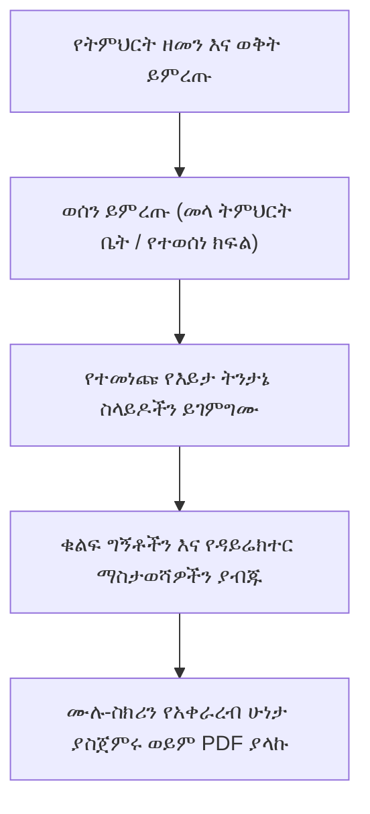

# የPTA የወላጅ አቀራረብ አመንጪ

የትምህርት ቤት ዳይሬክተሮች በወላጅ-መምህር ማህበር (PTA) ስብሰባዎች እና በወቅት መዝጊያ ስብሰባዎች ወቅት የትምህርት ውጤቶችን፣ የመገኘት አዝማሚያዎችን እና የመላ ትምህርት ቤት ስኬቶችን ለቤተሰቦች በተደጋጋሚ ያቀርባሉ። የ**ወላጅ አቀራረብ አመንጪ** (`/director/reports/parent-presentation`) ውስብስብ የትምህርት ቤት ውሂብን በራስ-ሰር ለቀጥታ ትንበያ ዝግጁ ወደሆኑ የሥራ አስፈጻሚ የእይታ ስላይድ ዲኮች እና ገበታዎች ያጠናቅራል።

---

## ቁልፍ የአቀራረብ ብልጫዎች

::u-page-grid
:::u-page-card
---
title: የትምህርት እድገት ገበታዎች
icon: i-lucide-bar-chart-3
---
አማካይ የትምህርት ዓይነት ውጤቶችን፣ የማለፊያ መጠኖችን እና የውጤት ስርጭትን በክፍለ-ክፍሎች እና ወቅቶች የሚያነጻጽሩ የእይታ አሞሌ ገበታዎች።
:::

:::u-page-card
---
title: የመገኘት አስተማማኝነት
icon: i-lucide-user-check
---
የመላ ትምህርት ቤት ቅድመ-አካሄድ መለኪያዎች፣ ሥር የሰደደ መቅረት ቅነሳ መጠኖች እና ከፍተኛ የመገኘት መማሪያ ክፍሎች።
:::

:::u-page-card
---
title: የምርጥ አፈጻጸም ማሳያ
icon: i-lucide-trophy
---
የውጤት ዝርዝር ተማሪዎችን፣ የትምህርት ዓይነት ሻምፒዮኖችን እና ልዩ መሻሻልን የሚያጎሉ ራስ-ሰር የእውቅና ስላይዶች።
:::
::

---

## ደረጃ በደረጃ፦ የPTA አቀራረብ ዲክ ማመንጨት

### 1. የአቀራረብ ወሰንን ማዋቀር
1. በዳይሬክተር የአሰሳ ምናሌ ውስጥ **ሪፖርቶች** > **የወላጅ አቀራረብ** ን ጠቅ ያድርጉ።
2. **የትምህርት ዘመኑን** (ለምሳሌ *2018 ዓ.ም.*) እና **ወቅት / ሩብ** (ለምሳሌ *ሩብ 2*) ይምረጡ።
3. የዒላማ ቡድኑን ይምረጡ፦
   - **ሁሉም ክፍሎች፦** ለመላ ትምህርት ቤት ጉባኤዎች እና አጠቃላይ የPTA ስብሰባዎች።
   - **የተወሰነ የክፍል ደረጃ (ለምሳሌ 8ኛ ወይም 12ኛ ክፍል)፦** ለብሔራዊ ፈተና ማብራሪያ ክፍለ-ጊዜዎች።
   - **የተወሰነ የክፍል ክፍል (ለምሳሌ 10ኛ B)፦** ለክፍል-ደረጃ የወላጅ-መምህር ኮንፈረንሶች።

### 2. በራስ-ሰር የተጠናቀሩ የስላይድ ዲክ ክፍሎች

የአቀራረብ ሞተሩ አምስት የተዋቀሩ የአቀራረብ ሞጁሎችን ያጠናቅራል፦

1. **ሥራ አስፈጻሚ ማጠቃለያ፦** አጠቃላይ ምዝገባ፣ የጾታ ጥምርታ፣ አጠቃላይ የማለፊያ መቶኛ እና አጠቃላይ የትምህርት ቤት አማካይ ውጤት።
2. **የትምህርት ዓይነት ብቃት አጠቃላይ እይታ፦** የትምህርት ዓይነት አፈጻጸምን ከከፍተኛ ውጤት (ለምሳሌ ሒሳብ 84%) እስከ ትኩረት የሚፈልጉ የትምህርት ዓይነቶች የሚደረድሩ መስተጋብራዊ አሞሌ ገበታዎች።
3. **የመገኘት እና የስነ-ምግባር ጤና፦** ከ95% በላይ መገኘት ያላቸው የተማሪ መቶኛ እና አዎንታዊ የባህሪ ብቃት ቋቶች።
4. **ምርጥ አፈጻጸም እና የውጤት ዝርዝር፦** በእያንዳንዱ ክፍለ-ክፍል ከፎቶዎች እና ድምር አማካዮች ጋር ከፍተኛ 3 ደረጃ ያላቸው ተማሪዎች።
5. **የቀጣይ ወቅት ቅድሚያዎች እና የእርምጃ እቅድ፦** ቁልፍ የትምህርት ቋቶች፣ የፈተና ቀኖች፣ የክፍያ ቀነ-ገደቦች እና ከመደበኛ ትምህርት ውጭ መርሃ ግብሮች።

---

## የአቀራረብ ሁነታዎች እና የማላኪያ አማራጮች

- **የቀጥታ አቀራረብ ሁነታ፦** የስላይድ ዲኩን በክፍል ፕሮጀክተሮች ወይም ስማርት ቴሌቪዥኖች ላይ ለማቅረብ **ሙሉ ስክሪን አቅርብ** ን ጠቅ ያድርጉ። ስላይዶችን በተቀላጠፈ ለማንቀሳቀስ የቁልፍ ሰሌዳ ቀስት ቁልፎችን (`←` / `→`) ይጠቀሙ።
- **ወደ PDF ማላክ፦** ለተገኙ ወላጆች ለማከፋፈል ከፍተኛ-ጥራት ሊታተም የሚችል የእጅ ጽሑፍ ያውርዱ።
- **ወደ Excel / ስፕሬድሼት ማላክ፦** ለትምህርት ቤት ቦርድ አስተዳደር መዝገቦች ስር ያለውን ስታቲስቲካዊ ውሂብ ያላኩ።

---

## ቀጣይ እርምጃዎች

- [የውሂብ ወጥነት እና ኦዲት ሞተር](/am/director/data-consistency) — ከማቅረብ በፊት ሁሉንም የውጤት እና የመገኘት ውሂብ ያረጋግጡ
- [የዳይሬክተር ሪፖርቶች እና ትንታኔ](/am/director/reports-analytics) — የትምህርት ቤት የአፈጻጸም ስታቲስቲክስን ይመልከቱ
- [ብጁ ሰርተፊኬት እና ትራንስክሪፕት ገንቢ](/am/registrar/certificate-templates) — የውጤት ዝርዝር ሽልማቶችን ያዘጋጁ