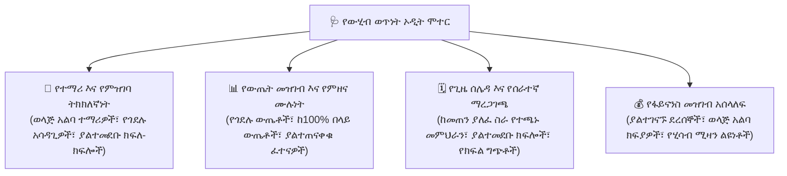

# የውሂብ ወጥነት እና የጤና ኦዲት

የወቅት መጨረሻ የውጤት ካርዶችን ከማመንጨት፣ የክፍል ማደግን ከማስኬድ ወይም ይፋዊ የቁጥጥር ሪፖርቶችን ከማስገባት በፊት ዳይሬክተሮች የትምህርት ቤት መዝገቦች 100% የተሟሉ እና ከስህተት የፀዱ መሆናቸውን ማረጋገጥ አለባቸው። የ**ውሂብ ወጥነት ኦዲት ፓነል** (`/director/reports/data-consistency`) ያልተለመዱ ነገሮችን፣ የጎደሉ ውጤቶችን እና ወላጅ አልባ መገለጫዎችን ለመለየት በሁሉም የትምህርት ቤት የውሂብ ስብስቦች ላይ ራስ-ሰር የጤና ምርመራዎችን ያካሂዳል።

---

## 4 ቁልፍ የኦዲት ጎራዎች

---

## ራስ-ሰር የስርዓት ኦዲት ማካሄድ

1. በዳይሬክተር የአሰሳ ምናሌ ውስጥ **ሪፖርቶች** > **የውሂብ ወጥነት** ን ጠቅ ያድርጉ።
2. **ሙሉ የስርዓት ኦዲት ያሂዱ** የሚለውን አዝራር ጠቅ ያድርጉ።
3. ሞተሩ በትምህርት ቤትዎ ዳታቤዝ ላይ በቅጽበት ጥያቄዎችን ያካሂዳል እና የተመደበ የጤና ውጤት ካርድ ያሳያል፦
   - 🟢 **ጤናማ (0 ችግሮች)፦** የውሂብ ስብስቡ የተሟላ እና የተረጋገጠ ነው።
   - 🟡 **ማስጠንቀቂያ፦** አነስተኛ ያልሆኑ አጋጆች የውሂብ ክፍተቶች (ለምሳሌ 3 ተማሪዎች የአሳዳጊ ስልክ ቁጥር የሌላቸው)።
   - 🔴 **ወሳኝ ችግር፦** ወቅቱ ከመዝጋቱ በፊት መፍትሄ የሚጠይቁ አጋጆች (ለምሳሌ 12 ተማሪዎች በ11ኛ ክፍል ፊዚክስ የመጨረሻ ፈተና ውጤት የሌላቸው)።

---

## የተለመዱ እክሎች እና በአንድ-ጠቅታ መፍትሄዎች

| የተገኘ ችግር | የስጋት ተጽእኖ | የሚመከር መፍትሄ |
| :--- | :--- | :--- |
| **ለበረራ የቀረ የተማሪ መዝገብ** | ተማሪው ንቁ ነው ነገር ግን ለአሁኑ የትምህርት ዘመን በማንኛውም የክፍል ክፍል ውስጥ አልተመዘገበም | ተማሪውን ወደ ተመደበው የመማሪያ ክፍል ለመመደብ **ክፍለ-ክፍል መድብ** ን ጠቅ ያድርጉ። |
| **ያልገባ የምዘና ውጤት** | መምህሩ ተማሪውን ተገኝቷል ብሎ ምልክት አድርጓል ነገር ግን የፈተና ወይም የጥያቄ ውጤት ባዶ ትቶታል | አስቸኳይ የማስታወሻ ማንቂያ በቀጥታ ወደ መምህሩ ዳሽቦርድ ለመላክ **መምህሩን አሳውቅ** ን ጠቅ ያድርጉ። |
| **የተባዛ የተማሪ መግቢያ** | ተመሳሳይ ተማሪ በተጋጭ የመለያ ቁጥሮች ሁለት ጊዜ ተመዝግቧል | የመገኘት እና የክፍያ ታሪክን ወደ አንድ ቀኖናዊ መዝገብ ለማጠናከር **መገለፎችን አዋህድ** ን ጠቅ ያድርጉ። |
| **የመምህር የጊዜ ሰሌዳ ግጭት** | ተመሳሳይ መምህር ማክሰኞ በወቅት 3 ለሁለት የተለያዩ ክፍለ-ክፍሎች ተመድቧል | አንዱን የወቅት ቦታ ለሚገኝ መምህር በድጋሚ ለመመደብ **የጊዜ ሰሌዳ ክፈት** ን ጠቅ ያድርጉ። |

---

## የወቅት መጨረሻ የመዝጊያ ምርመራ ዝርዝር

የወቅት መዝገቦችን ከመቆለፍ እና ይፋዊ የውጤት ካርዶችን ከማተም በፊት አራቱም የኦዲት ዕቃዎች **100% ተፈትተዋል** መሆናቸውን ያረጋግጡ፦

- [ ] ሁሉም የተማሪ መገለጫዎች ንቁ የክፍል እና የክፍለ-ክፍል ምደባ አላቸው።
- [ ] የቀጣይ ግምገማ ውጤቶች እና የመጨረሻ ፈተና ውጤቶች 100% በትምህርት ዓይነት መምህራን ገብተው እና ቀርበዋል።
- [ ] የትምህርት ቤት የመገኘት መዝገቦች ከዜሮ ያልተፈቱ የመቅረት ባንዲራዎች ጋር ተስተካክለዋል።
- [ ] ሁሉም የገንዘብ እና ዲጂታል ክፍያ ደረሰኞች ከሂሳብ መዝገቦች ጋር ተመጣጣኝ ሆነዋል።

---

## ቀጣይ እርምጃዎች

- [የPTA የወላጅ አቀራረብ አመንጪ](/am/director/parent-presentation) — የተረጋገጠ የወቅት ስታቲስቲክስን ለቤተሰቦች ያቅርቡ
- [የዳይሬክተር ሪፖርቶች እና ትንታኔ](/am/director/reports-analytics) — የተጠናከረ የትምህርት አፈጻጸም ይመልከቱ
- [የማደግ ሂደት የስራ ፍሰት](/am/registrar/promotion) — ተማሪዎችን ወደ ቀጣዩ የክፍል ደረጃ ያሳድጉ