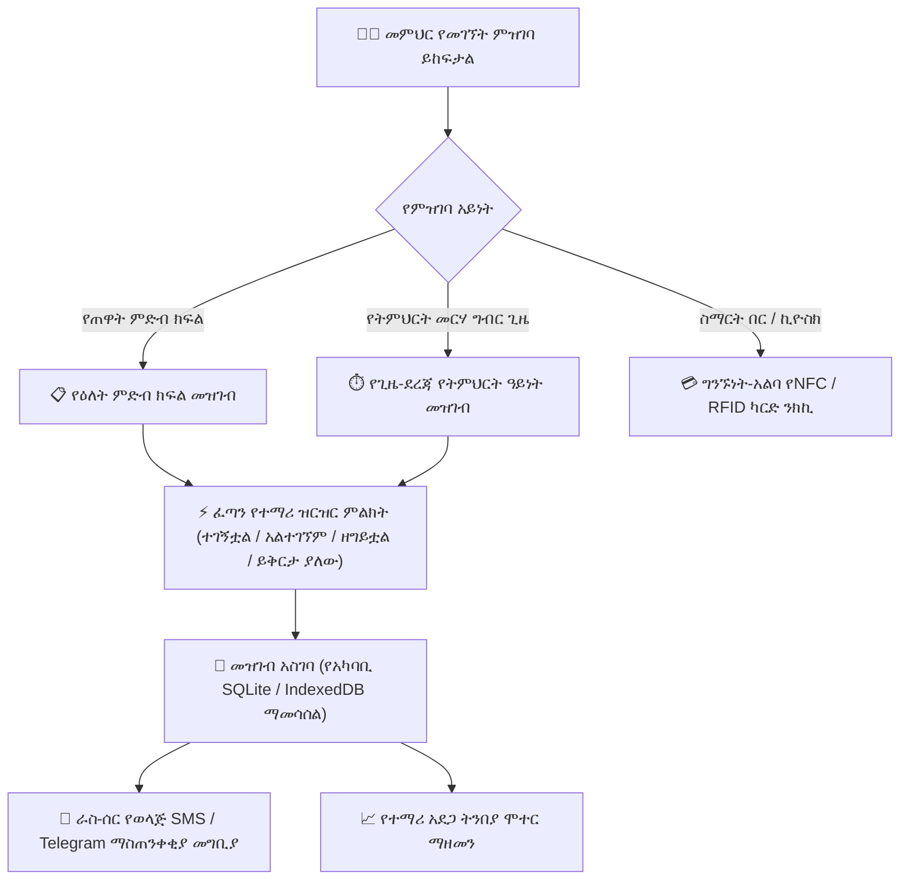
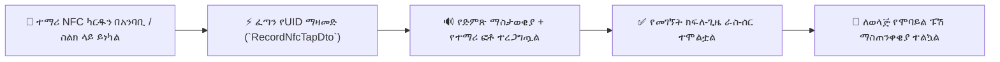

# የክፍል መገኘት ምዝገባ (በመስመር፣ ከመስመር ውጭ እና በNFC ካርድ ንክኪ)

የ**YeneSchool የመገኘት ሞጁል** (`AttendanceSession`፣ `AttendanceRecord`፣ `attendance-nfc.service.ts`) ለከፍተኛ ፍጥነት እና ለተወራረደ አስተማማኝነት የተነደፈ ነው። መምህራን ከ40 በላይ ተማሪዎችን በድር ብራውዘር፣ በሞባይል መተግበሪያ ወይም በግንኙነት-አልባ የNFC ስማርት ካርድ ንክኪ በ30 ሰከንድ ባልበለጠ ጊዜ ውስጥ መጥሪያ ማድረግ ይችላሉ—ሙሉ የመስመር-ውጭ ቅጂ ይዞ።

---

## 1. የዕለት ምድብ ክፍል ከጊዜ-ደረጃ የትምህርት ዓይነት መገኘት ጋር

YeneSchool በትምህርት ቤቱ ዳይሬክተር የተዋቀሩ ሁለት የመገኘት ክትትል ሁነታዎችን ይደግፋል፡-

1. **የዕለት ምድብ ክፍል መገኘት**፡
   - በየቀኑ ጠዋት በተመደበው የምድብ ክፍል መምህር (`ClassHomeroom`) ይካሄዳል።
   - ለትምህርት ሚኒስቴር ተገዢነት፣ ለሴሚስተር መጨረሻ የውጤት ካርዶች እና ለዕለታዊ የወላጅ መቅረት ማሳወቂያዎች ዋና ኦፊሴላዊ ህጋዊ የመገኘት መዝገብ ሆኖ ያገለግላል።
2. **የጊዜ-ደረጃ የትምህርት ዓይነት መገኘት (`timetableSlotId`)**፡
   - በእያንዳንዱ የትምህርት ዓይነት ጊዜ መጀመሪያ ላይ ይካሄዳል (ለምሳሌ፣ *ጊዜ 3፡ 10ኛ ክፍል B ኬሚስትሪ*)።
   - የክፍል መትረፍን ይከላከላል፣ የተማሪን ተሳትፎ በእያንዳንዱ የትምህርት ዓይነት ይከታተላል፣ እና ወደ የመምህር ሊደርቦርድ የጊዜ አክባሪነት መረጃ ጠቋሚ ይመገባል።

---

## 2. መደበኛ የተማሪ ዝርዝር ምልክት የስራ ሂደት

### የደረጃ-በ-ደረጃ መመሪያዎች
1. በላፕቶፕዎ፣ በታብሌትዎ ወይም በስማርትፎንዎ ላይ ወደ **የመምህር ፖርታል** ይግቡ።
2. በዳሽቦርድዎ ላይ **የዛሬውን መገኘት ውሰድ** ይጠቅሙ ወይም ወደ **መገኘት > መገኘትን አመልክት** ይሂዱ።
3. **ክፍሉን እና ክፍልፋዩን** ይምረጡ (ወይም የነቃውን የመርሃ ግብር ጊዜዎን ይንኩ)።
4. ስርዓቱ የተማሪ ዝርዝሩን ይከፍታል፣ ሁሉም ተማሪዎች ለከፍተኛ-ፍጥነት ምልክት በ**ተገኝቷል (P)** ተቀድመው፡-

| የመገኘት ሁኔታ ኮድ | የሁኔታ ስያሜ | የአሰራር ባህሪ እና የስርዓት ድርጊቶች |
| :--- | :--- | :--- |
| **`PRESENT` (አረንጓዴ P)** | በሰዓቱ ተገኝቷል | ተማሪው በክፍል ውስጥ መገኘቱ ተመዝግቧል። መደበኛ መነሻ ነው። |
| **`ABSENT` (ቀይ A)** | ያለ ምክንያት መቅረት | ራስ-ሰር ፈጣን SMS / Telegram ማስጠንቀቂያ ለወላጅ ይላካል። የወርሃዊ የመቅረት ቆጣሪውን ይጨምራል። |
| **`LATE` (ቢጫ L)** | ዘግይቶ መምጣት | የመድረሻ ሰዓት ወይም የዘገየ ደቂቃዎች ብዛት ይጠይቃል። ከ`ATTENDANCE_CUTOFF_TIME` (ለምሳሌ፣ 08፡15 ከጠዋት) በኋላ ከተመዘገበ፣ የዘገየ ህጎች ይተገበራሉ። 3 መዘገየቶች ወደ 1 የቅጣት ምልክት ይቀየራሉ። |
| **`EXCUSED` (ሰማያዊ E)** | በምክንያት መቅረት | ለተረጋገጡ የህክምና ፈቃዶች፣ ለቤተሰብ ሀዘን ወይም ለትምህርት ቤት ስፖርት ውክልና ይጠቅማል። የማስተዋወቂያ መገኘት ውጤትን አይቀጣም። |
| **`HALF_DAY` (ሐምራዊ H)** | የግማሽ ቀን መገኘት | በተፈቀደ የህክምና/ፈቃድ ፓስ ቀድመው ከግቢው ለወጡ ተማሪዎች። |

5. ለጎደሉ ወይም ለዘገዩ ተማሪዎች አማራጭ **አስተያየቶች / የምክንያት ማስታወሻዎች** ያክሉ።
6. **የመገኘት መዝገብ አስገባ** የሚለውን ጠቅ ያድርጉ።

---

## 3. ግንኙነት-አልባ የNFC እና RFID ስማርት ካርድ ንክኪ መገኘት

የRFID/NFC የተማሪ መታወቂያ ካርዶች የተገጠሙላቸው ትምህርት ቤቶች ራስ-ሰር ግንኙነት-አልባ መግቢያ መጠቀም ይችላሉ፡-

### የNFC ንክኪ እንዴት ይሰራል
1. ተማሪ ወደ ክፍል ወይም የትምህርት ቤት በር ሲገባ፣ ስማርት ካርዱን በመምህሩ የNFC-አስተናጋጅ ስማርትፎን ወይም በክፍል ዩኤስቢ አንባቢ ላይ ይነካል።
2. የ`POST /attendance/nfc/tap` መጨረሻ-ነጥብ የካርድ UID (`cardUid`) ያረጋግጣል እና ትክክለኛውን የማይክሮሰከንድ ጊዜ ማህተም ይመዘግባል።
3. የመምህሩ ስክሪን በተረጋገጠው የተማሪ ፎቶ በአረንጓዴ ያብረቀርቃል።
4. በ`ATTENDANCE_CUTOFF_TIME` ድረስ ያልነከከ ማንኛውም ተማሪ በራስ-ሰር እንዳልተገኘ ምልክት ይደረግበታል።

---

## 4. ከመስመር ውጭ መገኘት እና PWA ማመሳሰል

የትምህርት ቤቱ የበይነመረብ ግንኙነት ወይም ኤሌክትሪክ ከተቋረጠ፡-

1. በሞባይል መተግበሪያዎ ወይም በላፕቶፕ ድር ብራውዘርዎ ላይ ያለ መቆራረጥ የመገኘት ምዝገባዎን መቀጠል ይችላሉ።
2. በናቭባር ውስጥ አምበር ቀለም ያለው **ከመስመር ውጭ ካሽንግ** አመልካች ይታያል።
3. መዝገቦቹ በመሣሪያው የአካባቢ **SQLite / IndexedDB ዳታቤዝ** ውስጥ በተለዋዋጭ የግብይት ጊዜ ማህተሞች ተመስጥረው ይደረደራሉ።
4. የበይነመረብ ግንኙነት ወዲያውኑ ሲመለስ፣ የጀርባ ሰራተኛው ወረፋውን (`POST /sync/batch`) በራስ-ሰር ያጸዳል፣ ሁሉንም መዝገቦች ያለምንም የዳታ መጥፋት ያመሳስላል።

---

## 5. የመገኘት መቆለፊያ ፖሊሲዎች እና የሱፐርቫይዘር ተቆራጭ ፈቃዶች

የዳታ ትክክለኛነትን ለመጠበቅ እና ከኋላ የሚደረግ ማጭበርበርን ለመከላከል፡-
- **`ATTENDANCE_DAILY_LOCK_TIME`** (ለምሳሌ፣ *17፡00 / ከሰዓት 5፡00*): የዕለት መገኘት መዝገቦች በትምህርት ቀን መጨረሻ ላይ በራስ-ሰር ይቆለፋሉ።
- **`ATTENDANCE_EDIT_WINDOW_DAYS`** (ለምሳሌ፣ *3 ቀናት*): መምህራን የመገኘት መዝገቦችን ለመቀየር እስከ 3 ቀናት ድረስ ጊዜ አላቸው (ለምሳሌ፣ የዶክተር ማስረጃ ሲደርስ *ያልተገኘ*ን ወደ *በምክንያት መቅረት (ህክምና)* ማዘመን)።
- የማርትዕ መስኮቱ ከተዘጋ በኋላ፣ ማንኛውም የኋላ እይታ ማሻሻያ **የሱፐርቫይዘር ወይም የዳይሬክተር ፈቃድ** ከኦዲት ምዝግብ ማስታወሻ ምክንያት ኮድ ጋር ይጠይቃል።

---

## ቀጣይ እርምጃዎች

- [የመምህር ሞባይል ልምድ](/am/mobile/teacher-mobile) — በሞባይል መተግበሪያ መጥሪያ ማድረግ
- [QR ኮድ እና ባርኮድ በር መቃኘት](/am/mobile/qr-attendance) — በግቢ መግቢያ በሮች የተማሪ መታወቂያ ካርዶችን መቃኘት
- [የተማሪ አደጋ ትንበያ ዳሽቦርድ](/am/director/student-risk) — ሥር የሰደደ መቅረት ዘይቤዎችን መከታተል
- [የወላጅ መገኘት ክትትል](/am/parent/attendance) — ወላጆች የተማሪ መገኘት ታሪክን እንዴት እንደሚመለከቱ