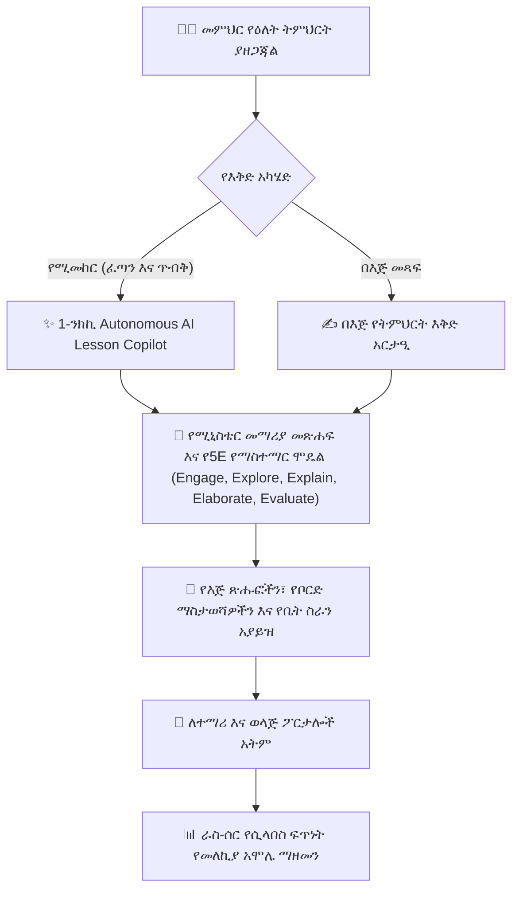

# የትምህርት እቅዶች እና የቤት ስራ ምደባዎች (AI Copilot እና በእጅ)

የ**YeneSchool የትምህርት እቅድ እና ምደባ ስብስብ** (`Lesson`፣ `CurriculumTextbookUnit`፣ `ContentSubmission`) መምህራን ከፍተኛ ጥራት ያላቸውን፣ ከሚኒስቴር ጋር የተስተካከሉ የማስተማር እቅዶች እና ዲጂታል የቤት ስራዎች እንዲያዘጋጁ ያስችላቸዋል። መምህራን የትምህርት እቅዶችን ከባዶ በእጅ መፃፍ ቢችሉም፣ **Autonomous AI Lesson Copilotን (የሚመከር)** መጠቀም ሰዓታትን የሚቆጥብ ሲሆን የትምህርት ጥብቅነትንም ከፍ ያደርጋል።



---

## 1. Autonomous AI የትምህርት እቅድ ማመንጫ (የሚመከር)

የAI Lesson Copilot የኢትዮጵያን ብሔራዊ ሥርዓተ ትምህርት ይረዳል እና ትምህርቶችን በአለም-አቀፍ ደረጃ እውቅና የተሰጠውን **የ5E የማስተማር ሞዴል** በመጠቀም በራስ-ሰር ያዋቅራል።

```
┌────────────────────────────────────────────────────────────────────────┐
│ 🤖 AI Lesson Copilot ጠያቂ                                                     │
│ "Grade 10 Physics — Unit 3: Newton's Laws of Motion (45-Min Period)"   │
├────────────────────────────────────────────────────────────────────────┤
│ 1. Engage (5 Mins): Real-world demonstration hook with a moving cart.  │
│ 2. Explore (15 Mins): Student group experiment with inclined planes.   │
│ 3. Explain (15 Mins): Mathematical derivation of F = m × a on board.   │
│ 4. Elaborate (5 Mins): Real-life automotive braking distance problem.  │
│ 5. Evaluate (5 Mins): 3-question diagnostic exit ticket quiz.          │
└────────────────────────────────────────────────────────────────────────┘
```

### የAI ትምህርት እቅድ ለማመንጨት ደረጃዎች
1. ወደ **የመምህር ፖርታል > ትምህርቶች > + አዲስ የትምህርት እቅድ** ይሂዱ።
2. ከላይ ያለውን **✨ በAI Copilot አመንጭ (የሚመከር)** ይጠቅሙ።
3. **የትምህርት ዓይነቱን**፣ **የክፍል ደረጃውን** እና **የመማሪያ መጽሐፍ ምዕራፍ/ክፍሉን** ይምረጡ (ለምሳሌ፣ *9ኛ ክፍል ባዮሎጂ — ክፍል 2፡ የሴል መዋቅር እና ኦርጋኔልስ*)።
4. **የታለመውን የጊዜ ቆይታ** ይግለጹ (ለምሳሌ፣ *45 ደቂቃ* ወይም *90-ደቂቃ ባለ ሁለት ጊዜ ላብራቶሪ*)።
5. (አማራጭ) ብጁ መመሪያዎችን ያቅርቡ (ለምሳሌ፣ *"በአካባቢያዊ ቁሳቁሶች በቡድን ስራ ላይ ያተኩሩ"* ወይም *"የአማርኛ የቃላት ፍቺዎችን ያካትቱ"*)።
6. **የትምህርት እቅድ አመንጭ** የሚለውን ጠቅ ያድርጉ።
7. ከ5 ሰከንድ ባነሰ ጊዜ ውስጥ፣ AIው የሚከተሉትን ያመነጫል፡-
   - **ግልጽ የባህሪ የመማር ዓላማዎች**፡ ለምሳሌ፣ *"SWBAT identify and differentiate plant and animal cells under a microscope."*
   - **የተጠቀሰ-ሰዓት የ5E ደረጃ ክፍፍል**፡ በደቂቃ የተከፋፈለ የክፍል እንቅስቃሴ የመንገድ ካርታ።
   - **የማስተማሪያ መርጃዎች እና የእይታ ቁሳቁሶች**፡ የሚመከሩ የቦርድ ሥዕሎች እና የዕለት ተዕለት ቁሳቁሶች።
   - **የቅርጻዊ መውጫ-ትኬት ጥያቄዎች**፡ ከ3 እስከ 5 ፈጣን የግምገማ ጥያቄዎች።
8. ይገምግሙ፣ ማንኛውንም ጽሑፍ በመስመር ያርትዑ፣ እና **ትምህርቱን አስቀምጥ እና አትም** የሚለውን ጠቅ ያድርጉ።

---

## 2. በእጅ የትምህርት እቅድ መጻፍ

ብጁ ማስታወሻዎች እና ኦሪጅናል የንግግር እቅዶችን በእጅ መፃፍ ለሚመርጡ መምህራን፡-

1. በ**ትምህርቶች > + አዲስ የትምህርት እቅድ** ውስጥ **ባዶ የትምህርት አርታዒ**ን ይምረጡ።
2. **የትምህርቱን ርዕስ**፣ **የትምህርት ዓይነቱን** እና **የክፍል ክፍልፋዩን** ያስገቡ።
3. የትምህርቱን ከተዛማጁ **ሥርዓተ-ትምህርት ክፍል** (`CurriculumTextbookUnit`) ጋር ያገናኙ፣ ስለዚህ የትምህርት ቤቱ የሲላበስ ፍጥነት መከታተያ በራስ-ሰር እንዲጨምር።
4. ርዕሶችን፣ ነጥቦችን፣ የሂሳብ LaTeX ቀመሮችን ለመቅረጽ እና ምስሎችን ወይም የYouTube ቪዲዮ ማሳያዎችን ለመክተት **የበለጸገ የጽሑፍ አርታዒ**ን ይጠቀሙ።
5. ተጨማሪ የPDF የጥናት መመሪያዎችን ወይም የስራ ሉህ ፋይሎችን አያይዙ።
6. በኋላ ለማጣራት **እንደ ረቂቅ አስቀምጥ** ወይም ለተማሪዎች ወዲያውኑ ተደራሽ ለማድረግ **ለክፍል አትም** የሚለውን ይምረጡ።

---

## 3. የቤት ስራ ምደባዎችን መፍጠር እና ማሰራጨት

1. ወደ **የመምህር ፖርታል > ምደባዎች > + ምደባ ፍጠር** ይሂዱ።
2. የምደባውን መለኪያዎች ያዘጋጁ፡-
   - **የታለመ ክፍል እና የትምህርት ዓይነት**፡ የተለየውን ክፍልፋይ ይምረጡ (ለምሳሌ፣ *8ኛ ክፍል A አጠቃላይ ሳይንስ*)።
   - **የማስገቢያ ቀነ-ገደብ**፡ የመጨረሻውን ቀን እና የጊዜ መቆራረጫ ያዘጋጁ (ለምሳሌ፣ *አርብ ከሰዓት 05፡00*)።
   - **ከፍተኛ ውጤት**፡ ለምሳሌ `10` ወይም `20` ነጥቦች።
   - **የማስገቢያ ዘዴ**፡
     - `Online File Upload` (ተማሪዎች የተቃኙ የPDF/ፎቶ የቤት ስራዎችን ያስገባሉ)።
     - `In-App Text Entry` (ተማሪዎች መልሶችን በቀጥታ በፖርታላቸው ውስጥ ይተይባሉ)።
     - `Physical Classroom Turn-In` (መምህር አካላዊ የልምምድ መጽሐፎችን ያመለክታል)።
3. **ምደባውን አትም** የሚለውን ጠቅ ያድርጉ። ተማሪዎች እና ወላጆች ወዲያውኑ በመተግበሪያው ውስጥ ፑሽ እና Telegram ማስጠንቀቂያ ይቀበላሉ።

---

## 4. ግቤቶችን ማመዛዘን እና በራስ-ሰር ወደ Gradebook ማመሳሰል

1. የ**ቀጥታ ግቤት መከታተያ**ውን ለማየት ምደባውን ይክፈቱ፡-
   - በቀለም የተሰየሙ ቆጠራዎች፡- *የገቡ (አረንጓዴ)*፣ *በመጠባበቅ ላይ (ቢጫ)*፣ *የማለፉ (ቀይ)*።
2. የተማሪውን ግቤት ጠቅ ያድርጉ እና የጫኑትን ሰነድ በተሰራው የሰነድ መመልከቻ ውስጥ ይመርምሩ።
3. **ውጤቱን** ያስገቡ እና ገንቢ የጥራት አስተያየት ይፃፉ።
4. **ከGradebook ጋር አመሳስል** የሚለውን ያብሩ፡-
   - ውጤቱ በራስ-ሰር ወደ ተማሪው ቀጣይነት ያለው ግምገማ gradebook አምድ (ለምሳሌ፣ *የቤት ስራ ምደባ #3*) ይተላለፋል፣ በእጅ ድርብ ማስገባትን ያስወግዳል።
5. **አስተያየት ወደ ተማሪ መልስ** የሚለውን ጠቅ ያድርጉ።

---

## ቀጣይ እርምጃዎች

- [የAI የማስተማር ረዳት እና የኩዊዝ ማመንጫ](/am/teacher/ai-copilot) — የምዕራፍ ኩዊዞች እና የምርመራ የስራ ሉሆችን ያመንጩ
- [Gradebook ግቤት እና ቀጣይነት ያለው ግምገማ](/am/teacher/gradebook-entry) — የሴሚስተር መካከለኛ እና የፈተና ውጤቶችን ማስገባት
- [ሥርዓተ-ትምህርት እና የመማሪያ መጽሐፍ ምዕራፍ ካርታ](/am/teacher/curriculum-syllabus) — የሲላበስ ማጠናቀቂያ ፍጥነትን መከታተል