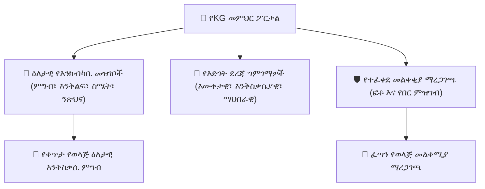
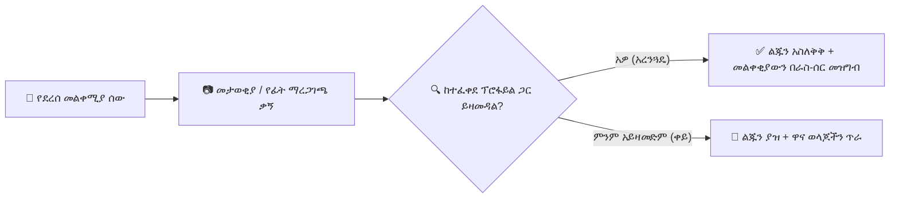

# የቅድመ-ትምህርት ቤት እና ኪንደርጋርተን (KG) እንክብካቤ

የ**YeneSchool የቅድመ-ትምህርት ቤት ትምህርት (ECE) ሞጁል** በተለይ ለናርሰሪ፣ KG-1፣ KG-2 እና KG-3 ክፍሎች የተነደፈ ነው። ከመደበኛ ውጤት አሰጣጥ ባለፈ፣ ሁሉን-አቀፍ የእንክብካቤ ክትትልን፣ የእድገት ደረጃ ግምገማዎችን እና ጥብቅ የአሳዳጊ መልቀቂያ ደህንነትን ይሰጣል።

---

## 1. ዕለታዊ የእንክብካቤ መዝገቦች (የዕለት ተዕለት ስራዎች እና እንቅስቃሴዎች)

የKG መምህራን ዕለታዊ አካላዊ እና ስሜታዊ ስራዎችን ይመዘግባሉ፣ ስለዚህ ወላጆች የትንንሽ ልጆቻቸውን በአእምሮ ሰላም መከታተል ይችላሉ።

### የዕለት እንክብካቤ ግቤቶችን መመዝገብ
1. ወደ **የመምህር ፖርታል > ኪንደርጋርተን > ዕለታዊ የእንክብካቤ መዝገብ** ይሂዱ።
2. የKG ክፍልፋይዎን ይምረጡ (ለምሳሌ፣ *KG-2 ፀሀይ ክፍልፋይ*)።
3. የተማሪ ዝርዝሩ እያንዳንዱን ልጅ በፈጣን-ንክኪ የሁኔታ መግብሮች ያሳያል፡-

| የእንቅስቃሴ ምድብ | አማራጮች / የሚከታተሉ መለኪያዎች | ለወላጆች ያለው ተጽእኖ |
| :--- | :--- | :--- |
| **ምግብ እና መክሰስ መውሰድ** | `ሁሉንም ጨርሷል`፣ `ግማሽ በልቷል`፣ `በጣም ትንሽ በልቷል`፣ `ምግብ አልተቀበለም` | ልጁ ምሳ ካልበላ ወይም ውሃውን ካላጠናቀቀ ወላጆችን ያስጠነቅቃል። |
| **እንቅልፍ እና የማረፊያ ጊዜ** | የመጀመሪያ ሰዓት፣ የመጨረሻ ሰዓት፣ የእንቅልፍ ጥራት (`ጥሩ እንቅልፍ`፣ `እንቅልፍ አልተዋጠም`፣ `አልተኛም`) | ወላጆች የምሽት የመተኛያ ሰዓት መርሃ ግብሮችን እንዲያስተዳድሩ ይረዳል። |
| **ስሜት እና ማህበራዊ ባህሪ**| `ደስተኛ እና ጉልህት`፣ `ረጋ ያለ`፣ `የሚያስቸግር / የሚያለቅስ`፣ `ደክሞታል`፣ `ተጨማሪ ፍቅር ያስፈልገዋል` | ስለ ስሜታዊ ደህንነት እና የእኩዮች ማህበራዊ ግንኙነት ግንዛቤን ይሰጣል። |
| **ንጽህና እና ፖቲ** | የዳይፐር መለወጫ ብዛት፣ የፖቲ ስልጠና ሙከራዎች፣ የአደጋ ማስታወሻዎች | ለጨቅላ እና ለናርሰሪ ደረጃ ክትትል አስፈላጊ ነው። |
| **የተሰጠ መድሃኒት**| ሰዓት፣ መጠን፣ የመድሃኒት ስም (ለምሳሌ፣ *የአስም ኢንሃለር በ11፡30 ከጠዋት*) | መምህሩ የወላጅን የሐኪም ትእዛዝ መመሪያ መከተሉን ያረጋግጣል። |

4. **የዕለት መዝገብ አሰራጭ** የሚለውን ይንኩ። ወላጆች በሞባይል ምግባቸው ውስጥ የማጠቃለያ ካርድ ወዲያውኑ ይቀበላሉ።

---

## 2. የእድገት ደረጃ ግምገማዎች

በመቶኛ ውጤት ከሚገመገሙ የመጀመሪያ ደረጃ ክፍሎች በተለየ፣ የኪንደርጋርተን እድገት በእድገት ዘርፎች ይለካል።

### ደረጃዎችን እንዴት መገምገም እንደሚቻል
1. ወደ **ኪንደርጋርተን > የእድገት ደረጃ ግምገማዎች** ይሂዱ።
2. **ሴሚስተሩን** እና **የእድገት ዘርፉን** ይምረጡ፡-
   - **አጠቃላይ እና ጥሩ የእንቅስቃሴ ችሎታዎች**፡ እርሳስ መያዝ፣ በልጆች መቀስ መቁረጥ፣ በአንድ እግር መዝለል፣ ብሎኮችን መደርደር።
   - **ቋንቋ እና ማንበብ-መጻፍ**፡ የፊደል ቁጥሮችን/ፊደልን መለየት፣ ተረት መናገር፣ ባለ-ሁለት-ደረጃ የቃል መመሪያዎችን መከተል።
   - **እውቀታዊ እና ሂሳባዊ**፡ እስከ 20 የሚደርሱ ነገሮችን መቁጠር፣ በቀለም/በቅርጽ መደርደር፣ ዘይቤዎችን መለየት።
   - **ማህበራዊ እና ስሜታዊ እድገት**፡ መጫወቻዎችን መጋራት፣ ስሜቶችን በቃል መግለጽ፣ ከእኩዮች ጋር ግጭቶችን መፍታት።
3. የእያንዳንዱን ተማሪ የብቃት ደረጃ ያመልክቱ፡-
   - `Emerging (Beginning to explore)`
   - `Developing (Shows progress with teacher guidance)`
   - `Proficient / Mastered (Demonstrates independently and consistently)`
4. የመምህር የጥራት ምልከታዎችን ያክሉ እና የክፍል የእጅ ስራ የፎቶ ማስረጃዎችን አያይዙ።
5. ኦፊሴላዊውን **የቅድመ-ትምህርት ቤት የእድገት ደረጃ የውጤት ካርድ** ያመንጩ።

---

## 3. የተፈቀደ የአሳዳጊ መልቀሚያ እና የመልቀቂያ ደህንነት

ትንንሽ ልጆች ያልተፈቀዱ መውጣቶችን ለመከላከል በከሰዓት መልቀቂያ ጊዜ ጥብቅ የርክክብ ደህንነት ይጠይቃሉ።

### የመልቀቂያ ርክክብ ፕሮቶኮል
1. በሞባይል መተግበሪያው ወይም በክፍል ታብሌት ላይ **ኪንደርጋርተን > መልቀቂያ**ን ይንኩ።
2. ወላጅ፣ ሹፌር ወይም ዘመድ ወደ ክፍል በር ሲደርስ፡-
   - የልጁን ስም ይፈልጉ።
   - ስክሪኑ በወላጆቹ የተመዘገቡ ሁሉንም **የተፈቀዱ መልቀሚያ ሰዎች** (`KgAuthorizedPickup`) የተረጋገጡ ፎቶዎች እና ህጋዊ ሙሉ ስሞች ያሳያል።
3. ከተዛማጅ ሰው አጠገብ **አረጋግጥ እና አስለቅቅ**ን ይንኩ (ለምሳሌ፣ *እመቤት ቤተልሔም ከበደ*)።
4. ስርዓቱ የማይለወጥ የመልቀቂያ ጊዜ ማህተም (`KgDismissalLog`) ይመዘግባል እና ለሁለቱም ዋና ወላጆች ፈጣን SMS / ፑሽ ማስጠንቀቂያ ይልካል፡-
   > *"ሰላም! ሊያ ኡስማን በቤተልሔም ከበደ በከሰዓት 03፡18 በደህና ተልቋል።"*

---

## ቀጣይ እርምጃዎች

- [ሥርዓተ-ትምህርት እና የመማሪያ መጽሐፍ ምዕራፎች](/am/teacher/curriculum-syllabus) — የትምህርት እቅዶችን ከመማሪያ መጽሐፍ ክፍሎች ጋር ካርታ ማድረግ
- [ትምህርቶች እና የቤት ስራ ምደባዎች](/am/teacher/lessons-assignments) — የጥናት ቁሳቁሶችን እና ልምምዶችን መስቀል
- [የወላጅ ሞባይል ልምድ](/am/mobile/parent-mobile) — ወላጆች የKG ዕለታዊ እንቅስቃሴ ምግቦችን እንዴት እንደሚመለከቱ