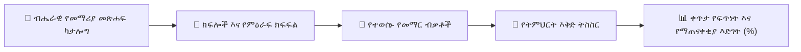

# ሥርዓተ-ትምህርት እና የመማሪያ መጽሐፍ ምዕራፍ ካርታ

YeneSchool ዕለታዊ የትምህርት እቅዶችን በቀጥታ ከኦፊሴላዊ ብሔራዊ መማሪያ መጽሐፎች እና ከሲላበስ መስፈርቶች (`CurriculumTextbook`፣ `CurriculumTextbookUnit`፣ `SyllabusMapping`) ጋር ያገናኛል። ይህ መምህራን በትምህርት ዘመኑ ሙሉ የተረጋጋ ፍጥነት እንዲጠብቁ ያረጋግጣል እና ከሴሚስተር መካከለኛ እና የመጨረሻ ፈተናዎች በፊት የሥርዓተ-ትምህርት ክፍተቶችን ይከላከላል።



---

## 1. የመማሪያ መጽሐፍ መዋቅር እና የክፍል ክፍፍል

መምህራን ለሚያስተምሩባቸው የትምህርት ዓይነቶች የተመደቡትን ቀድሞ-የተጫኑ ብሔራዊ ሥርዓተ-ትምህርት መማሪያ መጽሐፎችን ማየት ይችላሉ፡-

| ክፍል እና የትምህርት ዓይነት | ኦፊሴላዊ የመማሪያ መጽሐፍ ርዕስ | ክፍሎች / ምዕራፎች | የሚጠበቅ ፍጥነት |
| :--- | :--- | :--- | :--- |
| **9ኛ ክፍል ሂሳብ** | *የትምህርት ሚኒስቴር የተማሪ መማሪያ መጽሐፍ 9ኛ ክፍል* | 8 ክፍሎች (ከቁጥር ስርዓቶች እስከ ትሪጎኖሜትሪ) | በሩብ ዓመት 2 ክፍሎች |
| **10ኛ ክፍል ፊዚክስ** | *የኢትዮጵያ ብሔራዊ ሥርዓተ-ትምህርት 10ኛ ክፍል ፊዚክስ* | 6 ክፍሎች (ኪነማቲክስ፣ ዳይናሚክስ፣ ቴርሞዳይናሚክስ...) | በሴሚስተር 3 ክፍሎች |
| **11ኛ ክፍል ባዮሎጂ** | *11ኛ ክፍል ባዮሎጂ የተማሪ የመረጃ መጽሐፍ* | 5 ክፍሎች (ባዮኬሚካል ሞለኪውሎች፣ ጄኔቲክስ...) | በሴሚስተር 2.5 ክፍሎች |

---

## 2. ዕለታዊ ትምህርቶችን ከመማሪያ መጽሐፍ ብቃቶች ጋር ማገናኘት

ዕለታዊ የትምህርት እቅድ ሲፈጥሩ፡-
1. ወደ **የመምህር ፖርታል > ትምህርቶች > + የትምህርት እቅድ ፍጠር** ይሂዱ።
2. **የትምህርት ዓይነቱን** እና **የክፍል ክፍልፋዩን** ይምረጡ።
3. በ**ሥርዓተ-ትምህርት ክፍል መራጭ** ውስጥ የነቃውን ክፍል ይምረጡ (ለምሳሌ፣ *ክፍል 3፡ ባለ አራት ማዕዘን እኩልታዎች እና መተግበሪያዎች*)።
4. የተወሰነውን **የመማር ብቃት / የምዕራፍ ርዕስ** ይምረጡ፡-
   - ለምሳሌ፣ *ክፍል 3.2፡ ባለ አራት ማዕዘን እኩልታዎችን በፋክተሪንግ እና ካሬን በማጠናቀቅ መፍታት*።
5. የትምህርት እጅ ጽሑፎችን፣ የቦርድ ማጠቃለያ ማስታወሻዎችን ወይም የቤት ስራ ምደባዎችን አያይዙ።
6. ንግግሩ ሲደርስ **ምዕራፍ ንዑስ-ርዕስ እንደተጠናቀቀ ምልክት አድርግ** የሚለውን ያመልክቱ።

---

## 3. የሲላበስ ማጠናቀቂያ እና የፍጥነት እድገት መከታተል

በ**የመምህር ዳሽቦርድ** እና **የዳይሬክተር ሥርዓተ-ትምህርት አጠቃላይ እይታ** ላይ፡-
- የቅጽበት **የፍጥነት መለኪያ አሞሌ** የሲላበስ ማጠናቀቂያን ከትምህርት ቀን መቁጠሪያው አንጻር ያሳያል፡-
  ```
  [ Grade 9B Mathematics ]  █████████████░░░░░  65% Completed (On Schedule)
  [ Grade 10A Physics    ]  ████████░░░░░░░░░░░  40% Completed (2 Weeks Behind Pace)
  ```
- አንድ ክፍል ከሚጠበቀው ሳምንታዊ የፍጥነት ዒላማ ጀርባ እየቀረ ከሆነ፣ ስርዓቱ መምህሩን የመገምገሚያ ክፍለ-ጊዜዎችን ወይም የመለማመጃ ጊዜያትን በሚመከር ማስጠንቀቂያ ያሳውቃል።

---

## ቀጣይ እርምጃዎች

- [የጊዜ መርሃ ግብር ተቆራጭ እና የጊዜ ልውውጥ ጥያቄዎች](/am/teacher/period-swaps) — ጊዜያዊ የመምህር ምትክ ይጠይቁ
- [የAI የማስተማር ረዳት እና የኩዊዝ ማመንጫ](/am/teacher/ai-copilot) — ከመማሪያ መጽሐፍ ምዕራፎች ጋር የሚዛመዱ የፈተና ጥያቄዎችን ያመንጩ
- [ትምህርቶች እና የቤት ስራ ምደባዎች](/am/teacher/lessons-assignments) — ዲጂታል ግብዓቶችን ከተማሪዎች ጋር ያጋሩ