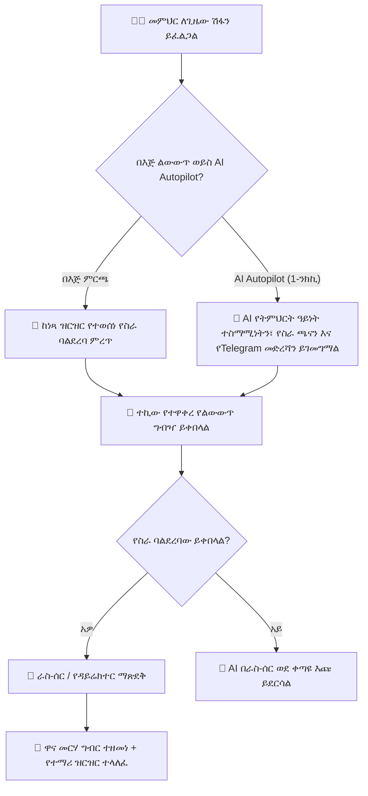

# የጊዜ መርሃ ግብር ተቆራጮች፣ የጊዜ ልውውጥ እና AI ምትክ

መምህር ድንገተኛ ሁኔታ ሲገጥመው፣ ስልጠና ሲከታተል ወይም ሲታመም፣ YeneSchool የተዋቀረ፣ ከግጭት ነጻ የሆነ የጊዜ ምትክ (`TimetableSwapRequest`፣ `TimetableSlotOverride`) እንዲኖር ያስችላል። መምህራን በእጅ የስራ ባልደረባቸውን መምረጥ ይችላሉ ወይም አጠቃላይ የምትክ ሂደቱን ለ**Autonomous AI Copilot** መተው ይችላሉ።

---

## 1. በእጅ የጊዜ ልውውጥ የስራ ሂደት

### የልውውጥ ጥያቄን በእጅ ለማስገባት ደረጃዎች
1. ወደ **የመምህር ፖርታል > የጊዜ መርሃ ግብር > የእኔ መርሃ ግብር** ይሂዱ።
2. ማስተማር የማይችሉትን የተወሰነ ጊዜ ጠቅ ያድርጉ (ለምሳሌ፣ *ማክሰኞ ጊዜ 3 — 9ኛ ክፍል A ኬሚስትሪ*)።
3. **የጊዜ ልውውጥ / ምትክ ጠይቅ** የሚለውን ጠቅ ያድርጉ።
4. የልውውጥ መለኪያዎቹን ይሙሉ፡-
   - **የመቅረት ምክንያት**፡ የህክምና ቀጠሮ፣ ኦፊሴላዊ የትምህርት ቤት ዎርክሾፕ፣ የግል ፈቃድ።
   - **የልውውጥ ዓይነት**፡
     - `1-ለ-1 የጊዜ ልውውጥ`፡ "የእኔን ማክሰኞ ጊዜ 3 ብትወስድ፣ ሐሙስ ጊዜ 4ዎን እወስዳለሁ።"
     - `ሽፋን / ምትክ ብቻ`፡ የስራ ባልደረባው በተዘጋጁ የትምህርት የስራ ሉሆች ክፍሉን ይሸፍናል።
   - **ተኪ መምህር ምርጫ**፡ በዚያ ጊዜ በአሁኑ ሰዓት ነጻ ከሆኑ የስራ ባልደረቦች ዝርዝር ይምረጡ (ስርዓቱ ድርብ-ቀጠሮን ለመከላከል የተጠመዱ መምህራንን ይደብቃል)።
   - **የትምህርት መመሪያዎች**፡ ለሚሸፍነው መምህር የተወሰኑ የስራ ሉሆችን ወይም መመሪያዎችን አያይዙ።
5. **የልውውጥ ጥያቄ አስገባ** የሚለውን ጠቅ ያድርጉ።
6. የስራ ባልደረባው ሲቀበል እና ዳይሬክተሩ ሲያጸድቅ፣ ዋናው መርሃ ግብር ወዲያውኑ ይዘመናል።

---

## 2. "AI፣ ለእኔ ተኪ አግኝ!" (Autonomous AI ረዳት)

በአልጋ ላይ ታምሞ ከሆነ፣ በከባድ ትራፊክ ተጠምዶ ከሆነ፣ ወይም የክፍልዎን ማን መሸፈን እንደሚችል የማያውቁ ከሆነ፣ በርካታ መምህራንን በግል መጥራት ወይም መልዕክት መላክ አያስፈልግዎትም። ስራውን ለ**Autonomous AI Copilot** በቀላሉ ይተዉት፡-

### የAI ምትክ ረዳትን እንዴት መጠቀም እንደሚቻል
1. በልውውጥ ዳያሎጉ ውስጥ ወይም በቀጥታ በ**YeneSchool Telegram ቦት** ውስጥ **🤖 AI በራስ-ሰር ተኪ እንዲያገኝ ፍቀድ** የሚለውን ይንኩ።
2. መቅረትዎን ይግለጹ (ለምሳሌ፣ *"በድንገት የመኪና ጎማ ተቦርቧርዷል እና ዛሬ የመጀመሪያ ጊዜ ሂሳብ ማስተማር አልችልም። እባክህ ተኪ አግኝ።"*)።
3. AIው ወዲያውኑ ይቆጣጠራል፡-
   - **ፈጣን የመምህራን-ሃይል ትንታኔ**፡ AIው የሁሉንም መምህራን ዕለታዊ የስራ ጫናዎች፣ ነጻ ጊዜያት እና የትምህርት ዓይነት ክፍል ብቃቶች ይቃኛል።
   - **ብልህ ደረጃ አሰጣጥ**፡ እጅግ ብቁ እና አነስተኛ-ጫና ያላቸውን የስራ ባልደረቦችን ይለያል (ለምሳሌ፣ የሂሳብ ክፍልን ለመሸፈን የፊዚክስ መምህርን ማዛመድ)።
   - **ራስ-ሰር ግንኙነት**፡ AIው ለከፍተኛ ደረጃ ላለው ተኪ ጨዋ የTelegram እና በመተግበሪያ ውስጥ ጥያቄዎችን የትምህርት ማስታወሻዎችዎን አያይዞ ይልካል።
   - **ራስ-ሰር የውድቀት ሽግግር**፡ የመጀመሪያው መምህር ካልተቀበለ ወይም በ5 ደቂቃ ውስጥ ካልመለሰ፣ AIው ወደ እጩ #2 ያለችግር መልእክት ይልካል።
4. ከተቀበለ በኋላ፣ AIው የመርሃ ግብር ተቆራጩን ያስተካክላል፣ ዳይሬክተሩን ያሳውቃል እና ማረጋገጫ ይልክዎታል፡-
   > *"✅ ተፈትቷል! መምህር ዳዊት የመጀመሪያ ጊዜ ሂሳብ ክፍልዎን ለመሸፈን ተስማምተዋል። የትምህርት ማስታወሻዎችዎ እና የመገኘት ዝርዝርዎ ለእሱ ተላልፈዋል።"*

---

## 3. ቀጥታ የጊዜ መርሃ ግብር እና የመገኘት ርክክብ

ምትክ ሲጠናቀቅ (በእጅም ሆነ በAI)፡-
- የተኪው መምህር የሞባይል ጊዜ መርሃ ግብር አዲስ የተመደበውን የክፍል ጊዜ ወዲያውኑ ያሳያል።
- የዚያ የተወሰነ ጊዜ የክፍል መገኘት መዝገብ ለተኪው ጊዜያዊ በሆነ መልኩ ይመደባል፣ ያለ የአስተዳደር የይለፍ ቃል ተቆራጭነት መጥሪያ እንዲያደርጉ ያስችላቸዋል።
- የትምህርት ቤቱ ሳይረን እና የሃርድዌር ደወል በዋናው መርሃ ግብር መሰረት መስራቱን ይቀጥላሉ።

---

## ቀጣይ እርምጃዎች

- [Autonomous AI የጊዜ መርሃ ግብር ጠባቂ](/am/ai/timetable-watchdog) — በAI ማዛመጃ አልጎሪዝም ላይ ዝርዝር ጥልቅ ግንዛቤ
- [የመምህር ሞባይል ልምድ](/am/mobile/teacher-mobile) — መርሃ ግብርዎን በሞባይል ማስተዳደር
- [የመገኘት ምዝገባ እና ከመስመር ውጭ የስራ ሂደት](/am/teacher/attendance-marking) — ተኪ መምህራን መጥሪያ እንዴት እንደሚያደርጉ