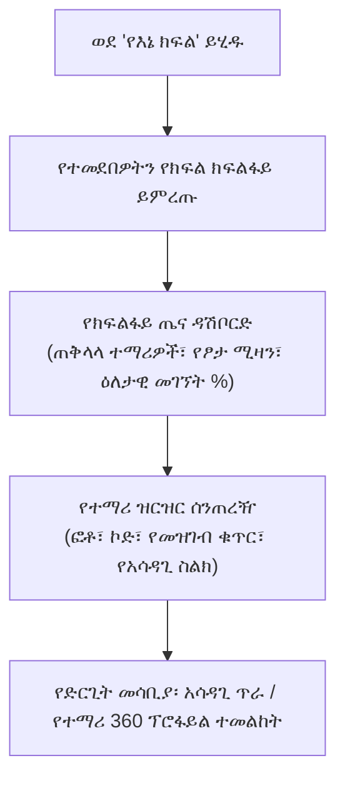

# የምድብ ክፍል እና የክፍል መምህር የስራ ቦታ

ከትምህርት ዓይነት ማስተማር በተጨማሪ፣ የተመደቡ **የምድብ ክፍል መምህራን** (የክፍል መምህራን) ለተመደበላቸው ክፍልፋይ (ለምሳሌ *9ኛ ክፍል B* ወይም *11ኛ ክፍል የተፈጥሮ ሳይንስ*) የአሳዳጊነት እና የአስተዳደር ቁጥጥር ይጎተታሉ። የ**የእኔ ክፍል የስራ ቦታ** (`/teacher/my-class`) የተማሪ ደህንነትን፣ የመገኘት ጤናን፣ የአካዳሚክ እድገትን እና የቤተሰብ ግንኙነቶችን ለመከታተል የተዋሃደ የትእዛዝ ማዕከል ይሰጣል።

---

## ቁልፍ የምድብ ክፍል አቅሞች

::u-page-grid
:::u-page-card
---
title: የክፍልፋይ ዝርዝር እና ፕሮፋይሎች
icon: i-lucide-contact
---
በክፍልፋይዎ ውስጥ የተመዘገቡ ሁሉም ተማሪዎች አፋጣኝ መዳረሻ፣ ከመዝገብ ቁጥሮች፣ የፆታ ክፍፍል እና የድንገተኛ አሳዳጊ ስልክ ቁጥሮች ጋር።
:::

:::u-page-card
---
title: የመገኘት ጤና መቆጣጠሪያ
icon: i-lucide-calendar-check-2
---
የቅጽበት የክፍልፋይ መገኘት ክትትል፣ የቅድመ-ማስጠንቀቂያ የአደጋ ባንዲራዎችን ከማንሳታቸው በፊት ሥር የሰደደ ያለ-ምክንያት መቅረት ያለባቸውን ተማሪዎች ይለያል።
:::

:::u-page-card
---
title: የአካዳሚክ ሊደርቦርድ እና አስተያየቶች
icon: i-lucide-award
---
የክፍልፋይ ደረጃዎች፣ የትምህርት ዓይነት ጠንቅቆ መረዳት ማጠቃለያዎች፣ እና በውጤት ካርዶች ላይ ኦፊሴላዊ የሴሚስተር መጨረሻ የምድብ ክፍል መምህር አስተያየቶችን ማስገባት።
:::
::

---

## ደረጃ-በ-ደረጃ፡ የተመደበውን ክፍልፋይ ማስተዳደር

### 1. ወደ የክፍልፋይ የትእዛዝ ማዕከል መሄድ
1. በመምህር የጎን አሞሌ ምናሌ ውስጥ **የእኔ ክፍል**ን ጠቅ ያድርጉ።
2. ለበርካታ ክፍልፋዮች የተመደቡ ከሆነ፣ ዒላማዎን ክፍልፋይ ከክፍል ካርዶቹ ይምረጡ።
3. ዳሽቦርዱ ቁልፍ የክፍልፋይ KPIs ይዞ ይከፈታል፡-
   - **አጠቃላይ ምዝገባ**፡ በክፍልዎ ውስጥ ንቁ ወንዶች እና ሴቶች።
   - **የዛሬው መገኘት**፡ ለጠዋት መጥሪያ ተገኝተዋል፣ አልተገኙም እና ዘግይተዋል ቆጠራዎች።
   - **የአካዳሚክ ጤና**፡ በሁሉም የትምህርት ዓይነቶች የክፍልፋይ አማካይ GPA።

### 2. አሳዳጊዎችን በፍጥነት ማግኘት
ተማሪ ሲቀር ወይም የባህሪ ትኩረት ሲያስፈልገው፡-
1. በተማሪ ዝርዝር ሰንጠረዡ ውስጥ ተማሪውን ያግኙ።
2. የ**ወላጅ ስልክ** አምድ የተረጋገጡ የአሳዳጊ ስልክ ቁጥሮችን ያሳያል።
3. ከቤተሰቡ ጋር በቀጥታ የመገናኛ መጽሐፉን ለመክፈት የ**ጥሪ (የስልክ አዶ)** ወይም **መልእክት** አዝራሩን ጠቅ ያድርጉ።

### 3. የምድብ ክፍል መምህር የሴሚስተር አስተያየቶችን ማስገባት
በእያንዳንዱ ሴሚስተር ወይም ሩብ ዓመት መጨረሻ ላይ፡-
1. በስራ ቦታው ውስጥ ወደ **የውጤት ካርድ አስተያየቶች** ትር ይሂዱ።
2. የተማሪውን ረድፍ ይምረጡ።
3. መደበኛ የትምህርታዊ ግምገማ ሐረግ ይምረጡ (ለምሳሌ፣ *"የላቀ ጉጉት እና የአክብሮት የእኩዮች ትብብር ያሳያል"* ወይም *"በትንታኔ አቀፍ የትምህርት ዓይነቶች ተስፋ ሰጪ ጥረት ያሳያል፤ የቤት ስራ ጊዜ አክባሪነትን እንዲያሻሽል ይበረታታል"*)።
4. ወይም ለተማሪው ኦፊሴላዊ የታተመ ትራንስክሪፕት ግላዊ የጥራት አስተያየቶችን ይፃፉ።
5. **አስተያየቶች አስቀምጥ** የሚለውን ጠቅ ያድርጉ።

---

## የምድብ ክፍል ከክፍል መምህር የትምህርት ዓይነት መምህር ኃላፊነቶች ጋር

| የስራ ሂደት | የትምህርት ዓይነት መምህር | የምድብ ክፍል (ክፍል) መምህር |
| :--- | :---: | :---: |
| **የትምህርት ዓይነት መገኘትን አመልክት** | ✅ | ✅ |
| **የትምህርት ዓይነት ኩዊዝ እና የፈተና ውጤቶች አስገባ** | ✅ | ✅ |
| **ሙሉ የክፍልፋይ GPA እና የክፍል ደረጃ ተመልከት** | ❌ (የራሱ የትምህርት ዓይነት ብቻ) | ✅ (ሙሉ ክፍልፋይ በሁሉም የትምህርት ዓይነቶች) |
| **የጠዋት መቅረት ምክንያቶችን አጽድቅ** | ❌ | ✅ |
| **የመጨረሻ የውጤት ካርድ የባህሪ አስተያየቶች አስገባ** | ❌ | ✅ |
| **የወላጅ-መምህር ጉባኤዎችን አስተናግድ** | አማራጭ | ✅ (መሪ አዘጋጅ) |

---

## ቀጣይ እርምጃዎች

- [የመገኘት ምዝገባ መመሪያ](/am/teacher/attendance-marking) — ዕለታዊ የመጥሪያ ስራ ሂደት እና ከመስመር ውጭ ምዝገባ
- [Gradebook እና የውጤት ማስገቢያ](/am/teacher/gradebook-entry) — ቀጣይነት ያላቸው ግምገማዎች እና የፈተና ውጤቶችን ማስገባት
- [የተማሪ አደጋ ትንታኔ](/am/teacher/risk-analytics) — ለአደጋ ለተጋለጡ ተማሪዎች የቅድመ-ማስጠንቀቂያ አመልካቾችን መገምገም