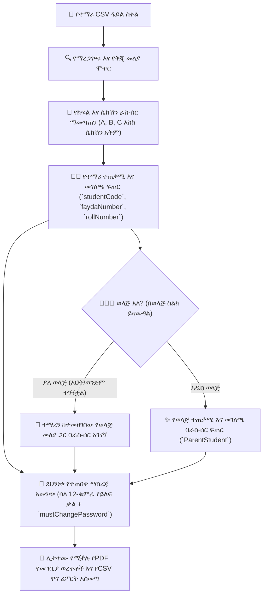

# የጅምላ ማስመጣት እና የተማሪ/ወላጅ ራስ-ሰር አቅርቦት

**የYeneSchool ጅምላ ማስመጫ ሞተር** (`BulkStudentImportService`, `BulkStaffImportService`, `BulkCredentialService`) ሬጅስትራሮች እና ዳይሬክተሮች ሙሉ የክፍል ቡድኖችን እንዲያስመዘግቡ፣ ክፍሎችን እና ሴክሽኖችን እንዲመድቡ፣ ድርብ የተማሪ/ወላጅ የተጠቃሚ መለያዎችን እንዲፈጥሩ እና የእህት-ወንድሞችን በአንድ የማይከፋፈል ክዋኔ እንዲያገናኙ ያስችላቸዋል።

---

## 1. የተማሪ የጅምላ CSV አብነት እና የአምድ ዝርዝሮች

ኦፊሴላዊውን አብነት ከ**ሬጅስትራር > የጅምላ ስቀል > ተማሪዎች (አውቶ)** ያውርዱ። የCSV መዋቅር ሙሉ የኢትዮጵያዊ የስም አሰጣጥ እና የወላጅ ስነ-ሕዝብ መረጃን ይደግፋል፦

| የአምድ ርዕስ | አስፈላጊ | ትክክለኛ ቅርፀቶች / ምሳሌዎች | የሞተር አሠራር ባህሪ |
| :--- | :---: | :--- | :--- |
| `first_name` | **አዎ** | *Abebe*, *Bethlehem* | የተማሪ የመጀመሪያ ስም። |
| `middle_name` | **አዎ** | *Tesfaye*, *Kebede* | የአባት ስም (መደበኛ የኢትዮጵያ መካከለኛ ስም)። |
| `last_name` | አይ | *Assefa*, *Tadesse* | የአያት ስም። |
| `fan` | **አዎ** | `100000000001` (12 አኃዝ) | ብሔራዊ ዲጂታል መታወቂያ (የፋይዳ መታወቂያ ቁጥር)። ልዩነትን ያስፈጽማል። |
| `phone` | **አዎ** | `0911223344` or `+251911223344` | የተማሪ የመገናኛ ስልክ (ወደ መደበኛ የኢትዮጵያ ቅርፀት የተቀየረ)። |
| `gender` | **አዎ** | `MALE` or `FEMALE` | የስነ-ሕዝብ ሪፖርት እና የዶርም/ስፖርት መመደብ። |
| `current_class` | **አዎ** | `Grade 9`, `Grade 10`, `KG 2` | በትምህርት ቤቱ ከተዋቀረው የክፍል ክልል (`grade_system`) ውስጥ መውደቅ አለበት። |
| `section` | አይ | `A`, `B`, `C` | አማራጭ የተመረጠ ሴክሽን። ከተተወ፣ ሞተሩ በራስ-ሰር ይመድባል። |
| `stream` | (11ኛ–12ኛ ክፍል) | `NATURAL` or `SOCIAL` | ለዝግጅት ሁለተኛ ደረጃ ደረጃዎች የትምህርት ስትሪም ምደባ። |
| `parent_name` | **አዎ** | *Tesfaye Assefa* | ዋና አሳዳጊ ሙሉ ህጋዊ ስም። |
| `parent_phone` | **አዎ** | `0933445566` | ለSMS ማንቂያዎች እና ለወላጅ ፖርታል መግቢያ የሚያገለግል የአሳዳጊ ሞባይል ቁጥር። |
| `relation` | አይ | `Father`, `Mother`, `Guardian` | በ`ParentStudent` አገናኝ ውስጥ የሚመዘገብ ዝምድና። |
| `mother_name` | አይ | *Almaz Haile* | ለትምህርት ሚኒስቴር የተማሪ ማህደሮች ይመዘገባል። |

---

## 2. ራስ-ሰር የሴክሽን ምደባ እና የአቅም ማመጣጠን

መዝገቦች ሲገቡ፣ ሞተሩ የሴክሽን ምደባን በራስ-ሰር ያከናውናል፦

1. **ግልጽ የሴክሽን ምደባ**፦ የተማሪ ረድፍ `section: B` ከጠቀሰ፣ ሞተሩ ሴክሽን B በዚያ ክፍል መኖሩን ያረጋግጣል። ሴክሽን B ከ`DEFAULT_SECTION_CAPACITY` (ለምሳሌ 40 መቀመጫዎች) በታች ከሆነ፣ ተማሪው በሴክሽን B ውስጥ ይቀመጣል።
2. **በሴክሽኖች መካከል ራስ-ሰር ማመጣጠን**፦ `section` ባዶ ከተተወ፣ ሞተሩ ተማሪዎችን በሙሉ ስም ፊደል በፊደል ይመድባል እና በሴክሽኖች `A`፣ `B` እና `C` መካከል በእኩል መጠን ያከፋፍላቸዋል፣ ይህም ሚዛናዊ የክፍል መጠኖችን ያረጋግጣል።
3. **የሮል ቁጥር እና የክፍል ቁጥር ማመንጨት**፦
   - ሞተሩ የተማሪውን የፊደል ቅደም ተከተል ሮል ቁጥር (`rollNumber`፣ ለምሳሌ `1`፣ `2`፣ `3...`) በተመደበለት ሴክሽን ውስጥ በራስ-ሰር ያሰላል።
   - በ`ROOM_NAMING_CONVENTION` ላይ በመመስረት የመማሪያ ክፍል ቁጥሮችን በራስ-ሰር ይመድባል።

---

## 3. ድርብ መለያ መፍጠር እና የእህት-ወንድም ራስ-ሰር ማገናኘት

የYeneSchool በጣም ኃይለኛ ባህሪያት አንዱ **ብልህ የወላጅ ቅጂ-ማስወገጃ ሞተር** ነው፦

- **አዲስ ወላጅ የስራ ሂደት**፦ `parent_phone` በትምህርት ቤቱ ዳታቤዝ ውስጥ ከሌለ፣ ስርዓቱ በራስ-ሰር አዲስ `User` ከ`Role.PARENT` ጋር ይፈጥራል፣ `ParentProfile` ያዘጋጃል እና ተማሪውን ያገናኛል።
- **የእህት-ወንድም ራስ-ሰር ማገናኘት (ዜሮ የቅጂ መለያዎች)**፦ አንድ ወላጅ ቀድሞውኑ በ9ኛ ክፍል የተመዘገበ ትልቅ ልጅ ካለው፣ እና ትንሽ እህት/ወንድምን በ4ኛ ክፍል ከተመሳሳይ `parent_phone` ጋር ካስመጡ፦
  - ስርዓቱ ያለውን የወላጅ መዝገብ ያገኛል።
  - የቅጂ የመግቢያ ማስረጃዎችን ሳይፈጥር **አዲሱን ተማሪ ከተመዘገበው የወላጅ መገለጫ ጋር ያገናኛል**።
  - ወላጁ በሞባይል መተግበሪያው የልጆች መቀየሪያ ውስጥ ሁለቱንም ልጆች ወዲያውኑ ያያል።

---

## 4. የጅምላ ማስረጃ ማመንጨት እና ሊታተሙ የሚችሉ ወረቀቶች

ለእያንዳንዱ አዲስ ለተፈጠረ ተጠቃሚ (ለሁለቱም ተማሪ እና ወላጅ)፦

1. **ልዩ የመግቢያ ኮዶች**፦ መደበኛ የተቋም የተጠቃሚ ስሞችን ያመነጫል (ለምሳሌ `STU-2024-0142` እና `PAR-2024-0089`)።
2. **ከፍተኛ-ኢንትሮፒ ጊዜያዊ የይለፍ ቃሎች**፦ በbcrypt የተሰወሩ ደህንነታቸው የተጠበቀ ባለ 12-ቁምፊ የይለፍ ቃሎችን ያመነጫል።
3. **የመጀመሪያ-መግቢያ የደህንነት ጠባቂ**፦ `mustChangePassword: true` ያዘጋጃል፣ ይህም ተጠቃሚዎች ለመጀመሪያ ጊዜ ሲገቡ የግል የይለፍ ቃል እንዲፈጥሩ ይጠይቃል።
4. **ሊታተሙ የሚችሉ የመግቢያ ወረቀቶች አስመጣ**፦
   - ለመግቢያ ቀን ግላዊ የመግቢያ ካርዶችን ለማተም **የማስረጃ PDF አውርድ**ን ጠቅ ያድርጉ።
   - ለአስተዳደራዊ ኦዲት መዝገቦች **ዋና CSV ሪፖርት አውርድ**ን ጠቅ ያድርጉ።

---

## 5. የሰራተኛ የጅምላ ስቀል (`staffbulk.csv`)

ከተማሪዎች በተጨማሪ፣ ሬጅስትራሮች እና ዳይሬክተሮች መምህራንን እና አስተዳዳሪ ሰራተኞችን በጅምላ ማስመጣት ይችላሉ፦

### የሰራተኛ CSV አምዶች
- `full_name`፦ ሙሉ ህጋዊ ስም።
- `email`፦ ኦፊሴላዊ የትምህርት ቤት ኢሜይል አድራሻ።
- `phone`፦ የሞባይል ስልክ ቁጥር።
- `role`፦ `teacher`, `finance`, `registrar`, ወይም `supervisor`።
- `teaching_subject`፦ ለምሳሌ `Mathematics`, `English`, `Physics`።
- `teaching_classes`፦ ለምሳሌ `Grade 9, Grade 10`።

ሲገቡ፣ ሞተሩ የሰራተኛ መለያን በራስ-ሰር ይፈጥራል፣ የተጠቃሚ ሚናዎችን ይመድባል እና ለሁሉም የተጠቀሱ ክፍሎች የ`TeacherSubjectAssignment` አገናኞችን በራስ-ሰር ያቋቁማል።

---

## ቀጣይ እርምጃዎች

- [የተማሪ መገለጫ አስተዳደር](/am/registrar/student-management) — የግለሰብ የተማሪ መዝገቦችን ይፈልጉ፣ ያጣሩ እና ያርትዑ
- [ሊታተሙ የሚችሉ የተማሪ መታወቂያ ካርዶች](/am/registrar/id-cards) — ለአዲስ ለተመዘገቡ ተማሪዎች የባርኮድ ባጆችን ያመንጩ
- [የክፍሎች እና ሴክሽኖች መዋቅር](/am/academic/classes-sections) — የተዘመኑ የክፍል ስራ ዝርዝሮችን እና የሴክሽን ብዛቶችን ይመልከቱ