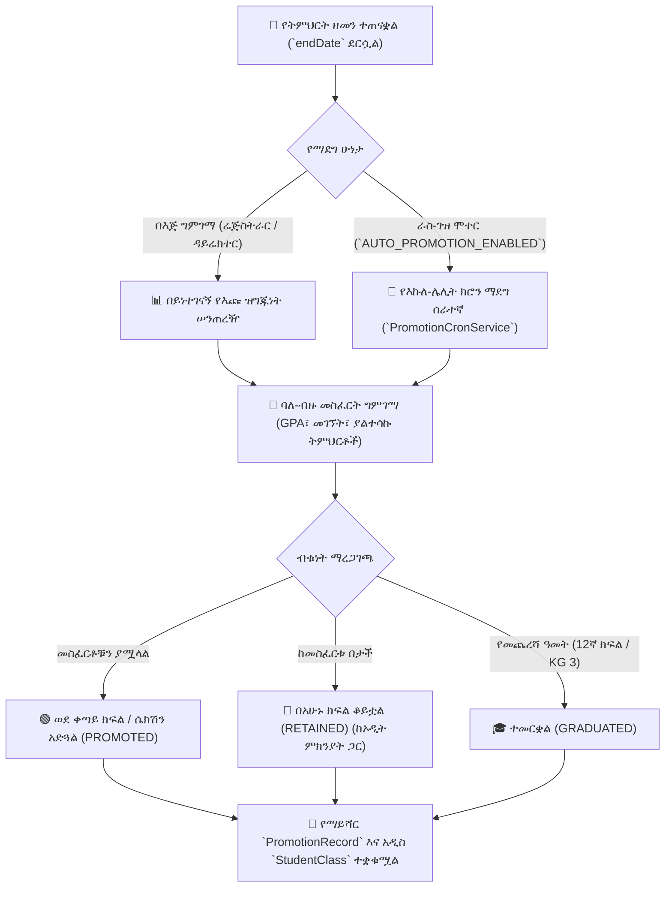
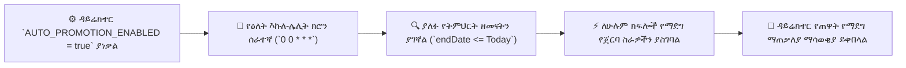

# የዓመት መጨረሻ የክፍል ማደግ (በእጅ እና ራስ-ገዝ ኤአይ)

በትምህርት ዘመን መጨረሻ ላይ፣ ትምህርት ቤቶች ብቁ የሆኑ ተማሪዎችን ወደ ቀጣዩ የክፍል ደረጃ ማሳደግ፣ ተጨማሪ ድጋፍ የሚፈልጉ ተማሪዎችን ማቆየት እና የመጨረሻ ዓመት ቡድኖችን ማስመረቅ አለባቸው (`PromotionRecord`, `PromotionCandidatesService`, `PromotionCronService`)። YeneSchool ሁለቱንም **በይነተገናኝ በእጅ የግምገማ ዳሽቦርድ** እና **ሙሉ ራስ-ገዝ የእኩለ-ሌሊት ራስ-ማደግ ሞተር** ያቀርባል።

---

## 1. ባለ-ብዙ መስፈርት የማደግ ፖሊሲ

የማደግ ሞተሩ የመጨረሻ የታተሙ የውጤት ካርዶችን (`ReportCardStatus.PUBLISHED`) በ**ዳይሬክተር > የትምህርት ቤት ቅንብሮች** ውስጥ ከተዋቀሩ ሶስት የተቋም ገደቦች ጋር ያወዳድራል፦

| የፖሊሲ መለኪያ | የቅንብር ቁልፍ | የተለመደ የተቋም መስፈርት | የአሠራር ባህሪ |
| :--- | :--- | :--- | :--- |
| **ዝቅተኛ አማካይ ውጤት** | `PROMOTION_MIN_AVERAGE_GRADE` | `50%` or `60%` | ለማደግ በሁሉም ትምህርቶች የሚፈለግ ዝቅተኛ ድምር መቶኛ። |
| **ዝቅተኛ የመገኘት መጠን** | `PROMOTION_MIN_ATTENDANCE` | `80%` or `85%` | የፈተና ውጤት ምንም ይሁን ምን በተደጋጋሚ የሚቀሩ ተማሪዎች እንዳያድጉ ይከላከላል። |
| **የሚፈቀዱ ያልተሳኩ ትምህርቶች** | `PROMOTION_ALLOW_FAILED_SUBJECTS` | `0` or `1` Non-Core Subject | ከተፈቀደው ብዛት በላይ ያልተሳካላቸው ተማሪዎች ለማቆየት ወይም ለበጋ ማገገሚያ ምልክት ይደረግባቸዋል። |

---

## 2. በይነተገናኝ በእጅ የማደግ ግምገማ የስራ ሂደት

ሬጅስትራሮች እና ዳይሬክተሮች ውሳኔዎችን ከማጠናቀቃቸው በፊት እጩዎችን ክፍል በክፍል መገምገም ይችላሉ፦

### ደረጃ 1 — የእጩ ክፍልን ይጫኑ
1. ወደ **ሬጅስትራር > የክፍል ማደግ** (ወይም **ዳይሬክተር > ማደግ**) ይሂዱ።
2. **ከ የትምህርት ዘመን** (የሚያልቀው ዓመት) እና **ዒላማ ክፍል** (ለምሳሌ *Grade 9A*) ይምረጡ።
3. **ለ የትምህርት ዘመን** (የሚመጣው አዲስ ክፍለ-ጊዜ) ይምረጡ።
4. **እጩዎችን ጫን**ን ጠቅ ያድርጉ።

### ደረጃ 2 — ሁኔታን እና የኤአይ ስትሪም ምክሮችን ይገምግሙ
የእጩ ሠንጠረዥ ተማሪዎችን በፊደል ቅደም ተከተል እና በክፍል ሮል ቁጥር የተደረደሩ ያሳያል፦

- **`PROMOTED (አረንጓዴ)`**፦ ተማሪው ሁሉንም የGPA፣ የመገኘት እና ያልተሳኩ-ትምህርት መስፈርቶችን ያሟላል።
- **`NEEDS_REVIEW / RETAINED (አምበር/ቀይ)`**፦ አንድ ወይም ከዚያ በላይ መስፈርቶችን አያሟላም (ጠቋሚውን ሲያንዣብቡ ትክክለኛ ምክንያቶችን ያሳያል፣ ለምሳሌ *"የሂሳብ ውጤት 42% (ከ50% በታች)"* ወይም *"መገኘት 74% (ከ80% በታች)"*)።
- **`GRADUATED (ሐምራዊ)`**፦ ለመጨረሻ ክፍል ቡድኖች (ለምሳሌ 12ኛ ክፍል ወይም ኪንደርጋርደን/KG)።
- **የኤአይ ትምህርት ስትሪም ምክር (10ኛ ክፍል ወደ 11ኛ ክፍል ሽግግር)**፦
  - ወደ ዝግጅት ሁለተኛ ደረጃ ትምህርት ቤት ለሚያድጉ የ10ኛ ክፍል ተማሪዎች፣ ኤአይው በSTEM እና በሰብአዊነት ትምህርቶች የቀድሞ አፈጻጸምን ይመረምራል እና `NATURAL SCIENCE` ወይም `SOCIAL SCIENCE` በራስ-ሰር ይጠቁማል።

### ደረጃ 3 — የእጅ ለውጦች እና የጅምላ አፈጻጸም
1. ምልክት ለተደረገባቸው ተማሪዎች፣ አስተዳዳሪዎች በአስተያየት የቦርድ ስምመቶችን መተግበር ይችላሉ፦
   - **ከስምመት ጋር አሳድግ**ን ጠቅ ያድርጉ እና የግዴታ የኦዲት ማስታወሻ ያስገቡ (ለምሳሌ *"በተረጋገጠ የህክምና ፈቃድ ተከትሎ በአካዳሚክ ኮሚቴ ግምገማ መሰረት አድጓል"*)።
2. **የጅምላ ማደግን አስፈጽም**ን ጠቅ ያድርጉ።
3. የBullMQ የጀርባ ወረፋ ቡድኑን ያካሂዳል፣ ለአዲሱ የትምህርት ዘመን አዲስ `StudentClass` መዝገቦችን ይፈጥራል፣ `StudentProfile.className`ን ያሳድጋል እና እያንዳንዱን ሽግግር በ`PromotionRecord` ውስጥ ይመዘግባል።

---

## 3. ራስ-ገዝ የእኩለ-ሌሊት ራስ-ማደግ ሞተር

በዓመት መጨረሻ ላይ ምንም የአስተዳደር ጭንቀት ሳይፈጠር የሚወዱ ተቋማት ለሆኑ፣ YeneSchool ሙሉ በሙሉ ራስ-ገዝ የክሮን ሰራተኛን ያካትታል፦

### ራስ-ማደጉ እንዴት ይሰራል
1. በ**ዳይሬክተር > የትምህርት ቤት ቅንብሮች > የትምህርት ፖሊሲዎች** ውስጥ፣ **ራስ-ማደግ ሞተር**ን ወደ `Enabled` (ንቁ) ይቀይሩ።
2. በየሌሊቱ በእኩለ-ሌሊት፣ ሰራተኛው ኦፊሴላዊ `endDate` ያለፉ የትምህርት ክፍለ-ጊዜዎችን ይፈትሻል።
3. በእጅ ያልተካሄደ ለማንኛውም ክፍል፣ ሞተሩ ሁሉንም ተማሪዎች በኦፊሴላዊ የማደግ መስፈርቶች ይገመግማል፦
   - ብቁ ተማሪዎች ለአዲሱ ክፍለ-ጊዜ ወደ ቀጣዩ የክፍል ደረጃ በራስ-ሰር ይንቀሳቀሳሉ።
   - ብቁ ያልሆኑ ተማሪዎች በአሁኑ ክፍላቸው ይቆያሉ።
   - የሚመረቁ ክፍሎች `GRADUATED` ምልክት ይደረግባቸዋል።
4. ዳይሬክተሩ ሙሉ የተማሪ ብዛት ያለው የተጠቃለለ የጠዋት ማሳወቂያ ይቀበላል።

---

## 4. የማደግ ኦዲት መዝገቦች እና የተማሪ ታሪክ

እያንዳንዱ የማደግ ወይም የማቆየት እርምጃ በተማሪው ቋሚ የውጤት ግልባጭ መዝገብ ውስጥ ይከማቻል፦
- **ከ / ለ የትምህርት ዘመን**፦ ለምሳሌ `2016 E.C.` ወደ `2017 E.C.`።
- **ከ / ለ ክፍል እና ሴክሽን**፦ ለምሳሌ `Grade 9A` ወደ `Grade 10A`።
- **የውሳኔ ሁኔታ**፦ `PROMOTED`, `RETAINED`, `GRADUATED`።
- **የኦፕሬተር ማንነት**፦ እንደ `System (Auto-Promotion)` ወይም የተወሰነው ሬጅስትራር የተጠቃሚ ስም ሆኖ ይመዘገባል።

---

## ቀጣይ እርምጃዎች

- [የተማሪ መገለጫ አስተዳደር](/am/registrar/student-management) — ባለ-ብዙ ዓመት የተማሪ የትምህርት ታሪክ መመልከት
- [የመጨረሻ የውጤት ካርዶች](/am/registrar/report-cards) — ከማደግ በፊት የመጨረሻ የውጤት ካርዶችን ማሳተም
- [የትምህርት ዘመናት እና ወቅቶች ማዋቀር](/am/academic/academic-years) — አዲሱን የትምህርት ዘመን ክፍለ-ጊዜ መጀመር