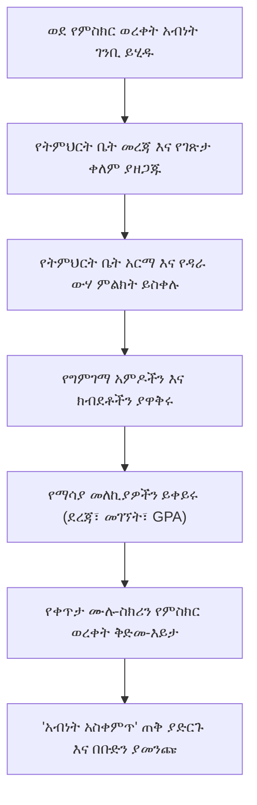

# ብጁ የምስክር ወረቀት እና የውጤት ግልባጭ ገንቢ

YeneSchool ለዳይሬክተሮች እና ሬጅስትራሮች የኦፊሴላዊ ተማሪ የውጤት ግልባጮች፣ የወቅት ውጤት ካርዶች እና የትምህርት ብቃት የምስክር ወረቀቶች ምስላዊ ምርት ስም፣ አቀማመጥ እና ህጋዊ ትክክለኛነት ላይ ሙሉ ቁጥጥር ይሰጣል (`/director/report-cards/certificate-template`)።

---

## የአብነት ማበጀት ቁልፍ ባህሪያት

::u-page-grid
:::u-page-card
---
title: የተቋም ምርት ስም
icon: i-lucide-palette
---
ከፍተኛ ጥራት ያላቸውን የትምህርት ቤት አርማዎች ይስቀሉ፣ ብጁ የምርት ስም የቀለም ቤተ-ስዕሎችን ይግለጹ እና ኦፊሴላዊ የደብዳቤ ራስጌ አድራሻዎችን እና የመገናኛ መረጃን ያዘጋጁ።
:::

:::u-page-card
---
title: የውሃ ምልክት እና ዳራ
icon: i-lucide-stamp
---
የፍርሃት-መከላከያ የውሃ ምልክት ማህተሞችን፣ ብጁ የማስዋቢያ የምስክር ወረቀት ድንበሮችን እና ኦፊሴላዊ የማህተም ሽፋኖችን ይተግብሩ።
:::

:::u-page-card
---
title: ተለዋዋጭ መለኪያዎች መቀየሪያዎች
icon: i-lucide-sliders
---
የክፍል ደረጃን፣ የመገኘት %ን፣ ድምር GPAን፣ የግምገማ ስብርባሪን እና የርዕሰ-መምህር ፊርማዎችን በአንድ ጠቅታ ያንቁ ወይም ይደብቁ።
:::
::

---

## በደረጃ-በደረጃ፦ የምስክር ወረቀት እና የውጤት ካርድ አብነቶችን ማዋቀር

### 1. ራስጌ መረጃ እና የትምህርት ቤት ዝርዝሮች
1. በመሄጃ ምናሌው ውስጥ ወደ **የውጤት ካርዶች** ይሂዱ እና **የምስክር ወረቀት አብነት**ን ጠቅ ያድርጉ።
2. የተቋሙን ዝርዝሮች ያጠናቅቁ፦
   - **የምስክር ወረቀት ርዕስ**፦ ለምሳሌ *"የኦፊሴላዊ ተማሪ የትምህርት ውጤት የምስክር ወረቀት"* ወይም *"የወቅት መጨረሻ የውጤት ካርድ"*።
   - **የትምህርት ቤት ስም እና አድራሻ**፦ ኦፊሴላዊ የተመዘገበ የተቋም ስም፣ የካምፓስ አድራሻ፣ የስልክ ቁጥር እና ኢሜይል።
   - **የርዕሰ-መምህር / ዳይሬክተር ስም**፦ ከተመደበው የፊርማ መስመር ጎን ይታተማል።

### 2. የምርት ስም እና የውሃ ምልክት ማስዋብ
1. **የገጽታ ቀለም**፦ ከትምህርት ቤትዎ የምርት ስም ቤተ-ስዕል ጋር ለማዛመድ የቀለም መራጩን ጠቅ ያድርጉ (ነባሪ፦ Royal Navy `#1B4F72` ወይም Crimson `#800020`)። ይህ ቀለም የራስጌ ባነሮችን፣ የሰንጠረዥ ድንበሮችን እና የውጤት ባጆችን ይቀርፃል።
2. **የትምህርት ቤት አርማ**፦ ከፍተኛ ጥራት ያለው ግልጽ (transparent) PNG ወይም SVG የኦፊሴላዊ የትምህርት ቤት አርማ ይስቀሉ።
3. **ብጁ ዳራ / የውሃ ምልክት**፦ **ብጁ ዳራ ተጠቀም**ን ያብሩ እና ቀላል የውሃ ምልክት ምስል (እንደ ቅርጸ-ተጎ ማህተም ወይም የምስክር ወረቀት ድንበር) ይስቀሉ።

### 3. የግምገማ አምዶች እና ክብደት
ቀጣይ ግምገማ ውጤቶች በውጤት ግልባጩ ላይ እንዴት እንደሚታዩ ያዋቅሩ፦
- የግምገማ ክፍሎችን ያክሉ (ለምሳሌ *የክፍል ፈተናዎች (20%)*, *የመካከለኛ ወቅት ፈተና (30%)*, *የመጨረሻ ፈተና (50%)*)።
- የክፍሎቹ መቶኛዎች በአጠቃላይ 100% መሆናቸውን ያረጋግጡ።

### 4. የማሳያ መቀየሪያዎች እና የግላዊነት ምልክቶች

| የመቀየሪያ ቅንብር | መግለጫ | የሚመከር አገልግሎት |
| :--- | :--- | :--- |
| **የክፍል ደረጃ አሳይ** | የተማሪውን በሴክሽን ውስጥ ያለ ቦታ ያሳያል (ለምሳሌ ከ45 ተማሪዎች 1ኛ) | ለትምህርት ብቃት የምስክር ወረቀቶች የነቃ፤ በአጠቃላይ የውጤት ካርዶች ላይ አማራጭ |
| **የመገኘት % አሳይ** | የተማሪውን የወቅት ጊዜ-አክባሪነት እና የመገኘት መቶኛ ያትማል | በኦፊሴላዊ ሩብ-ዓመታዊ የውጤት ካርዶች ላይ የነቃ |
| **GPA / አማካይ አሳይ** | ድምር የነጥብ አማካይ (Grade Point Average)ን ያሰላ እና ያትማል | ለሁለተኛ ደረጃ እና ዝግጅት የውጤት ግልባጮች የነቃ |
| **የሁለት-ቋንቋ ውጤት ማብራሪያ** | መደበኛ የፊደል ውጤት ሚዛንን (A, B, C, D, F) ከኢትዮጵያዊ የውጤት ክልሎች ጋር ያትማል | ለሁሉም ኦፊሴላዊ የመንግስት የምስክር ወረቀቶች የነቃ |

---

## የቀጥታ ሙሉ-ስክሪን ቅድመ-እይታ እና የቡድን ማመንጨት

የምስክር ወረቀቶችን ከማስቀመጥ እና ከማከፋፈል በፊት፦

1. የናሙና ተማሪ መረጃ ያለው የቀጥታ መስኮት ለመክፈት **የምስክር ወረቀት ቅድመ-እይታ** አዝራሩን ጠቅ ያድርጉ።
2. ምስላዊ አሰላለፍ፣ ጠርዝ፣ የጽሑፍ ግልጽነት እና የውሃ ምልክት ግልጽነት ያረጋግጡ።
3. **አብነት አስቀምጥ**ን ጠቅ ያድርጉ።
4. ለሙሉ ክፍል ወይም ለሚመረቅ ቡድን የምስክር ወረቀቶችን በቡድን ለማመንጨት፣ ወደ **የውጤት ካርዶች** > **የቡድን ህትመት** ይሂዱ፣ የክፍል ሴክሽኑን ይምረጡ እና **ኦፊሴላዊ የምስክር ወረቀቶችን አትም (PDF)**ን ጠቅ ያድርጉ።

---

## ቀጣይ እርምጃዎች

- [የውጤት ካርዶች ማመንጨት](/am/registrar/report-cards) — የሩብ-ዓመታዊ የውጤት ካርዶችን በቡድን ማመንጨት እና ማተም
- [የተማሪ መታወቂያ ካርዶች ማመንጨት](/am/registrar/id-cards) — የፎቶ መታወቂያ ባጆችን ያመንጩ
- [የዳይሬክተር ሪፖርቶች እና ትንታኔዎች](/am/director/reports-analytics) — የትምህርት ቤት አፈጻጸም ስታቲስቲክስን ይመልከቱ